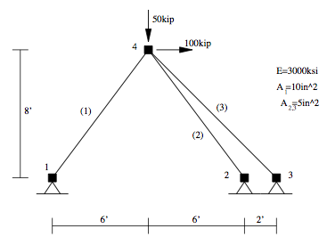
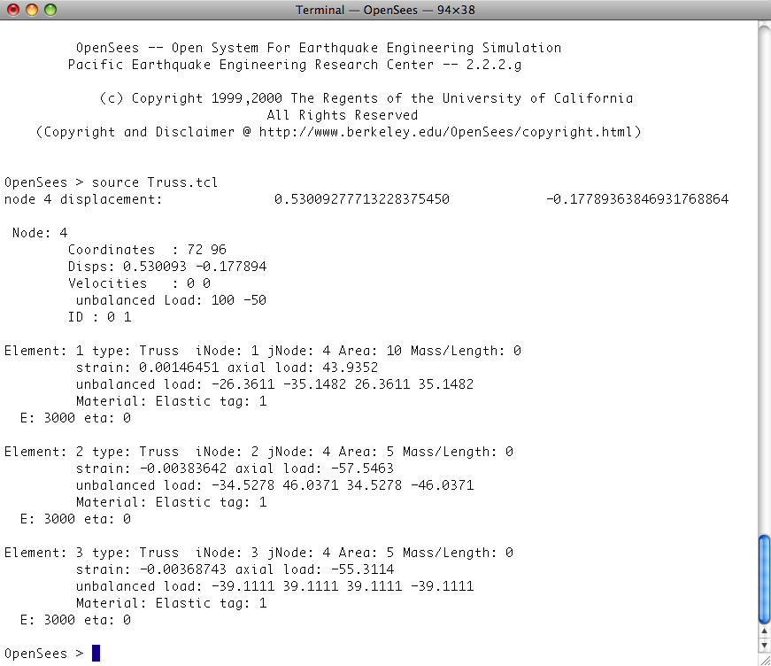

Basic Truss Example
-------------------

Introduction
*************

This example is of a linear-elastic three bar truss, as shown in the top figure, subject to static loads. The model has four nodes, labelled **1** through **4**, and three elements, labelled **1** through **3**. Nodes **1**, **2** ,and **3** are fixed and a loads of **100kip** and **-50kip** are imposed at node **4**. The elements all have a youngs modulus of **300ksi**, elements **2** and **3** have an area of **5in^2** and element **1** an area of **10in^***.

.. note::
    Because the model is planar and is comprised of truss elements, the spatial dimension of the mesh (``ndm``) will be specified as **2** and the nodes will only be specified to have **2** degrees-of-freedom.

Model Definition
*****************

   .. code-block:: tcl

        # units: kip, in

        # Remove existing model
        wipe

        # Create ModelBuilder (with two-dimensions and 2 DOF/node)
        model BasicBuilder -ndm 2 -ndf 2

        # Create nodes
        # ------------
        # Create nodes & add to Domain - command: node nodeId xCrd yCrd
        node 1   0.0  0.0
        node 2 144.0  0.0
        node 3 168.0  0.0
        node 4  72.0 96.0
            
        # Set the boundary conditions - command: fix nodeID xResrnt? yRestrnt?
        fix 1 1 1 
        fix 2 1 1
        fix 3 1 1
            
        # Define materials for truss elements
        # -----------------------------------
        # Create Elastic material prototype - command: uniaxialMaterial Elastic matID E
        uniaxialMaterial Elastic 1 3000

        # 
        # Define elements
        #

        # Create truss elements - command: element truss trussID node1 node2 A matID
        element Truss 1 1 4 10.0 1
        element Truss 2 2 4 5.0 1
        element Truss 3 3 4 5.0 1
                
        # Define loads
        # ------------
        #

        # create a Linear TimeSeries with a tag of 1
        timeSeries Linear 1
            
        # Create a Plain load pattern associated with the TimeSeries,
        # command: pattern Plain $patternTag $timeSeriesTag { load commands }

        pattern Plain 1 1 {
            # Create the nodal load - command: load nodeID xForce yForce
            load 4 100 -50
        }

Analysis
**********

We will now show the commands to perform a static analysis using a linear solution algorithm The model is linear, so we use a solution Algorithm of type Linear. Even though the solution is linear, we have to select a procedure for applying the load which is called an Integrator. For this problem, a LoadControl integrator advances the solution. The equations are formed using a banded system so the System is BandSPD, banded symmetric positive definite This is a good choice for most small size models. The equations have to be numbered so the widely used RCM (Reverse Cuthill-McKee) numberer is used. The constraints are most easily represented with a Plain constraint handler. Once all the components of an analysis are defined, the Analysis object itself is created. For this problem, a Static Analysis object is used. 

   .. code-block:: tcl

        # Create the system of equation
        system BandSPD
            
        # Create the DOF numberer, the reverse Cuthill-McKee algorithm
        numberer RCM
            
        # Create the constraint handler, a Plain handler is used as homo constraints
        constraints Plain

        # Create the integration scheme, the LoadControl scheme using steps of 1.0
        integrator LoadControl 1.0

        # Create the solution algorithm, a Linear algorithm is created
        algorithm Linear

        # create the analysis object 
        analysis Static 

Output Specification
***********************
For this analysis, we will record the displacement at node 4, and all the element forces expressed both in the global coordinate system and the local system. 

   .. code-block:: tcl

        # create a Recorder object for the nodal displacements at node 4
        recorder Node -file example.out -time -node 4 -dof 1 2 disp

        # create a Recorder for element forces, one for global system and the other for local system
        recorder Element -file eleGlobal.out -time -ele 1 2 3 forces
        recorder Element -file eleLocal.out  -time -ele 1 2 3 basicForces

Perform The Analysis
***********************
After the objects for the model, analysis and output has been defined we now perform the analysis. 

    .. code-block:: tcl

        analyze 1

Print Information to Screen
****************************
In addition to using recorders, it is possible to specify output using the print and puts commands. When no file identifiers are provided, these commands will print results to the screen. 

    .. code-block:: tcl

        puts "node 4 displacement: [nodeDisp 4]"
        print node 4
        print element

Results
**********
When you run this script, you should see the following printed to the screen: 

