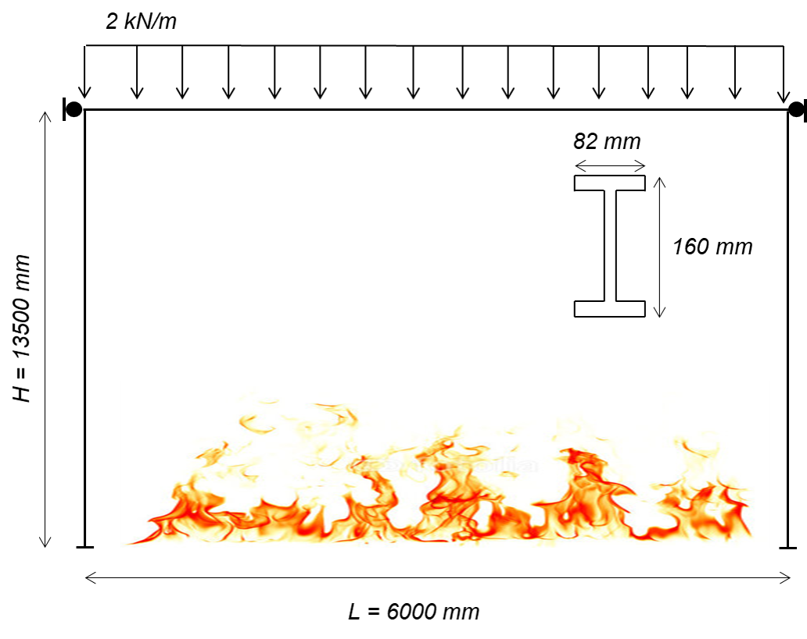
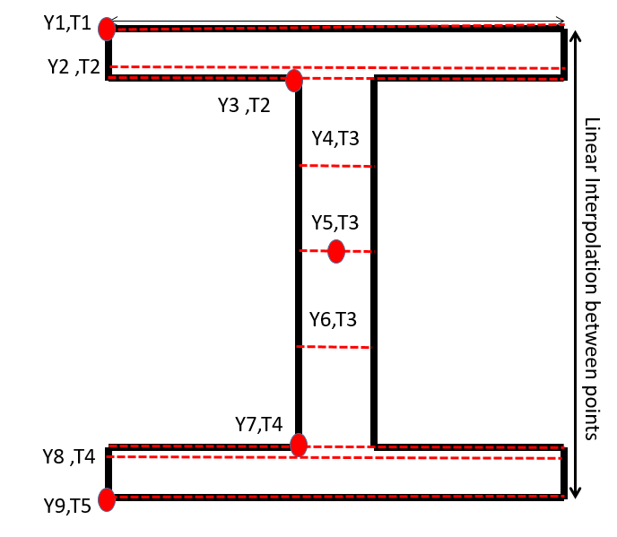
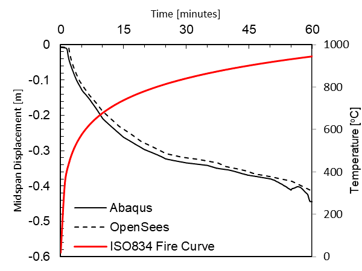

Example 4
=========

A 6 m x 3.5 m single bay frame with a 2 kN/m distributed load is subjected to a non-linear fire curve.
^^^^^^^^^^^^^^^^^^^^^^^^^^^^^^^^^^^^^^^^^^^^^^^^^^^^^^^^^^^^^^^^^^^^^^^^^^^^^^^^^^^^^^^^^^^^^^^^^^^^^^

    
**Elevation of frame**

Example overview: A one-bay frame is considered with a uniformly
distributed load (2 kN/m). The frame is exposed to a fire. Heat transfer
analyses were performed using a commercially available finite element
program to calculate the temperature distribution through the cross
section,and the temperatures at each fiber when the members are exposed
to a non-linear gas time-temperature curve. The horizontal displacements
of the top corners of frame are restrained to represent lateral bracing,
and the midspan displacement of the beam is recorded throughout the
analysis.

Download Example 4   files:

:download:`Example4.tcl <files/Example4.tcl>`.

:download:`WsectionThermal.tcl <files/WsectionThermal.tcl>`.

:download:`Nodal Temperature Files <files/NodalTemperatureFiles.zip>`. 

:download:`Example 4 Outputs <files/Example4_OUTPUT.zip>`. 

Objectives
----------

Example 4 Objectives: 1. Develop a portal frame in OpenSees using
displacement-based elements with tempurature-dependent material
properties, and 2. Implementing user-defined time-tempurature histories
for the elements calculated through heat transfer analysis.

Material
--------

The uniaxialMaterial Steel01Thermal includes temperature-dependent steel thermal and mechanical properties according to Eurocode 3 carbon steel. More details of Steel01 can be found at: `Steel01 Material <https://opensees.berkeley.edu/wiki/index.php/Steel01_Material>`__

.. function:: uniaxialMaterial Steel01Thermal $matTag $Fy $Es $b;

Es = 210000 MPa (Young’s modulus of elasticity at ambient temperatures)

Fy = 275 MPa (Yield strength of material at ambient temperatures)

b = 0.01 (Strain-Hardening Ratio)

Transformation
--------------

Because the beams in this example experience large deflections, 2nd
order bending effects were considered using the Corotational geometric
transformation.

.. function:: geomTransf Corotational $transftag;

Learn more about geometric transofrmations: `Geometric
Transformation <http://opensees.berkeley.edu/wiki/index.php/Geometric_Transformation_Command>`__

section
-------

This example uses a W-shape beam, therefore an external .tcl script is used to define the fiber sections. This script uses fibersecThermal to procure a fibered W-shape section with a section tag to be used while defining elements. Eight fibers are used throughout the web and four fibers within each flange. 

In previous versions of OpenSees, a default value for torsional stiffness was used (GJ). In versions 3.1.0 and newer fiber sections require a value for torsional stiffness. This is a 2D example with negligible torsion, however a value is required. The Young's Modulus is used for convenience. 

Wsection dimensions:

 .. function:: set secTag 1; 
 .. function:: set d 160;
 .. function:: set bf 82;
 .. function:: set tf 7.4;
 .. function:: et tw 5.0;
 .. function:: set nfdw 8;
 .. function:: set nftw 1;
 .. function:: set nfbf 1;
 .. function:: set nftf 4;

* secTag - section tag
* matTag - material tag
* d  = nominal depth
* tw = web thickness
* bf = flange width
* tf = flange thickness
* nfdw = number of fibers along web depth 
* nftw = number of fibers along web thickness
* nfbf = number of fibers along flange width
* nftf = number of fibers along flange thickness 
* Gj = torsional stiffness

Wsection secTag matTag d bf tf tw nfdw nftw nfbf nftf Gj 

.. function:: Wsection 1 1 $d $bf $tf $tw 8 1 1 4 $Es

.. figure:: figures/Wsection_FiberSection.png
	:align: center
	:width: 500px
	:figclass: align-center

**Cross section of W-shape showing fibers in the flanges and the web**

Element
-------

dispBeamColumnThermal elements are used because temperature-dependent
thermal and mechanical steel properties can be applied to these
elements. Any portion of the structure that is being heated must use
elements that are compatible with uniaxialMaterial Steel01Thermal. At
the time this model was developed, dispBeamColumnThermal was the only
element type that could have tempurature-dependent thermal and
mechanical properties applied to them.

dispBeamColumnThermal $eleTag $iNode $jNode $numIntgrPts $secTag $TransfTag;

.. function:: element dispBeamColumnThermal 1 1 2 5 $secTag $transftag;

Each column and beam element is created using ten displacement-based elements with 3 iteration points in each element.

Output Recorders
----------------

$dataDir is defined at the beginning of the model, this creates a folder
within your working directory where output files will be saved. >set
dataDir Examples/EXAMPLE4_OUTPUT;

.. function:: file mkdir $dataDir;

Displacement of the beam midspan node (27), DOF 2 (Vertical Displacement) 

.. function:: recorder Node -file $dataDir/Midspan_BeamDisp.out -time -node 27 -dof 2 disp;

Reaction forces at end nodes. (1 & 12) 

.. function:: recorder Node -file $dataDir/RXNS.out -time -node 1 12 -dof 2 3 reaction;

Learn more about the Recorder Command: `Recorder
Command <http://opensees.berkeley.edu/wiki/index.php/Recorder_Command>`__

Thermal Loading
---------------

This particular model is heated using a fire time tempurature curve shown below. The fiber temperatures, or the temperature distribution through the cross section was calculated by performing a heat transfer analysis. 

.. figure:: figures/Example4_fireCurve.png
	:align: center
	:width: 500px
	:figclass: align-center

The results from the heat transfer analysis were used as inputs for the fiber temperatures in OpenSees. The locations of the input tempurature locations can be seen in the figure below. 

Three tempurature input files were created for the tempurature distribution of the beam and columns. Each tempurature file has 10 columns representing: Time, T1, T2, T3, T4, T5, T6, T7, T8 & T9. Time ranges from 0 to 1 to correlete with OpenSees analysis time steps. The T1 through T9 columns represent temperatures at each of the locations shown below for nine fibers through the cross section.

The red dots above below are locations where nodal temperatures were recorded during the heat transfer analysis and red dotted lines represent temperature input locations. The code below shows how to define each of the temperature input locations. The temperature through the depth of the web was constant.
::

    set Y9 [expr -$d/2];
    set Y2 [expr -($d/2 - 0.99*$tf)];
    set Y3 [expr -($d/2 - $tf)];
    set Y4 [expr -$d/4];
    set Y5 0.0;
    set Y6 [expr $d/4];
    set Y7 [expr ($d/2 - $tf)];
    set Y8 [expr ($d/2 - 0.99*$tf)];
    set Y9 [expr $d/2];

**Location of defined input temperature locations and extracted nodal temperatures on the member cross section (both beam and columns)**

The bottom extreme fiber temperature must be defined first in the thermal load pattern. The input temperature files must be in your working directories or have their paths specified.

**Temperature loading for the beam**

.. function:: pattern Plain 11 Linear { for {set level 21} {$level <= 30} {incr level 1} {set eleID $level; eleLoad -ele $eleID -type -beamThermal -source BeamTemp.txt $Y9 $Y8 $Y7 $Y6 $Y5 $Y4 $Y3 $Y2 $Y1;}}	

**Temperature loading for column 1**

.. function:: pattern Plain 11 Linear { for {set level 1} {$level <= 10} {incr level 1} {set eleID $level; eleLoad -ele $eleID -type -beamThermal -source Column1Temp.txt $Y9 $Y8 $Y7 $Y6 $Y5 $Y4 $Y3 $Y2 $Y1;}}	

**Temperature loading for column 2**

.. function:: pattern Plain 11 Linear { for {set level 11} {$level <= 20} {incr level 1} {set eleID $level; eleLoad -ele $eleID -type -beamThermal -source Column2Temp.txt $Y9 $Y8 $Y7 $Y6 $Y5 $Y4 $Y3 $Y2 $Y1;}}	

Thermal Analysis
----------------

Thermal loading is applied in 1000 steps, with a load factor of 0.001.
Each step is a 0.001 increment of the maximum temperature specified in
the thermal loading step: $T. The analysis is a static analysis and the
contraints of the beam are plain. 1000 increments was also used during
thermal analysis to allow for easy correlation between the input
temperatures and the recorded output.

A variety of load factors were examined and the solution converged when
a load factor of 0.001 was used. OpenSees is sensitive to the load
factor, therefore, it is important to ensure that benchmarking examples
are performed to determine the proper load factor to use in structural
fire engineering analyses.

.. function:: set Nstep 1000;

.. function:: set Factor [expr 1.0/$Nstep];

.. function:: integrator LoadControl $Factor;

.. function:: analyze $Nstep;

Output Plots
------------

After the model has completed running, the results will be the vertical midspan displacement of the beam. This displacement can be plotted against the time of the fire. It is suggested that if the user would like to develop a temperature history that matches every increment of the model, the same number of tempurature inputs as time steps is used.  

**Beam midspan displacement versus time for the heated one-bay frame:**

Sources
-------

[1] European Committee for Standardization (CEN). (2005). Eurocode 3: Design of Steel Structures, Part 1.2: General Rules - Structural Fire Design.

[2] W. Maddalozzo and E.C. Fischer, "Post-earthquake fire performance of steel buildings," World Conference on Earthquake Engineering, 17WCEE,
Sendai, Japan - September 13-18, 2020.
