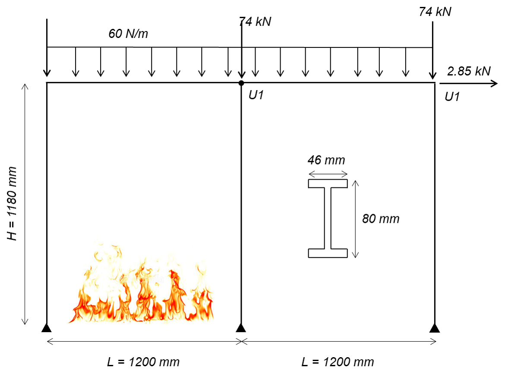
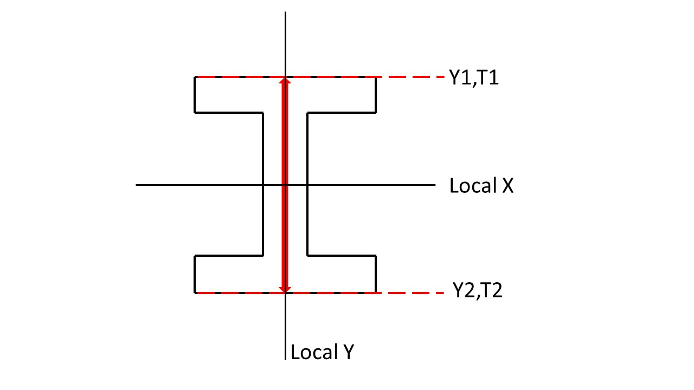
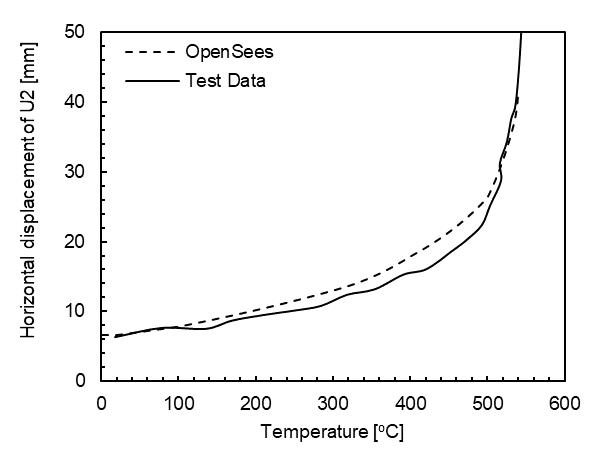

Example 5
=========

A two-bay frame that measures 2.4 m x 1.18 m with a 60 N/m distributed load and column point loads is subjected to a fire in one of the bays. The heated bay is heated linearly to a target temperature of 550 :sup:`o` C.
^^^^^^^^^^^^^^^^^^^^^^^^^^^^^^^^^^^^^^^^^^^^^^^^^^^^^^^^^^^^^^^^^^^^^^^^^^^^^^^^^^^^^^^^^^^^^^^^^^^^^^^^^^^^^^^^^^^^^^^^^^^^^^^^^^^^^^^^^^^^^^^^^^^^^^^^^^^^^^^^^^^^^^^^^^^^^^^^^^^^^^^^^^^^^^^^^^^^^^^^^^^^^^^^^^^^^^^^^^^^^^

**Elevation of two-bay frame**

Example overview: This example will combine the modeling methodologies
developed through the other examples and apply them to a two-bay frame
with a fire in one of the bays. Recorded data from the OpenSees analysis
will be compared with the experimental test data [2]. Heat transfer
analyses were performed using a commercially available finite element
program to calculate the temperature distribution through the cross
sections when the members are exposed to a linear gas time-temperature
curve. Horizontal displacement of upper corners, U1 & U2 are recorded.

Download Example 5   files:

:download:`Example5.tcl <files/Example5.tcl>`.

:download:`WsectionThermal.tcl <files/WsectionThermal.tcl>`.

:download:`Example 5 Outputs <files/Example5_OUTPUT.zip>`. 

Objectives
----------

Example 5 Objectives: 1. Create a two-bay frame in OpenSees using
displacement-based elements with tempurature-dependent material
properties, 2. Implementing user-defined time-tempurature histories for
the elements calculated through heat transfer analysis, and 3. Compare
recorded parameters from the OpenSees model to experimental testing data
[2] to benchmark modeling methodologies.

**Experimental Test Overview**

A two-bay frame was tested by researchers [2]. Each bay size was 1.2 m in width and 1.18 m in height. Point loads were applied at the beam-column joints in the lateral and gravity directions in addition to a uniformly distributed load applied to the beams. The columns and beam of one of the bays was heated using electrical heaters that surrounded each of the members, therefore, uniformly heating each member (there was no thermal gradient through the cross section). The temperature was increased until failure.

Material
--------

The uniaxialMaterial Steel01Thermal includes temperature-dependent steel thermal and mechanical properties per Eurocode 3 [1]. More details of Steel01 can be found at: `Steel01 Material <https://opensees.berkeley.edu/wiki/index.php/Steel01_Material>`__

Es = 210 GPa (Young’s modulus of elasticity at ambient temperatures)

Fy = 355 MPa (Yield strength of material at ambient temperatures)

b = 0.001 (Strain-Hardening Ratio)

.. function:: set matTag 1;

.. function:: uniaxialMaterial Steel01Thermal $matTag $Fy $Es $b;

Transformation
--------------

Because the beams and columns in this example experience bending, 2nd
order bending effects were considered using the Corotational geometric
transformation.

.. function:: geomTransf Corotational $transftag;

Learn more about geometric transofrmations: `Geometric
Transformation <http://opensees.berkeley.edu/wiki/index.php/Geometric_Transformation_Command>`__

Section
-------

This example uses an external .tcl script to define the cross section. This script uses fibersecThermal to procure a fibered W-shape section with a section tag to be used while defining elements. Eight fibers are used throughout the web and four fibers within each flange. 

In previous versions of OpenSees, a default value for torsional stiffness was used (GJ). In versions 3.1.0 and newer fiber sections require a value for torsional stiffness. This is a 2D example with negligible torsion, however a value is required. The Young's Modulus is used for convenience. 
Wsection dimensions are (units are meters):

    set secTag 1;   # section Tag
	set d 0.08; 	# depth of beam
	set bf 0.046; 	# flange width
	set tf 0.0052; 	# flange thickness
	set tw 0.0038; 	# web thickness

* secTag - section tag
* matTag - material tag
* d  = nominal depth
* tw = web thickness
* bf = flange width
* tf = flange thickness
* nfdw = number of fibers along web depth 
* nftw = number of fibers along web thickness
* nfbf = number of fibers along flange width
* nftf = number of fibers along flange thickness 
* Gj = torsional stiffness

Wsection secTag matTag d bf tf tw nfdw nftw nfbf nftf Gj 

.. function:: Wsection 1 1 $d $bf $tf $tw 8 1 1 4 $Es

.. figure:: figures/Wsection_FiberSection.png
	:align: center
	:width: 500px
	:figclass: align-center

**Cross section of W-shape showing fibers in the flanges and the web**

Element
-------

dispBeamColumnThermal elements are used because temperature-dependent thermal and mechanical steel properties can be applied to these elements. Any portion of the structure that is being heated must use elements that are compatible with uniaxialMaterial Steel01Thermal. At the time this model was developed, dispBeamColumnThermal was the only element type that could have tempurature-dependent thermal and mechanical properties applied to them.

dispBeamColumnThermal $eleTag $iNode $jNode $numIntgrPts $secTag $TransfTag;

.. function:: element dispBeamColumnThermal 1 1 2 5 $secTag $transftag;

Each column and beam element is created using ten displacement-based elements with 5 iteration points in each element. 

Output Recorders
----------------

$dataDir is defined at the beginning of the model, this creates a folder within your working directory where output files will be saved. 

.. function:: set dataDir Examples/EXAMPLE5_OUTPUT;				

.. function:: file mkdir $dataDir;

displacements of node U1 (node 11, top left), DOF 1 (Horizontal Displacement)

.. function:: recorder Node -file $dataDir/Midspan_BeamDisp.out -time -node 11 -dof 1 disp;

displacements of node U2 (node 22, top-middle), DOF 1 (Horizontal Displacement)

.. function:: recorder Node -file $dataDir/Midspan_BeamDisp.out -time -node 22 -dof 1 disp;

Reaction forces at support nodes (1, 12 & 23):

.. function:: recorder Node -file $dataDir/RXNS.out -time -node 1 12 23 -dof 2 3 reaction;

Learn more about the Recorder Command: `Recorder
Command <http://opensees.berkeley.edu/wiki/index.php/Recorder_Command>`__

Thermal Loading
---------------

In this model, the beams and columns of the left bay are heated by
increasing the temperature linearly from ambient temperature until
failure. The right bay remains at ambient tempurature.

Therefore, we set the maximum temperature as follows:

T = Max Temperature [ :sup:`o` C] 

.. function:: set T 550;

In OpenSees, the user can define 2 or 9 temperature data points
through the cross section. In a 2D analysis framework, like this
example, temperature data point locations are specified on the y-axis of
the local coordinate system (as shown in the figure above). And are
linearly interpolated between the defined points. Because this example
is using a uniformly heated beam, two temperature points on each extreme
fiber on the y-axis will be chosen. The beam has a depth of $d, therefore, Y1 = $d/2 & Y2 = -$d/2 the top and bottom fibers
respectively.

Top fiber of beam 

.. function:: set Y1 [expr $d/2];

Bottom fiber of beam 

.. function:: set Y2 [expr -$d/2];

**Location of defined input temperature locations on the member cross section (both beam and columns)**

The bottom extreme fiber temperature must be defined first. The target
maximum temperature for each extreme fiber is set to 550 :sup:`o` C and will be
increased linearly and incrementally as the time step continues in the
analysis. An external temperature data set can could also be used for
more complex temperature loading.

Using a for-loop and a plain linear loading pattern, elements 1-20 &
31-40 will be subjected to tempurature, $T. These elements define the
heated bay.

.. function:: pattern Plain 2 Linear {
.. function:: for {set i 1} {$i <= 20} {incr i} { eleLoad -ele $i -type -beamThermal $T $Y2 $T $Y1;}
.. function:: for {set i 31} {$i <= 40} {incr i} {eleLoad -ele $i -type -beamThermal $T $Y2 $T $Y1;}};

Thermal Analysis
----------------

Thermal loading is applied in 1000 steps, with a load factor of 0.001.
Each step is a 0.001 increment of the maximum temperature specified in
the thermal loading step: $T. The analysis is a static analysis and the contraints of the beam are plain. 1000 increments was also used during thermal analysis to allow for easy correlation between the input temperatures and the recorded output. Each step is an 0.001 increment of the maximum temperature specified in the thermal loading step: `\ T.

A variety of load factors were examined and the solution converged when
a load factor of 0.001 was used. OpenSees is sensitive to the load
factor, therefore, it is important to ensure that benchmarking examples
are performed to determine the proper load factor to use in structural
fire engineering analyses.

.. function:: set Nstep 1000

.. function:: set Factor [expr 1.0/$Nstep];

.. function:: integrator LoadControl $Factor;

.. function:: analyze $Nstep;

Output Plots
------------

After the model has completed running, the results will be horizontal
displacments of the recorded node. Since the temperature was linearly
ramped up from ambient to 550 :sup:`o` C, the user can develop a temperature
history that matches every increment of the model. The displacements are
benchmarked against test data [2] as shown in the figure below.

**Node U1 horizontal displacement versus temperature compared with the testing data**

.. figure:: figures/Example5_U1.png
	:align: center
	:width: 500px
	:figclass: align-center

**Node U2 horizontal displacement versus temperature compared with the testing data**

Sources
-------

[1] European Committee for Standardization (CEN). (2005). Eurocode 3:
Design of Steel Structures, Part 1.2: General Rules - Structural Fire
Design.

[2] Rubert A, Schaumann P. (1986). “Structural steel and plane frame
assemblies under fire action.” Fire Safety Journal, vol. 10, pp.173–184.

