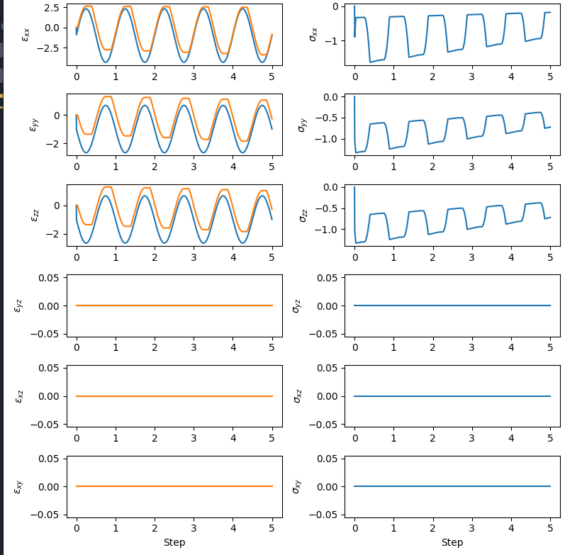

.. _ASDPlasticMaterial:

ASDPlasticMaterial
^^^^^^^^^^^^^^^^^^

| This command is used to construct an ``ASDPlasticMaterial`` material object. ``ASDPlasticMaterial`` implements a large family of constitutive models based on the classical theory of elastoplasticity. Users build new constitutive models by selecting the yield function, plastic-flow direction, elasticity law, and hardening models for the internal variables from several possible options for each component. 

To create a new model, specify the Yield Function type (``$YieldFunctionType``), Plastic Flow type (``$PlasticFlowType``), and Elasticity type (``$ElasticityType``). All internal variables and model parameters are set to zero unless specified by the user, which might or not make sense depending on context, and this initialization is printed out to the screen. 

After setting the ``$YieldFunctionType``, ``$PlasticFlowType`` and ``$ElasticityType``, you can give initial values to internal variables within the ``Begin_Internal_Variables`` ... ``End_Internal_Variables`` block. Then, the ``Begin_Model_Parameters`` ... ``End_Model_Parameters`` block is used to provide model parameter values (these can be changed during the analysis with the ``setParameter`` command as expected). Finally, model integration options are set within the ``Begin_Integration_Options`` ... ``End_Integration_Options`` code block. Specification blocks can occur in any order or ommitted. 

The complete command looks as follows::

   nDMaterial ASDPlasticMaterial $tag 
      $YieldFunctionType 
      $PlasticFlowType $
      ElasticityType 
      $IV_TYPE 
      Begin_Internal_Variables 
         $InternalVariable1 $$double_value1 $$double_value2... $$double_valueN1  
         $InternalVariable2 $$double_value1 $$double_value2... $$double_valueN2 
         #... (depends on how many internal variables the particular selected model has) 
      End_Internal_Variables 
      Begin_Model_Parameters 
         $ModelParameters1 $$double_value1 
         $ModelParameters2 $$double_value2 
         #... (depends on how many model parameters the particular selected model has) 
      End_Model_Parameters 
      Begin_Integration_Options 
         f_relative_tol $double_value 
         stress_relative_tol $double_value 
         n_max_iterations $int_value 
         return_to_yield_surface (0 or 1) 
         method (string) : Forward_Euler | Runge_Kutta_45_Error_Control 
      End_Integration_Options

Explanation

.. csv-table:: 
   :header: "Argument", "Type", "Description"
   :widths: 10, 10, 40

   $tag, |integer|, "Unique tag identifying this material."
   $YieldFunctionType, |string|, "Mandatory. Yield function to be used -> :ref:`YieldFunctionType`"
   $PlasticFlowType, |string|, "Mandatory. Plastic flow direction to be used -> :ref:`PlasticFlowType`"
   $ElasticityType, |string|, "Mandatory. Elastic model to be used -> :ref:`ElasticityType`"
   $IV_TYPE, |string|, "Mandatory. Hardening model for internal variables. Admitted types depend on YF, PF, and EL chosen.  "
   Begin_Internal_Variables, |string|, "Optional. Marks the beginning of the code block to set the internal variables. If ommitted, all internal variables are initialized to zero. You can specify as many of the following variables as wanted. Ommitted variables are initialized to zero. Number and name of variables that can be set is model dependent (once YF, PF, and EL are specified)"
   $InternalVariable1, |list of name/value pairs|, "Initial value of internal variable1. Dimension depends on internal variable type.  "
   $InternalVariable2, |list of name/value pairs|, "Initial value of internal variable2.  "
   "--", "--", "... (input as many as model supports)"
   End_Internal_Variables, |string|, "Mandatory if block started. Marks the end of the code block to set the internal variables"
   Begin_Model_Parameters, |string|, "Optional. Marks the beginning of the code block to set the model parameters"
   $ModelParameters, |list of name/value pairs|, "Values for parameters of the models to be used. This depends on the particular choices of ``$YieldFunctionType``, ``$PlasticFlowType``, ``$ElasticityType``, and ``$IV_type``. "
   "--", "--", "... (input as many as model supports)"
   End_Model_Parameters, |string|, "Mandatory if block started. Marks the beginning of the code block to set the model parameters"
   Begin_Integration_Options, |string|, "Optional. Marks the beginning of the code block to set the integration options. You can set any ammount "
   End_Integration_Options, |string|, "Mandatory if block started. Marks the beginning of the code block to set the model parameters"

|  The :ref:`YieldFunctionType`, :ref:`PlasticFlowType`, and :ref:`ElasticityType` have different variables and parameters to be set.

.. admonition:: Specification of internal variables (``$IV_TYPE``)

	All internal variables are specified in a single string with no spaces. Internal variables specifications are separated with a colon ``:``. After the name of the internal variable, the name of the hardening function must be provided in parenthesis. The specification string must end in a colon. The syntax is, thus:

	.. code-block::

		InternalVariable1(HardeningFunction1):InternalVariable2(HardeningFunction2):

	Internal variables are required for the yield function and plastic flow direction (see speficic components for details), and all internal variables must be provided with their hardening function otherwise instantiation fails. 

.. admonition:: Note

    Any internal variable or parameter that is not specified is set to zero by default.  

.. toctree::
   :caption: Arguments detailed description
   :maxdepth: 2

   ./ASDPlasticMaterial/YieldFunctions
   ./ASDPlasticMaterial/PlasticFlowType
   ./ASDPlasticMaterial/ElasticityType
   ./ASDPlasticMaterial/HardeningFunctions

.. _ASDPlasticTheory:

ASDPlasticMaterial Theory
""""""""""""""""""""""""""

The ``ASDPlasticMaterial`` internally uses Voigt notation to represent tensors. 

.. math::
   \newcommand{\vec}[1]{\boldsymbol{#1}}
   \newcommand{\state}{\sigma, \left\lbrace iv \right\rbrace, \left\lbrace param \right\rbrace }
   \newcommand{\matorvec}[2]{
    \left[\begin{array}{#1}
        #2
    \end{array}\right]
    }
   \vec{\epsilon} = \matorvec{c}{\epsilon_{11} \\ \epsilon_{22} \\ \epsilon_{33} \\ \gamma_{12} \\ \gamma_{23} \\ \gamma_{13} }
   \vec{\sigma} = \matorvec{c}{\sigma_{11} \\ \sigma_{22} \\ \sigma_{22} \\ \tau_{12} \\ \tau_{23} \\ \tau_{13} }

Where :math:`\gamma_{ij} = 2 \epsilon_{ij}`. 

The material recieves the total (trial) strain :math:`\vec{\epsilon}^{\text{trial}}` from the finite element that contains it. From this, the trial strain increment is computed by subtracting the previously committed total strain:

.. math::
    \Delta \vec{\epsilon}^{\text{trial}} = \vec{\epsilon}^{\text{trial}} - \vec{\epsilon}^{\text{commit}}

The elastic trial stress increment is computed using the elasticity law (depending on choice of ``$ElasticityType``), which may depend on stress (:math:`\sigma`) internal variables (represented as the list of internal variables of the model :math:`\left\lbrace iv \right\rbrace`) and parameters (represented as the list of parameters of the model :math:`\left\lbrace param \right\rbrace`):

.. math::
    \Delta \vec{\sigma}^{\text{trial}} = \vec{E}^{\text{current}}(\state) \Delta \vec{\epsilon}^{\text{trial}}

:math:`\vec{E}^{\text{current}}(\state )` is the 6x6 elastic tangent operator. The trial strain is computed as :math:`\mathbf{\sigma}^{\text{trial}} = \mathbf{\sigma}^{\text{commit}} + \Delta \sigma^{\text{trial}}`. With this predictor, the yield-function (:math:`f(\state )`) is evaluated to see whether the stress point falls inside or outside the yield surface (depending on choice of ``$YieldFunctionType``). If it falls inside, then the step is elastic and the integration stops. Otherwise, we need to do some plasticity for which the explicit Forward-Euler version will be used to present all components. 

The exact intersection point with the yield function is computed iteratively with a robust Brent algorithm. The trial stress increment is advanced to the yield-surface intersection point and plastic integration continues. Starting from :math:`\Delta \epsilon^{\text{trial}}` corresponding to a :math:`\Delta \sigma^{\text{trial}}`  on the yield surface, the strain increment is separated into elastic and plastic components (the "trial" qualifier es removed and implied in what follows):

.. math::
    \Delta \vec{\epsilon}   = \Delta \epsilon^{el} + \Delta \epsilon^{pl}

The plastic increment comes from:

.. math::
    \Delta \vec{\epsilon}^{pl}   = \Delta \lambda \cdot \mathbf{m} (\state)

Where the vector :math:`\mathbf{m} (\state)` is the plastic flow direction defined with the ``$PlasticFlowType`` option and :math:`\Delta \lambda\` is the plastic multiplier defined as:

.. math::
    \Delta \lambda\ = \dfrac{ \vec{n}^T E \Delta \vec{\epsilon} }{ \vec{n}^T E \Delta \vec{m} - H }

Where :math:`\mathbf{n} (\state)` is the outward normal to the yield surface, and :math:`H` is the hardening term due to internal variable evolution. For example, if the model has two internal variables :math:`s` a scalar internal variable and  :math:`\vec{T}` a tensor internal variable (e.g. :math:`\left\lbrace iv \right\rbrace = \left\lbrace s,\, \vec{T} \right\rbrace`), the hardening term is computed with:

.. math::
    H = \left.\dfrac{\partial f}{\partial s}\right\Vert_{(\state)} h_s(\state) + \left.\dfrac{\partial f}{\partial \vec{T}}\right\Vert_{(\state)} h_s(\state) \cdot \vec{h}_T(\state) 

Here the hardening functions of the scalar internal varialbe (a scalar) :math:`h_s(\state)` and the tensor internal variable :math:`\vec{h}_T(\state)` are introduced. These are specified using the ``$IV_type`` option. 

Finally, the trial stress increment considering plasticity is computed using:

.. math::
    \Delta \vec{\sigma}^{\text{trial}} = \vec{E}(\state) \cdot \Delta \vec{\epsilon}^{pl}

And the new trial state of the material is computed:

.. math::
    \vec{\sigma}^{\text{trial}} = \vec{\sigma}^{\text{commit}} + \Delta \vec{\sigma}^{\text{trial}}

    s^{\text{trial}} = s^{\text{commit}} + \Delta \lambda  h_s(\state)

    \vec{T}^{\text{trial}} = \vec{T}^{\text{commit}} + \Delta \lambda  \vec{h}_T(\state)

After this, an aditional algorithm can be called to return the stress point to the yield surface (recommended) as well as specific provisions in case integration is ocurring near an apex of the yield surface. 

.. _`Integration Options`:
Integration Options
"""""""""""""""""""

.. csv-table:: 
   :header: "Parameter", "Type", "Description"
   :widths: 10, 10, 40

   $f_relative_tol, |double|, "Relative tolerance to evaluate the yield function crossing."
   $stress_relative_tol, |double|, "Tolerance for the convergece of the integration algorithm."
   $n_max_iterations, |int|, "Maximum number of iterations for constitutive integration."
   $return_to_yield_surface, |0 or 1|, "Whether to apply a return to yield surface algorithm after integration convergence."
   $method, |string|, "Constitutive integration method. Options: ``Forward_Euler``, ``Runge_Kutta_45_Error_Control``"

The default integration method is **Runge_Kutta_45_Error_Control** that uses the classical RK45 ODE integration algorithm employing a 4-th order prediction of the stress increment together with a 5-order prediction to estimate the integration error. In this scheme the strain increment provided by the element to the Gauss point is sub-divided into sub-increments, a process which is automated such that the provided **$stress_relative_tol** is met. This method is provided as a robust standard method which is applicable across all possible combinations of components, although there are possibly better approaches for specific cases which might become available in the future. 

The different parameters are activated depending on the integration algorithm selected. The *Forward_Euler* algorithm only uses the **$return_to_yield_surface** parameter, while **Runge_Kutta_45_Error_Control** uses the rest. 

The **$f_relative_tol** parameter comes into play when the yield surface is being crossed, that is, when the previous (committed) stress is within the yield surface and the elastic prediction of the stress increment brings the stress state beyond the yield surface. In that case, an elastic increment occurs until the yield surface is touched which requires iterations with the Brent root finding algorithm. This is used by both currently available integration methods. 

.. _`Other Features`:

Other Features
""""""""""""""""""

.. admonition:: General parameters

    These parameters are defined for all models. 

    .. csv-table:: 
       :header: "Parameter", "Type", "Description"
       :widths: 10, 10, 40

       ``MassDensity``, scalar, Defines the material mass density :math:`\rho`. 
       ``InitialP0``, scalar, Defines the initial mean pressure at which material constants will be evaluated at the first step.  

.. admonition:: Responses  (`setResponse` and `getResponse` behavior)

    * *Valid queries for recorders*. `stresses` for stress, `strains` for strains, and `pstrains` for plastic strains. 
    * You can also request any and all internal variables by their specific name as an output. 

.. admonition:: `setParameter` behavior 

   * Not yet provided. 

Implementation details
""""""""""""""""""""""

``ASDPlasticMaterial`` is implemented using C++ template metaprogramming, with a header-only design and using the "eigen" C++ library for high-performance array operations. This design provides modularity and the ability to mix and match components to create new models, while also providing high-performance because runtime polymorphism is avoided. 

Example
"""""""

The following example defines an instance of ``ASDPlasticMaterial`` with a Drucker-Prager yield function, a constant dilatancy plastic-flow direction, elastic-isotropic elasticity law and linear hardening for both internal variables. 

.. admonition:: TCL code  

    .. code-block:: tcl

        nDMaterial ASDPlasticMaterial 1 \
            DruckerPrager_YF \
            ConstantDilatancy_PF \
            LinearIsotropic3D_EL \
            BackStress(TensorLinearHardeningFunction):VonMisesRadius(ScalarLinearHardeningFunction): \
            Begin_Internal_Variables \
                VonMisesRadius 1. \
                BackStress 0. 0. 0. 0. 0. 0. \
            End_Internal_Variables \
            Begin_Model_Parameters \
                YoungsModulus 1. \
                PoissonsRatio 0. \
                TensorLinearHardeningParameter 0. \
                ScalarLinearHardeningParameter 0. \
                Dilatancy 0.02 \
                MassDensity 2000. \
            End_Model_Parameters 
        

.. admonition:: Python code  

    .. code-block:: python

        ops.nDMaterial("ASDPlasticMaterial", 1, 
        "DruckerPrager_YF",
        "ConstantDilatancy_PF",
        "LinearIsotropic3D_EL",
        "BackStress(TensorLinearHardeningFunction):VonMisesRadius(ScalarLinearHardeningFunction):",
        "Begin_Internal_Variables",
            "VonMisesRadius", 1.,
            "BackStress", 0., 0., 0., 0., 0., 0.,
        "End_Internal_Variables",
        "Begin_Model_Parameters",
            "YoungsModulus", 1.,
            "PoissonsRatio", 0.,
            "TensorLinearHardeningParameter", 0.,
            "ScalarLinearHardeningParameter", 0.,
            "Dilatancy", 0.02,
            "MassDensity", 2000.,
        "End_Model_Parameters",
        )

If you subject this material to strain-controlled cyclic loading you get the following response.

  (Left) strain response with input strain history in blue and plastic strains in orange. (Right) stress response. 

Plotted in principal-stress space you can see the material soften as it dilates. 

.. figure:: ASDPlasticMaterial/example1_fig1.png
  :width: 50%

  Response of the material in principal-stress space with Drucker-Prager surface for reference. 

Code Developed by: **José A. Abell** (UANDES, Chile and ASDEA), **Guido Camata** and **Massimo Petracca**  (ASDEA Software, Italy).
