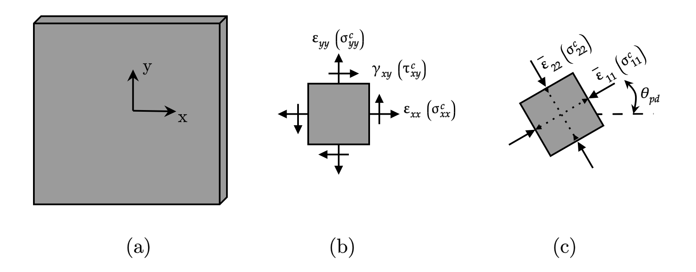

.. _OrthotropicRAConcrete:

OrthotropicRAConcrete Material
^^^^^^^^^^^^^^^^^^^^^^^^^^^^

This command is used to construct an OrthotropicRotatingAngleConcrete material object. It is the abstract representation of an orthotropic concrete layer (plane stress) 2D material with a rotating angle and tangent formulation for cycling or reversed loading with damage. In this formulation, the constitutive model of concrete in each of the principal strain directions (:math:`\theta_{pd}`) can be represented by a uniaxial concrete model (based on the work of Rojas et al., 2016).

	
	OrthotropicRAConcrete Material: (a) Local coordinate system of a concrete layer; (b) Concrete behavior in the local coordinate system; (c) Uniaxial concrete behavior along principal strain directions.

.. admonition:: Command
   
   nDMaterial OrthotropicRAConcrete $matTag $conc $ecr $ec $rho <-damageCte1 $DamageCte1> <-damageCte2 $DamageCte2>

.. csv-table:: 
   :header: "Parameter", "Type", "Description"
   :widths: 10, 10, 40

   $matTag, integer, unique tag identifyieng this material
   $conc, integer, tag of unixial simulating concrete
   $ecr, float, strain at tension cracking of the concrete
   $ec, float, strain at the compression strength of the concrete
   $rho, float, density
   $DamageCte1, float, damage constant (optional: default = 0.14)
   $DamageCte2, float, damage constant (optional: default = 0.6)

The following recorders are available with the OrthotropicRAConcrete material.

.. csv-table:: 
   :header: "Recorder", "Description"
   :widths: 20, 40

   concrete_layer_stress, "in-plane panel concrete stresses :math:`\sigma^{c}_{xx}`, :math:`\sigma^{c}_{yy}`, :math:`\tau^{c}_{xy}`"
   strain_stress_concrete1, "Uniaxial strain and stress of concrete strut 1 :math:`\bar{\varepsilon}_{11}`, :math:`\sigma^{c}_{11}`"
   strain_stress_concrete2, "Uniaxial strain and stress of concrete strut 2 :math:`\bar{\varepsilon}_{22}`, :math:`\sigma^{c}_{22}`"

.. admonition:: Notes
   
   | 1. The implementation of this material includes the effect of damage due to cyclic or reversal loading. Only damage in compression is considered. The equation used for the calculation of this effect is as follows (Palermo and Vecchio, 2003):
   
   .. math::

	  \beta_{d} = \frac{1}{1+\alpha_{1}\left(\frac{\epsilon_{rec}}{\epsilon_{c_{0}}}\right)^{\alpha_{2}}}

   where :math:`\epsilon_{c_{0}}` is the strain at the peak resistant stress of the concrete in compression, :math:`\alpha_{1}` represents the parameter ``$DamageCte1``, :math:`\alpha_{2}` represents the parameter ``$DamageCte2`` and :math:`\epsilon_{rec}` is defined as
   
   .. math::

	  \epsilon_{rec} = \epsilon_{max}-\epsilon_{min}

   where :math:`\epsilon_{max}` is the maximum strain recorded during cyclic loading and :math:`\epsilon_{min}` is the minimum strain.
   
   | 2. If this effect is not to be considered, damage constants can be set equal to **0.0**.

.. admonition:: Examples

   The following example constructs an OrthotropicRotatingAngleConcrete material with tag **2**, composed of a uniaxial concrete material (e.g. `Concrete02 <https://opensees.berkeley.edu/wiki/index.php/Concrete02_Material_--_Linear_Tension_Softening>`_, `Concrete06 <https://opensees.berkeley.edu/wiki/index.php/Concrete06_Material>`_) of tag **1**, a strain at tension cracking of **0.00008** and a strain at the compression strength of **-0.002** for a density of **0.0**.

   1. **Tcl Code**

   .. code-block:: tcl
	  
	  nDMaterial OrthotropicRAConcrete 2 1 0.00008 -0.002 0.0
		
   2. **Python Code**

   .. code-block:: python

      nDMaterial('OrthotropicRAConcrete', 2, 1, 0.00008, -0.002, 0.0)	  
   

   
**REFERENCES:**

#. Rojas, F., Anderson, J. C., Massone, L. M. (2016). A nonlinear quadrilateral layered membrane element with drilling degrees of freedom for the modeling of reinforced concrete walls. Engineering Structures, 124, 521-538. (`link <https://www.sciencedirect.com/science/article/pii/S0141029616302954>`_).
#. Palermo, D., Vecchio, F.J. (2003). Compression field modeling of reinforced concrete subjected to reversed loading: formulation.  ACI  Structural  Journal, 100(5), 616–625. (`link <https://www.scopus.com/record/display.uri?eid=2-s2.0-0141723356&origin=inward>`_)

**Code Developed by:** F. Rojas (University of Chile), M.J. Núñez (University of Chile).

