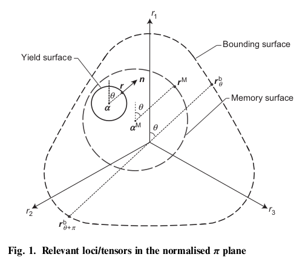
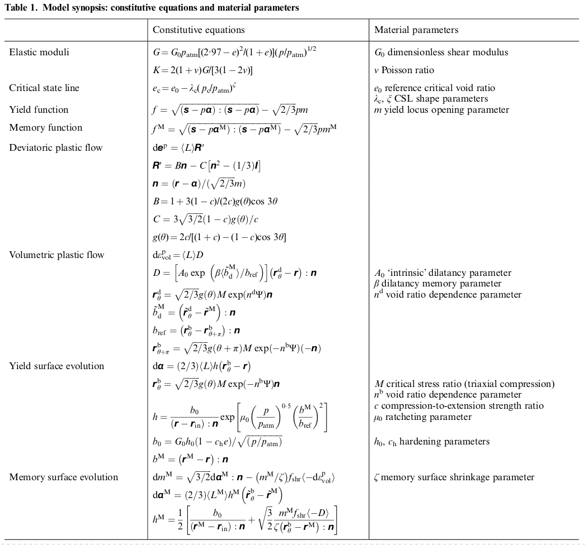

.. _SAniSandMS:

SAniSandMS Material
^^^^^^^^^^^^^^^^^^^

Code Developed by: Haoyuan Liu (TUDelft), `José A. Abell <http://www.joseabell.com>`_ (UANDES, Chile), and Federico Pisanò (TU Delft)

This command is used to construct a multi-dimensional [SAniSandMS]_ material, which is an extension of the Manzari-Dafalias (SAniSand) model to account for ratcheting effects using the memory-surface (MS) concept. This allows capturing the ratcheting effects in sands that occur in high-cyclic loading in the presence of a static stress field or in the case of assymetric loading. 

.. admonition:: function

   nDMaterial SAniSandMS  $matTag $G0 $nu $e_init $Mc $c $lambda_c $e0 $ksi $P_atm $m $h0 $ch $nb $A0 $nd $zeta $mu0 $beta $Den $fabric_flag $flow_flag $intScheme $TanType $JacoType $TolF $TolR

.. csv-table:: 
   :header: "Argument", "Type", "Description"
   :widths: 10, 10, 40

   $matTag, |integer|,	   unique tag identifying material
   $G0, |float|, 	   dimensionless shear modulus constant
   $nu, |float|, 	   Poisson ratio
   $e_init, |float|, 	   initial void ratio
   $Mc, |float|, 	   critical state stress ratio
   $c, |float|, 	   ratio of critical state stress ratio in extension and compression
   $lambda_c, |float|, critical state line constant
   $e0, |float|, reference critical void ratio at p = 0
   $ksi, |float|, critical state line constant
   $P_atm, |float|, atmospheric pressure
   $m, |float|, yield locus opening parameter (radius of yield surface in stress ratio space)
   $h0, |float|, hardening parameter
   $ch, |float|, hardening parameter
   $nb, |float|, bounding surface void ratio dependence parameter  $nb ≥ 0
   $A0, |float|, intrinsic dilatancy parameter
   $nd, |float|, dilatancy surface parameter $nd ≥ 0
   $zeta , |float|, memory surface shrinkage parameter
   $mu0 , |float|, ratcheting parameter
   $beta , |float|, dilatancy memory parameter
   $Den, |float|, mass density of the material
   $fabric_flag , |integer|, (deprecated)
   $flow_flag , |integer|, (deprecated)
   $intScheme , |integer|, constitutive integration method (1: modified Euler | 3: Runge-Kutta 4th order with error control (recommended))
   $TanType , |integer|, type of tangent stiffness to report (0: elastic stiffness | 1: continuum elastoplastic stiffness | 2: consistent elastoplastic stiffness)
   $JacoType , |integer|, placeholder (not used in explicit methods)
   $TolF , |float|, tolerance for the yield surface
   $TolR, |float|, placeholder (not used in explicit methods)

**Citation information. ** If you use SAniSandMS in your published research work, please cite [SAniSandMS]_ and also inform (jaabell *at* miuandes *dot* cl, to update the list of published artciles and works that use the code).

Please report bugs as an issue on the main OpenSees repositoy and tag ``@jaabell`` 

`<https://github.com/jaabell>`_

`<http://www.joseabell.com>`_

.. note::

   The material formulations for the SAniSandMS object are "ThreeDimensional" and "PlaneStrain"

.. note::
   Valid Element Recorder queries are:
   
   *  ``stress`` returns stress tensor 
   *  ``strain``returns strain tensor 
   *  ``alpha``  for :math:`\mathbf{\alpha}`, the back-stress ratio tensor for the yield surface
   *  ``alphaM``  for :math:`\mathbf{\alpha^M}`, the back-stress ratio tensor for the memory surface
   *  ``alpha_in`` for :math:`\mathbf{\alpha_{in}}`
   *  ``MM`` size of memory surface
   *  ``estrain`` elastic strain tensor

   .. code:: tcl

    recorder Element -eleRange 1 $numElem -time -file stress.out  stress

    #. Elastic or Elastoplastic response could be enforced by
       Elastic:   updateMaterialStage -material $matTag -stage 0
       Elastoplastic:	updateMaterialStage -material $matTag -stage 1

.. admonition:: Example

   This example, provides an assymetric drained triaxial test of the constitutive model to show the effect of ratcheting. First the sample is compressed isotropically to 200KPa, then a cyclic deviator stress is applied. 

   .. literalinclude:: SAniSandMS.tcl
      :language: tcl

   The script produces an output that can be visualized as follows. 

   .. figure:: SAniSandMS-fig1.png
      :align: center
      :width: 600px
      :figclass: align-center

   .. figure:: SAniSandMS-fig2.png
      :align: center
      :width: 600px
      :figclass: align-center

   .. figure:: SAniSandMS-fig3.png
      :align: center
      :width: 600px
      :figclass: align-center

List of works using SAniSandMS

.. [SAniSandMS] Haoyuan Liu, Andrea Diambra, José Antonio Abell, Federico Pisanò. Memory-enhanced plasticity modelling of sand behaviour under undrained cyclic loading. Journal of Geotechnical and Geoenvironmental Engineering, Vol. 146, Issue 11 (November 2020)

Haoyuan Liu, Evangelos Kementzetzidis, José Antonio Abell, Federico Pisanò From cyclic sand ratcheting to tilt accumulation in offshore monopiles: 3D FE modelling using SANISAND-MS. Géotechnique. Online March 8, 2021 (Ahead of print)