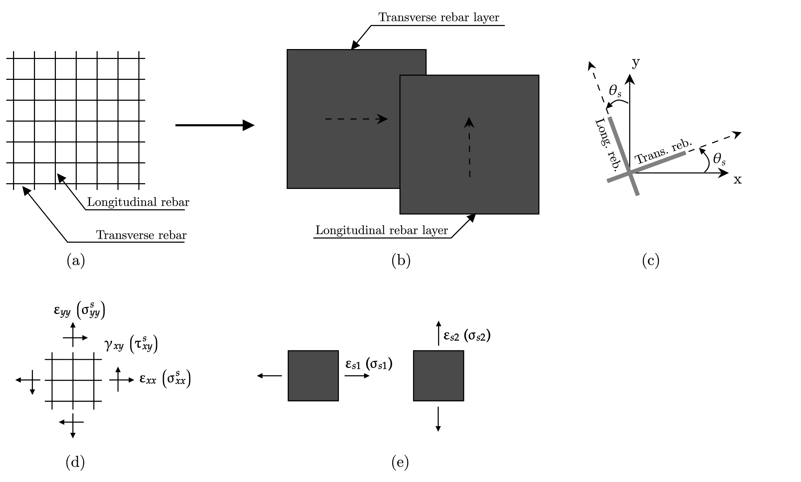

.. _SmearedSteelDoubleLayer:

SmearedSteelDoubleLayer Material
^^^^^^^^^^^^^^^^^^^^^^^^^^^^

This command is used to construct a SmearedSteelDoubleLayer material object. It is the abstract representation of a double perpendicular smeared steel layer (plane stress) 2D material with a tangent formulation. Each layer works only in the direction of the bars, so a uniaxial constitutive model is used to represent the behavior of reinforcing steel bars in each direction. The angle that defines the orientation
of the steel layers with respect to the local coordinate system **x-y** is denoted as :math:`\theta_{s}`, represented by the argument ``$OrientationEmbeddedSteel`` (based on the work of Rojas et al., 2016).

	
	SmearedSteelDoubleLayer Material: (a) Distributed reinforcement; (b) Rebar layers; (c) Steel layers orientation; (d) Steel behavior in the local coordinate system; (e) Uniaxial steel behavior.

.. admonition:: Command
   
   nDMaterial SmearedSteelDoubleLayer $matTag $s1 $s2 $ratioSteelLayer1 $ratioSteelLayer2 $OrientationEmbeddedSteel

.. csv-table:: 
   :header: "Parameter", "Type", "Description"
   :widths: 10, 10, 40

   $matTag, integer, unique tag identifyieng this material
   $s1, integer, tag of unixial simulating horizontal reinforcement
   $s2, integer, tag of unixial simulating vertical reinforcement
   $ratioSteelLayer1, float, reinforcing ratio in horizontal direction of smeared steel
   $ratioSteelLayer2, float, reinforcing ratio in vertical direction of smeared steel
   $OrientationEmbeddedSteel, float, orientation of the smeared steel layers

The following recorders are available with the SmearedSteelDoubleLayer material.

.. csv-table:: 
   :header: "Recorder", "Description"
   :widths: 20, 40

   steel_layer_stress, "in-plane panel steel stresses :math:`\sigma^{s}_{xx}`, :math:`\sigma^{s}_{yy}`, :math:`\tau^{s}_{xy}`"
   strain_stress_steel1, "Uniaxial strain and stress of steel 1 :math:`\varepsilon_{s1}`, :math:`\sigma_{s1}`"
   strain_stress_steel2, "Uniaxial strain and stress of steel 2 :math:`\varepsilon_{s2}`, :math:`\sigma_{s2}`"

.. admonition:: Notes

   | 1. The implementation of this material does not include the reductions in yield strength and strain-hardening ratio for embedded steel bars in concrete (Belarbi and Hsu, 1995).

.. admonition:: Examples

   The following example constructs a SmearedSteelDoubleLayer material with tag **2** , composed of a horizontal and vertical uniaxial steel material (e.g. `Steel02 <https://opensees.berkeley.edu/wiki/index.php/Steel02_Material_--_Giuffr%C3%A9-Menegotto-Pinto_Model_with_Isotropic_Strain_Hardening>`_, `SteelMPF <https://opensees.berkeley.edu/wiki/index.php/SteelMPF_-_Menegotto_and_Pinto_(1973)_Model_Extended_by_Filippou_et_al._(1983)>`_) of tag **1**, reinforcing ratio in horizontal and vertical direction of **1%** and an orientation of the double smeared steel layer of **0.0** radians.   

   1. **Tcl Code**

   .. code-block:: tcl
	  
	  nDMaterial SmearedSteelDoubleLayer 2 1 1 0.01 0.01 0.0;
		
   2. **Python Code**

   .. code-block:: python

      nDMaterial('SmearedSteelDoubleLayer', 2, 1, 1, 0.01, 0.01, 0.0)	  
   

   
**REFERENCES:**

#. Rojas, F., Anderson, J. C., Massone, L. M. (2016). A nonlinear quadrilateral layered membrane element with drilling degrees of freedom for the modeling of reinforced concrete walls. Engineering Structures, 124, 521-538. (`link <https://www.sciencedirect.com/science/article/pii/S0141029616302954>`_).
#. Belarbi, A., & Hsu, T. C. (1995). Constitutive  laws   of   softened   concrete   in   biaxial   tension-compression.  ACI  Structural  Journal, 92(5), 562–573. (`link <https://www.scopus.com/record/display.uri?eid=2-s2.0-0029361065&origin=inward>`_)

**Code Developed by:** F. Rojas (University of Chile), M.J. Núñez (University of Chile).

