**Non-linear Timber orthotropic material:**

**Reference**\ *: H. Eslami, L.B. Jayasinghe, D. Waldmann (2021),*

*"Nonlinear three-dimensional anisotropic material model for failure
analysis of timber",*

*Engineering Failure Analysis 130, 105764.*

**Commands:**

**Tcl Version:**

nDMaterial TimberHoffman3D $matTag $E1 $E2 $E3 $nu12 $nu13 $nu23 $G12
$G13 $G23 $fc1 $fc2 $fc3 $ft1 $ft2 $ft3 $f12 $f13 $f23 $h $sigmaE0
$Acomp $Bcomp $Gf1t $Gf2t $Gf3t $eta $Lc <$dt>

**Python Version:**

ops.nDMaterial('TimberHoffman3D', matTag, E1, E2, E3, nu12, nu13, nu23,
G12, G13, G23, fc1, fc2, fc3, ft1, ft2, ft3, f12, f13, f23, h, Gf1t,
Gf2t, Gf3t, eta)

+----------------------+-------------+------------------------------------+
| **Argument**         | **Units /   | **Description**                    |
|                      | type**      |                                    |
+======================+=============+====================================+
| **matTag**           | integer     | Unique material tag.               |
+----------------------+-------------+------------------------------------+
| **E1, E2, E3**       | Stress      | Young’s moduli in orthotropic      |
|                      |             | material directions 1, 2, and 3.   |
+----------------------+-------------+------------------------------------+
| **nu12, nu13, nu23** | —           | Independent Poisson ratios.        |
+----------------------+-------------+------------------------------------+
| **G12, G13, G23**    | stress      | Shear moduli in planes 1–2, 1–3,   |
|                      |             | and 2–3.                           |
+----------------------+-------------+------------------------------------+
| **fc1, fc2, fc3**    | stress      | Compressive strengths in           |
|                      |             | directions 1, 2, and 3.            |
+----------------------+-------------+------------------------------------+
| **ft1, ft2, ft3**    | stress      | Tensile strengths in directions 1, |
|                      |             | 2, and 3.                          |
+----------------------+-------------+------------------------------------+
| **f12, f13, f23**    | stress      | Shear strengths in planes 1–2,     |
|                      |             | 1–3, and 2–3.                      |
+----------------------+-------------+------------------------------------+
| **h**                | stress      | Linear isotropic hardening         |
|                      |             | modulus.                           |
+----------------------+-------------+------------------------------------+
| **Gf1t, Gf2t, Gf3t** | energy/area | Tensile fracture energies in       |
|                      |             | directions 1, 2, and 3.            |
+----------------------+-------------+------------------------------------+
| **eta**              | —           | Viscous regularization parameter   |
|                      |             | for damage evolution.              |
+----------------------+-------------+------------------------------------+

**Theory:**

1. **Orthotropic linear-elastic constitutive behavior:**

In the elastic range the orthotropic material stress-strain relationship
can be written in the form as:

   |image1|

   Where σ and ϵ are the applied stress and corresponding strain
   tensors, respectively. E is the orthogonal elastic matrix which is
   given as:

|image2|

Where *E\ i* represents the young’s moduli in the three orthotropic
directions, υ\ :sub:`ij` and G\ :sub:`ij` are the Poisson’s ratio and
shear moduli, respectively. Direction 1 is the direction parallel to
grain (longitudinal) and directions 2 and 3 are the radial and
tangential directions.

2. **Elastoplastic constitutive behavior:**

A constitutive relationship is adopted for timber material based on the
isotropic hardening elastoplastic model using the Hoffman yield
criterion, which is an extension of Hill’s criterion. **Hoffman yield
function** along with the yield criterion combined with isotropic
hardening is formulated as:

   |image3|

|image4|

|image5|

Where; **P** and **Q** are mapping matrices with the variables as stated
in above formulas in which the **σ\ e** is the equivalent yield stress
and **σ\ ek** is the formulation stated as below:

|image6|

In which the h is the hardening modulus and k is the hardening variable.
“\ *k*\ ” depends on the equivalent plastic strain obtained by means
iterative method (Newton-Raphson) for each load increment. However, “h”
is an input parameter of the proposed model which can be directly
obtained from the uniaxial stress–strain diagram. Depending on the
chosen value of h, perfect plasticity, slight hardening or softening can
be modelled. “h” parameter can simply be computed from:

|image7|

In which the **T\ 2** is the plastic tangent modulus in the orthotropic
2 direction. In the hardening state, each yield value will change
depending on the corresponding hardening parameter ki (i =1,2,..,9).
Thus, the parameters in the mapping vector Q change also. Isotropic
hardening is considered in this paper, because it assumes that the
initial yield surface expands uniformly without translation and
distortion as plasticity occurs. Thus, all the yield values change in
the same order. Consequently, the parameters α11, α22 and α33 in the
mapping vector Q will change depending on the hardening parameter k.

|image8|

If the stress reaches the yield condition, the elastoplastic radial
mapping algorithm is used to constrain stress point on the yield
surface. According to the theory of plasticity, the total strain
increment *Δε* can be divided into elastic component *Δε\ e* and plastic
component *Δε\ p* as:

|image9|

Where the associated flow rule was used to determine the plastic strain
as:

|image10|

In which Δλ denotes the plastic multiplier and ∂f ∂σ is the gradient
vector of the plastic potential energy function of f(σ,k) which can be
written as:

|image11|

3. **Damage Evolution:**

Anisotropic damage with non-uniform distribution of micro cracks and
voids in all directions of the timber matrix is considered. To consider
the anisotropic damage, three different damage factors must be
introduced. The reduction of the elastic stiffness matrix is simulated
here as a function of damage evolution in three orthogonal directions.
Therefore, the damaged stiffness matrix with the damage factors can be
written as:

|image12|

where d1, d2 and d3 are the damage factors defined in the longitudinal,
radial and tangential directions, respectively. The damage factor, di (i
=1,2,3), increases from 0 to 1 as damage grows from threshold value to
its ultimate value.

Since the timber has different damage evolution for tensile and
compression failures, the damage models are used to define the tensile
and compression damage evolutions. In this study, different tensile
damages in three orthogonal directions and compressive damage in only
longitudinal direction are considered as:

|image13|

In which dit, and Gfit are the tensile damage factor and fracture energy
under tension in the i-th direction of the timber, respectively. d1c is
the compression damage factor in the longitudinal direction of the
timber. Lc is the element characteristic length. Fit and F1c are the
variables and “A” and “B” are the material constants.

The stress-based continuum damage formulation with different failure
criteria in tension and compression is used in this study. It means,
damage starts to accumulate as soon as the stresses satisfy the failure
criterion. The failure criterion is described as:

|image14|

|image15|

Damage models can encounter convergence problems in static analysis. To
improve the convergence, viscous regularisation method is used to define
the model. In the viscous regularisation, the response of damaged
material is evaluated using a viscous regularised damage variable dv
which is defined as:

|image16|

where η is the viscous parameter. A small value of the viscous parameter
usually helps to improve the convergence rate of the model without
significantly influencing the results. Thus, the value of viscous
parameter is chosen to be equal to 0.0001.

**Responses/Backbones:**

**Example:
**

+-----------------+----------------+-----------------+----------------+
| **Property**    | **Value**      | **Property**    | **Value**      |
+=================+================+=================+================+
| **E1**          | 2050.8         | **E2=E3**       | 172.1          |
+-----------------+----------------+-----------------+----------------+
| **G23**         | 68             | **G12=G13**     | 145.2          |
+-----------------+----------------+-----------------+----------------+
| **ν23**         | 0.5            | **ν12=ν13**     | 0.45           |
+-----------------+----------------+-----------------+----------------+
| **fc1**         | 35             | **fc2=fc3**     | 2.5            |
+-----------------+----------------+-----------------+----------------+
| **ft1**         | 20             | **ft2=ft3**     | 0.7            |
+-----------------+----------------+-----------------+----------------+
| **f23**         | 0.5            | **f12=f13**     | 5              |
+-----------------+----------------+-----------------+----------------+
| **h**           | 1200           | **Gf1t**        | 60             |
+-----------------+----------------+-----------------+----------------+
| **Gf2t=Gf3t**   | 0.5            | **η**           | 0.0001         |
+-----------------+----------------+-----------------+----------------+

|image17|

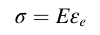
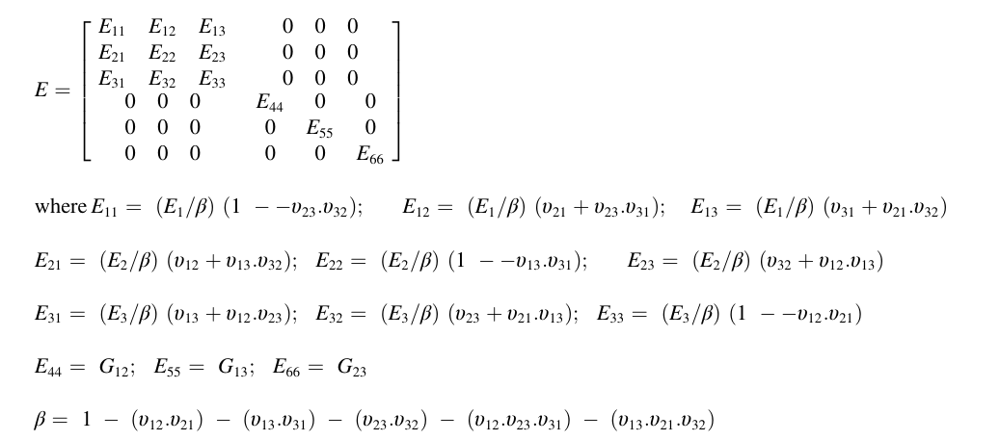
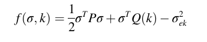
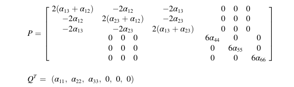
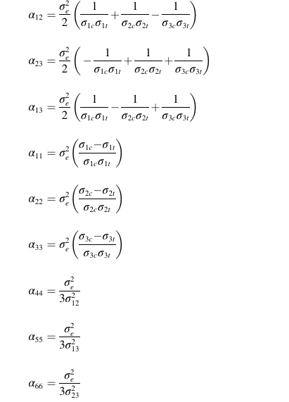
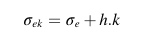
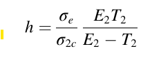
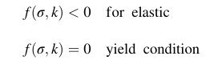
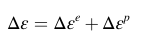
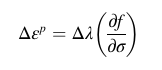
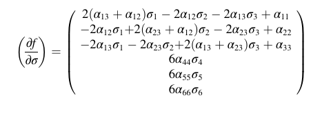
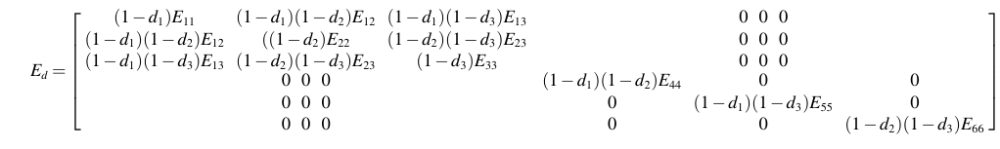
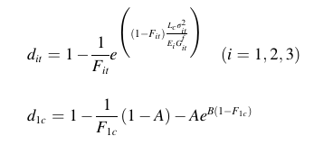
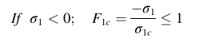
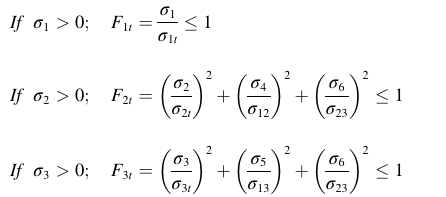
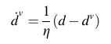
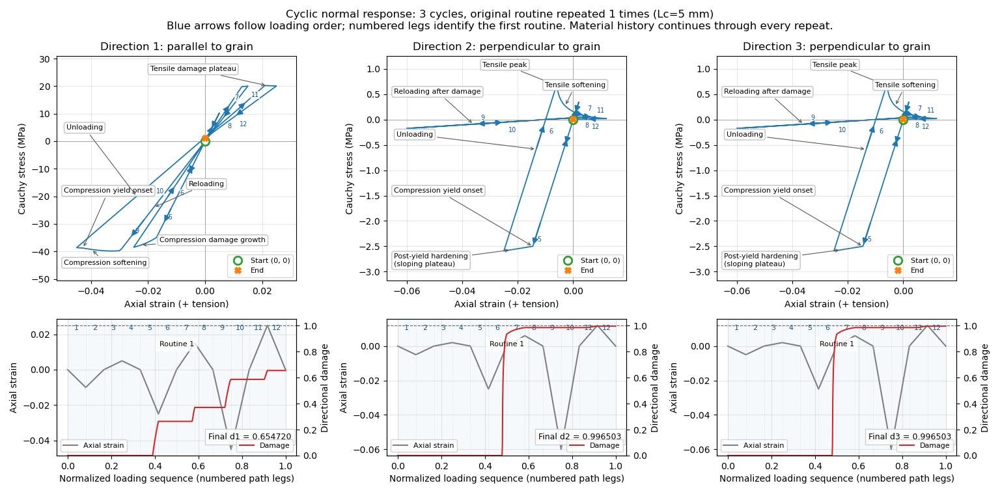
