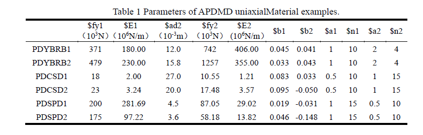
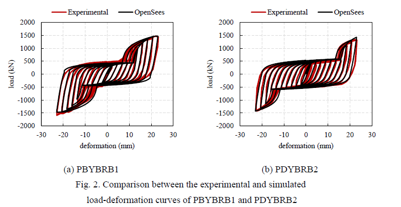
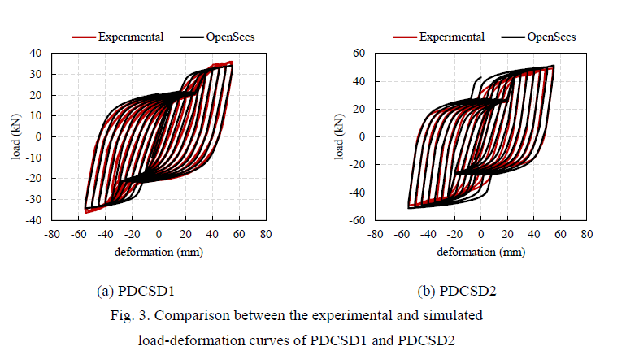

.. _APDMD :

APDMD Material
^^^^^^^^^^^^^^^^^^^^^^^^^^^^^^^^^^^^^^^^^^^^^^^^^^^^^^

This command is used to construct an APDMD material that simulates the hysteretic response of an asynchronous parallel double-stage metallic damper.
A typical asynchronous parallel double-stage metallic damper is composed of two sub-dampers and an asynchronously activation system. In the first stage only the first sub-damper works and when the deformation reaches to $ad2, the second sub-damper actives , exhibiting  the double-stage working mechanism.

.. function:: uniaxialMaterial APDMD $matTag $fy1 $E1 $ad2 $fy2 $E2 $b1 $b2 $a1 $n1 $a2 $n2

.. csv-table:: 
   :header: "Argument", "Type", "Description"
   :widths: 10, 10, 40

   $matTag, |integer|, integer tag identifying material.
   $fy1, |float|, Yield load of the first sub-damper
   $E1, |float|, Initial stiffness of the first sub-damper
   $ad2, |float|, Activation deformation of the second sub-damper
   $fy2, |float|, Yield load of the second sub-damper
   $E2, |float|, Initial stiffness of the second sub-damper
   $b1, |float|, Ratio of post-yield stiffness to the initial stiffness of the first sub-damper
   $b2, |float|, Ratio of post-yield stiffness to the initial stiffness of the second sub-damper
   $a1, |float|, Parameters to control the nonlinear behavior of the first sub-damper
   $n1, |float|, Parameters to control the transition from elastic to plastic branches of the first sub-damper
   $a2, |float|, Parameters to control the nonlinear behavior of the second sub-damper 
   $n2, |float|, Parameters to control the transition from elastic to plastic branches of the second sub-damper
  
Recommended values of $a1 $n1 $a2 $n2 for simulating three types of APDMDs are provided in the examples.

.. figure:: figures/APDMD/APDMD1.png
	:align: center
	:figclass: align-center

.. note::
Example:
   In order to verify the reliability of the APDMD uniaxialMaterial, three types of asynchronous parallel double-stage metallic dampers were simulated as examples, including the parallel double-stage yielding buckling restrained brace (PDYBRB), parallel double-stage crawler-track-shaped shear damper (PDCSD) and parallel double-stage shear panel damper (PDSPD). 
Parameters of the APDMD uniaxialMaterial examples for modeling two tests of each of the above three types of dampers are presented in Table 1. (Units can be arbitrarily converted, but must be unified.) 

  (1) When simulating parallel double-stage yielding buckling restrained brace (PDYBRB) using APDMD uniaxialMaterial, $a1, $n1, $a2 and $n2 are recommended to be 1, 10, 2 and 4, respectively. 

The input parameters for the material should be as follows:
    **Tcl Code**

   .. code-block:: tcl

      uniaxialMaterial APDMD  1   371  180  12    742  406   0.045  0.041  1  10   2  4
      uniaxialMaterial APDMD  1   479  230  15.8  659  355   0.033  0.043  1  10   2  4

Using these parameters, comparison between the experimental and simulated load-deformation curves of PDYBRB is shown in Fig. 2. 

 (2) When simulating parallel double-stage crawler-track-shaped shear damper (PDCSD) using APDMD uniaxialMaterial, $a1, $n1, $a2 and $n2 are recommended to be 0.5, 10, 1 and 15, respectively.

The input parameters for the material should be as follows:
    **Tcl Code**

   .. code-block:: tcl

      uniaxialMaterial APDMD  1   18  2     27    10.55   1.21   0.083   0.033   0.5  10  1  15
      uniaxialMaterial APDMD  1   23  3.24  20    17.48   3.57   0.095  -0.050   0.5  10  1  15

Using these parameters, comparison between the experimental and simulated load-deformation curves of PDCSD is shown in Fig. 3. 

 (3) When simulating parallel double-stage shear panel damper (PDSPD) using APDMD uniaxialMaterial, $a1, $n1, $a2 and $n2 are recommended to be 1, 15, 0.5 and 10, respectively.

The input parameters for the material should be as follows:
    **Tcl Code**

   .. code-block:: tcl

     uniaxialMaterial  APDMD  1  200  281.69  4.5  87.05  29.02  0.019  -0.031   1  15  0.5  10
     uniaxialMaterial  APDMD  1  175   97.22  3.6  58.18  13.82  0.046   0.133   1  15  0.5  10

Using these parameters, comparison between the experimental and simulated load-deformation curves of PDMD is shown in Fig. 4. 

.. figure:: figures/APDMD/APDMD5.png
	:align: center
	:figclass: align-center

Code Developed by: Linlin Xie, Cantian Yang, Bingyan Liu, Aiqun Li, Beijing University of Civil Engineering and Architecture.

References:

[1] Yang C, Xie L, An N, Li A, Liu Q, Wang X. Development of a novel parallel double-stage yielding buckling restrained brace: Theoretical, experimental, and numerical investigations. Journal of Building Engineering 2023; 68: 106089. DOI: 10.1016/j.jobe.2023.106089.

[2] Yang C, Xie L, Liu Q, Li A, Wang X, Liu Q. Experimental and numerical investigations of a novel parallel double-stage crawler-track-shaped shear damper. Thin-Walled Structures 2024; 195: 111428. DOI: 10.1016/j.tws.2023.111428.

[3] Fred Segal, and Dimitri V, Val. Energy evaluation for Ramberg Osgood hysteretic model. Journal of engineering mechanics 2006; 132(9): 907-913. DOI: 10.1061/(ASCE)0733-9399(2006)132:9(907)
