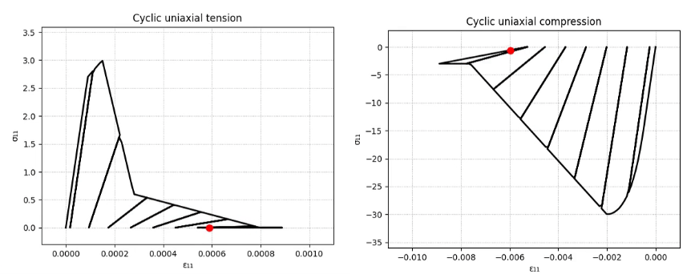

.. _ASDConcrete1D:

ASDConcrete1D Material
^^^^^^^^^^^^^^^^^^^^^^

| This command is used to construct an ASDConcrete1D material object, a plastic-damage model for concrete and masonry like materials.
| To improve robustness and convergence of the simulation in case of strain-softening, this model optionally allows to use the IMPL-EX integration scheme (a mixed IMPLicit EXplicit integration scheme).

.. function::
   uniaxialMaterial ASDConcrete1D $tag $E
   <-fc $fc> <-ft $ft>
   <-Te $Te -Ts $Ts <-Td $Td>>
   <-Ce $Ce -Cs $Cs <-Cd $Cd>>
   <-implex> <-implexControl $implexErrorTolerance $implexTimeReductionLimit> <-implexAlpha $alpha>
   <-eta $eta> <-tangent> <-autoRegularization $lch_ref>

.. csv-table:: 
   :header: "Argument", "Type", "Description"
   :widths: 10, 10, 40

   $tag, |integer|, "Unique tag identifying this material."
   $E, |float|, "Mandatory. Young's modulus."
   -fc $fc, |string| + |float|, "Optional. **-fc**: A keyword that precedes the float. **$fc**: The concrete compressive strength."
   -ft $ft, |string| + |float|, "Optional. **-ft**: A keyword that precedes the float. **$ft**: The concrete tension (rupture) strength."
   -Te $Te, |string| + |list|, "Optional. **-Te**: A keyword that precedes the list. **$Te**: A list of total-strain values for the tensile hardening-softening law. If not specified, $Te will be computed automatically from $fc and $ft. If specified, $Te will override $fc and $ft."
   -Ts $Ts, |string| + |list|, "Optional. **-Ts**: A keyword that precedes the list. **$Ts**: A list of stress values for the tensile hardening-softening law. If not specified, $Ts will be computed automatically from $fc and $ft. If specified, $Ts will override $fc and $ft."
   -Td $Td, |string| + |list|, "Optional. **-Td**: A keyword that precedes the list. **$Td**: A list of damage values for the tensile hardening-softening law. If not defined, no stiffness degradation will be considered.  If not specified, $Td will be computed automatically from $fc and $ft. If specified, $Td will override $fc and $ft."
   -Ce $Ce, |string| + |list|, "Optional. **-Ce**: A keyword that precedes the list. **$Ce**: A list of total-strain values for the compressive hardening-softening law.  If not specified, $Ce will be computed automatically from $fc and $ft. If specified, $Ce will override $fc and $ft."
   -Cs $Cs, |string| + |list|, "Optional. **-Cs**: A keyword that precedes the list. **$Cs**: A list of stress values for the compressive hardening-softening law.  If not specified, $Cs will be computed automatically from $fc and $ft. If specified, $Cs will override $fc and $ft."
   -Cd $Cd, |string| + |list|, "Optional. **-Cd**: A keyword that precedes the list. **$Cd**: A list of damage values for the compressive hardening-softening law. If not defined, no stiffness degradation will be considered. If not specified, $Cd will be computed automatically from $fc and $ft. If specified, $Cd will override $fc and $ft."
   -implex, |string|, "Optional. If defined, the IMPL-EX integration will be used, otherwise the standard implicit integration will be used (default)."
   -implexControl $implexErrorTolerance $implexTimeReductionLimit, |string| + 2 |float|, "Optional. **-implexControl**: Activates the control of the IMPL-EX error. **implexErrorTolerance**: Relative error tolerance. **implexTimeReductionLimit**: Minimum allowed relative reduction of the time-step. If the error introduced by the IMPL-EX algorithm is larger than **implexErrorTolerance** , the material will fail during the computation. The user can therfore use an adaptive time-step to reduce the time-step to keep the error under control. If the reduction of the time-step is smaller than **implexTimeReductionLimit** , the error control will be skipped. Suggested values: -implexControl 0.05 0.01."
   -implexAlpha $alpha, |string| + |float|, "Optional. Default = 1. The :math:`\alpha` coefficient for the explicit extrapolation of the internal variables in the IMPL-EX algorithm. It can range from 0 to 1."
   -eta $eta, |string| + |float|, "Optional. If defined, the rate-dependent model is used (By default the model is rate-independent). **-eta**: Activates the rate-dependent model. **eta**: The viscosity parameter :math:`\eta`, representing the relaxation time of the viscoplastic system."
   -tangent, |string|, "Optional. If defined, the tangent constitutive matrix is used. By default, the secant stiffness is used."
   -autoRegularization $lch_ref, |string| + |float|, "Optional. If defined, and if the tensile and/or the compressive hardening-softening law has strain-softening, the area under the hardening-softening law is assumed to be a real fracture energy (:math:`G_f` with dimension = :math:`F/L`), and the specific fracture energy :math:`g_f` (with dimension = :math:`F/L^2`) is automatically computed as :math:`g_f=G_f/l_{ch}`, where :math:`l_{ch}` is the characteristic length of the Finite Element. In this case $lch_ref is 1. If, instead, the area is a specific fracture energy (:math:`g_{f,ref}` with dimension = :math:`F/L^2`), $lch_ref should be set equal to the experimental size used to obtain the strain from the displacement jump. In this case, the regularization will be performed as :math:`g_f=G_f/l_{ch} = g_{f,ref}*l_{ch,ref}/l_{ch}`"

.. note::
  * This is the uniaxial counter-part of the nDMaterial ASDConcrete3D. For the theory, please refer to :ref:`ASDConcrete3D`

.. admonition:: Example 1 - Understanding the Hardening/Softening Laws

   | This material accepts either a simple input (-ft and -fc) or a more customizable one, where the user can provide the tensile and compressive hardening laws by points (strain, stress and damage).
   | For each point of the tensile (or compressive) backbone curve, strain and stress define the actual point on the backbone, while the damage parameter defines the degradation of the intial stiffness at that point.
   | The damage parameter can range from 0 to 1.
   | Note that the damage parameter should satify several constraints: It should be monotonically increasing, cannot be 1.0 if sigma > 0.0, etc... . The ASDConcrete1D material takes care of correcting invalid values of damage parameter.
   | This is a simple Python module to generate typical hardening-softening laws for normal concrete:
   | :download:`ASDConcrete1D_MakeLaws.py <examples/ASDConcrete1D_MakeLaws.py>`

.. admonition:: Example 2 - Understanding the Plastic-Damage behavior and the rate-dependent/rate-independent model

   | This example runs multiple analyses with different settings, producing an animation saved as a GIF file for each one.
   | :download:`ASDConcrete1D_Ex_Cyclic.py <examples/ASDConcrete1D_Ex_Cyclic.py>`
   
   | **Case 1: Mixed plastic-damage behavior in both tension and compression without any rate effect.**
   | Compressive strength :math:`f_c = 30 MPa` and tensile strength :math:`f_t = 3 MPa`.
   | On the left-side the stress-strain response, while on the right-side the evolution of damage variables and equivalent plastic strains.
   .. |asd_conc1d_pic_1_a| image:: examples/Mixed-Plastic-Damage(rate-independent).gif
   .. |asd_conc1d_pic_1_b| image:: examples/Mixed-Plastic-Damage(rate-independent)-still.png
   |asd_conc1d_pic_1_a| |asd_conc1d_pic_1_b|
   
   |
   | **Case 2: Mixed plastic-damage behavior in both tension and compression with rate effects.**
   | Same as Case 1, but with the viscosity parameter :math:`\eta = 0.001`. If :math:`\eta > 0` the material is allowed to violate the yield/damage domain at high strain rates.
   .. |asd_conc1d_pic_2_a| image:: examples/Mixed-Plastic-Damage(rate-dependent).gif
   .. |asd_conc1d_pic_2_b| image:: examples/Mixed-Plastic-Damage(rate-dependent)-still.png
   |asd_conc1d_pic_2_a| |asd_conc1d_pic_2_b|
   
   |
   | **Case 3: Pure-damage behavior in both tension and compression.**
   | Same as Case 1, but without any plastic strain. All nonlinearity comes from cracking, and upon unloading the stress always go to zero at zero strain following the secant stiffness :math:`Ed = (1-d)E`.
   | Note that on the right-side there is no evolution of equivalent plastic strain.
   | To achieve this, all damage variables are set to the maximum value of 1.
   .. |asd_conc1d_pic_3_a| image:: examples/Pure-Damage.gif
   .. |asd_conc1d_pic_3_b| image:: examples/Pure-Damage-still.png
   |asd_conc1d_pic_3_a| |asd_conc1d_pic_3_b|
   
   |
   | **Case 4: Pure-plastic behavior in both tension and compression.**
   | Same as Case 1, but without any cracking strain (no damage). All nonlinearity comes from plastic deformation, and upon unloading the stress always follows the initial stiffness.
   | Note that on the right-side there is no evolution of damage.
   | To achieve this, all damage variables are set to the minimum value of 10.
   .. |asd_conc1d_pic_4_a| image:: examples/Pure-Plasticity.gif
   .. |asd_conc1d_pic_4_b| image:: examples/Pure-Plasticity-still.png
   |asd_conc1d_pic_4_a| |asd_conc1d_pic_4_b|
   
   |
   | **Case 5: Pure-damage behavior tension.**
   | Similar to Case 3, but the plastic behavior has been removed only for the tensile response, keeping the compressive response the result of a mixed plastic-damage process.
   | To achieve this, all damage variables are set to the maximum value of 1 only for the tensile backbone curve.
   .. |asd_conc1d_pic_5_a| image:: examples/Mixed-Plastic-Damage(compression)-Pure-Damage(tension).gif
   .. |asd_conc1d_pic_5_b| image:: examples/Mixed-Plastic-Damage(compression)-Pure-Damage(tension)-still.png
   |asd_conc1d_pic_5_a| |asd_conc1d_pic_5_b|

Code Developed by: **Massimo Petracca** at ASDEA Software, Italy.

