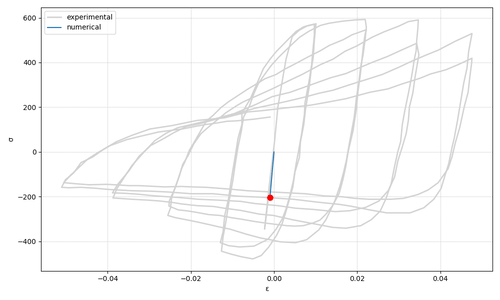
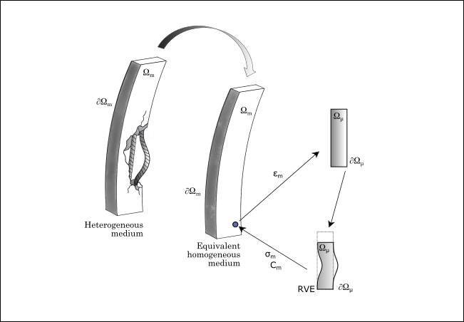

.. _ASDSteel1D:

.. |integer| replace:: ``integer``
.. |string| replace:: ``string``
.. |float| replace:: ``float``

ASDSteel1D Material
^^^^^^^^^^^^^^^^^^^

| The ASDSteel1D command is used to create a uniaxial material object that models the nonlinear response of reinforcing steel bars under monotonic and cyclic loading. 
| The formulation integrates kinematic hardening plasticity, damage mechanics, buckling behavior and bond-slip mechanism.
| To improve numerical robustness and computational performance under severe nonlinearities  an optional IMPL-EX integration scheme is available.
| Additionally, the entire model is regularized using the element's characteristic length to guarantee mesh-independent results.

.. function::
   uniaxialMaterial ASDSteel1D $tag $E $sy $su $eu 
   <-implex> 
   <-auto_regularization> 
   <-buckling $lch <$r>> 
   <-fracture <$r>> 
   <-slip $matTag <$r>> 
   <-K_alpha $K_alpha> 
   <-max_iter $max_iter> 
   <-tolU $tolU> 
   <-tolR $tolR>

.. csv-table:: 
   :header: "Argument", "Type", "Description"
   :widths: 10, 10, 40

   $tag, |integer|, "Unique tag identifying this material."
   $E $sy $su $eu, 4 |float|, "Mandatory. Young's modulus, Yield stress, Ultimate stress and Ultimate strain."
   -implex, |string|, "Optional. If defined, the IMPL-EX integration will be used, otherwise the standard implicit integration will be used (default)."
   -auto_regularization, |string|, "Optional. Activates automatic regularization based on the characteristic length of the finite element."
   -buckling $lch <$r>, |string| + |float| <+ |float|>, "Optional. Enables buckling simulation using an RVE-based approach. Requires characteristic length $lch and optionally a section radius $r."
   -fracture <$r>, |string| <+ |float|>, "Optional. Activates fracture modeling. Optionally specify the section radius $r."
   -slip $matTag <$r>, |string| + |integer| <+ |float|>, "Optional. Activates slip modeling with a secondary uniaxial material ($matTag). Optionally specify the section radius $r."
   -K_alpha $K_alpha, |string| + |float|, "Optional.  Defines the weight between the consistent elastoplastic tangent modulus and the purely elastic modulus (default = 0.5). Set to 1.0 for full consistent tangent, or 0.0 to use only the elastic modulus."
   -max_iter $max_iter, |string| + |float|, "Optional. Maximum number of iterations for the global Newton-Raphson loop used in the RVE (default = 100)."
   -tolU $tolU, |string| + |float|, "Optional. Tolerance on displacement increment convergence (default = 1e-6)."
   -tolR $tolR, |string| + |float|, "Optional. Tolerance on residual force convergence (default = 1e-6)."

Theory
""""""

| The ASDSteel1D material is formulated within an elasto-plastic framework enriched with damage, buckling, and slip mechanisms, specifically tailored to model the nonlinear behavior of reinforcing steel bars.

Plasticity
""""""""""

| The plasticity model employs a two-term Chaboche kinematic hardening law.

| The trial stress is computed as:

.. math::
   \sigma_{trial} = \sigma_n + E \Delta \varepsilon
   
| The yield function is defined as:

.. math::
   f = | \sigma - \alpha_1 - \alpha_2 | - \sigma_y

| The evolution of the backstresses follows:

.. math::
   \dot{\alpha}_i = H_i n - \gamma_i \alpha_i, \quad i=1,2

.. math::
   n = \text{sign}(\sigma - \alpha_1 - \alpha_2)

| The parameters :math:`H_1, \gamma_1` and :math:`H_2, \gamma_2` are calibrated to fit the target values of yield stress (:math:`\sigma_y`), ultimate stress (:math:`\sigma_u`), and ultimate strain (:math:`\varepsilon_u`).

Damage
""""""

| Fracture is controlled by a scalar damage variable :math:`d \in [0, 1]`, which progressively reduces the effective stress:

.. math::
   \sigma = (1-d) \sigma_{eff}
   
| Damage initiates once the equivalent plastic strain :math:`\varepsilon_{pl}` ​exceeds the ultimate plastic strain :math:`\varepsilon_{upl}`, and evolves as:

.. math::
   d = 1 - \frac{\sigma_d}{\sigma_y}, \quad \sigma_d = \sigma_y \exp \left( -\frac{\sigma_y (\varepsilon_{pl} - \varepsilon_{upl})}{G_f} \right)

Buckling
""""""""

| Buckling is modeled using a homogenization-inspired multiscale approach, in which the macroscopic behavior of the material is enriched by the nonlinear response of a localized Representative Volume Element (RVE).
| The RVE is defined at a lower scale and incorporates the minimal microstructural features required to represent local instability phenomena without modeling them explicitly across the entire structure.
| At this scale, we employ a generic configuration of corotational beam elements with geometric imperfections, capable of autonomously developing buckling patterns under increasing compressive loads.
| The multiscale coupling is carried out through a two-way exchange of information between the macroscopic and microscopic scales.
| In the downscaling step, the strain computed at the macroscopic level is transferred to the RVE and applied as a boundary condition.
| Once the RVE problem is solved, the upscaling step follows. The resulting stress field, stiffness degradation, or other internal variables obtained from the RVE are fed back into the macroscopic model.
| This bidirectional process ensures that the influence of microstructural effects is consistently reflected at the structural scale.

Bond-Slip
"""""""""

| A bond–slip material can be inserted in series with the steel to simulate anchor slip phenomena. The following conditions apply: 

.. math::
   \sigma_{\text{steel}} = \sigma_{\text{slip}}
   
.. math::
   \varepsilon_{\text{total}} = \varepsilon_{\text{steel}} + \varepsilon_{\text{slip}}

| The slip law (e.g., :math:`\tau–slip` curve) is defined by the user via an external uniaxial material and internally converted into a stress–strain relationship.

Regularization
""""""""""""""

| Three of the four nonlinear mechanisms included in the model, damage, buckling, and bond-slip, can exhibit strain-softening behavior, which leads to mesh sensitivity when modeled without proper regularization.
| To ensure that the material response remains objective and independent of the element size, each of these mechanisms is regularized through tailored strategies based on the characteristic length of the finite element.

| For the bond–slip mechanism, regularization must be handled by the secondary material used in series. At present, the only uniaxial material that supports this form of regularization is the :ref:`ASDConcrete1D`.

IMPL-EX scheme
""""""""""""""

| An optional IMPL-EX integration scheme can be activated to improve convergence behavior.
| This scheme combines the efficiency of explicit integration with the stability of implicit correction, offering improved robustness in simulations involving highly nonlinear material behavior, such as softening or large strain evolution.
| At each time step, the algorithm first executes an explicit predictor step, estimating the evolution of internal variables without solving a full nonlinear system.
| This is followed by an implicit corrector step, which refines the predicted state to ensure consistency and numerical stability.

.. math::
   \Delta \lambda_n \approx \frac{\Delta t_n}{\Delta t_{n-1}} (\lambda_n - \lambda_{n-1})

Usage Notes
"""""""""""

.. admonition:: Responses

   * All standard responses for a uniaxialMaterial object: **stress**, **strain**, **tangent**.
   * **BucklingIndicator** or **BI**: The lateral displacement caused by buckling (available with the **-buckling** option).
   * **EquivalentPlasticStrain** or **PLE**:  The equivalent plastic strain.
   * **Damage** or **D**: Current damage variable (available with the **-fracture** option).
   * **SlipResponse**: 2 components (:math:`slip`, :math:`\tau`). Current bond-slip response (available with the **-slip** option).
   
.. admonition:: Example 1 - Fracture

   A Python example to simulate tensile fracture: :download:`ASDSteel1D_Ex_Damage.py <examples/ASDSteel1D/ASDSteel1D_Ex_Damage.py>`
   
   .. image:: figures/ASDSteel1D/ASDSteel1D_Ex_Damage_Output.gif
      :width: 100%
      
.. admonition:: Example 2 - Buckling

   A Python example to simulate buckling: :download:`ASDSteel1D_Ex_Buckling.py <examples/ASDSteel1D/ASDSteel1D_Ex_Buckling.py>`
   
   .. image:: figures/ASDSteel1D/ASDSteel1D_Ex_Buckling_Output.gif
      :width: 100%
      
.. admonition:: Example 3 - Bond-Slip

   A Python example to simulate rebars bond-slip: :download:`ASDSteel1D_Ex_Bond_Slip.py <examples/ASDSteel1D/ASDSteel1D_Ex_Bond_Slip.py>`
   
   .. image:: figures/ASDSteel1D/ASDSteel1D_Ex_Bond_Slip_Output.gif
      :width: 100%

References
""""""""""

.. [Kashani2015] Kashani, M. M., Lowes, L. N., Crewe, A. J., & Alexander, N. A. (2015). "Phenomenological hysteretic model for corroded reinforcing bars including inelastic buckling and low-cycle fatigue degradation" Computers & Structures, 156, 58-71 (`Link to article <https://www.researchgate.net/publication/275652031_Phenomenological_hysteretic_model_for_corroded_reinforcing_bars_including_inelastic_buckling_and_low-cycle_fatigue_degradation>`_)
.. [Oliver2008] Oliver, J., Huespe, A. E., & Cante, J. C. (2008). "An implicit/explicit integration scheme to increase computability of non-linear material and contact/friction problems" Computer Methods in Applied Mechanics and Engineering, 197(21-24), 1865-1889 (`Link to article <https://core.ac.uk/download/pdf/325948712.pdf>`_)
