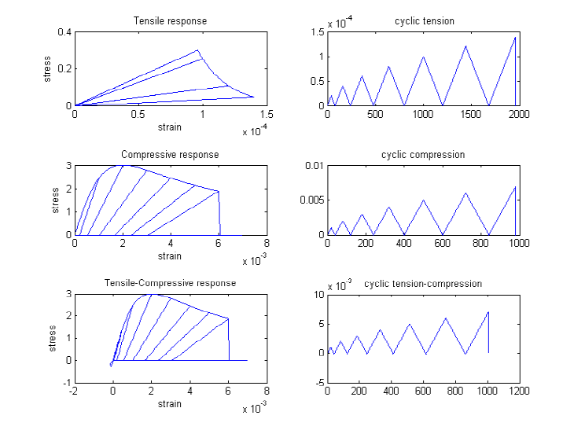
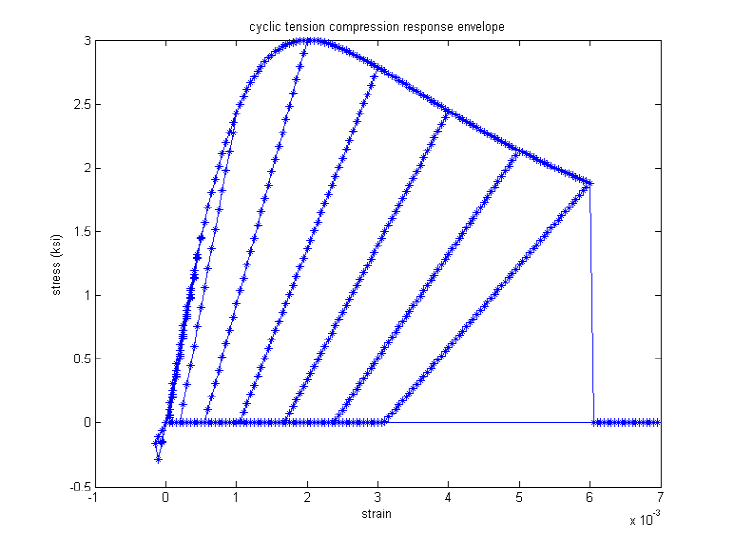

.. _Concrete04 :

Concrete04 Material -- Popovics Concrete Material
^^^^^^^^^^^^^^^^^^^^^^^^^^^^^^^^^^^^^^^^^^^^^^^^^^^^^^

This command is used to construct a uniaxial Popovics concrete material object with degraded linear unloading/reloading stiffness according to the work of Karsan-Jirsa and tensile strength with exponential decay. 
.. function:: uniaxialMaterial Concrete04 $matTag $fc $ec $ecu $Ec <$fct $et> <$beta>  

.. csv-table:: 
   :header: "Argument", "Type", "Description"
   :widths: 10, 10, 40

   $matTag, |integer|, integer tag identifying material.
   $fc, |float|,  concrete compressive strength at 28 days (compression is negative)*.
   $ec, |float|, concrete strain at maximum strength*.
   $ecu, |float|, concrete crushing strength*.
   $Ec, |float|, initial stifness**.
   $fct, |float|, maximum tensile strength of concrete.
   $et, |float|, ultimate tensile strain of concrete.
   $beta, |float|, exponential curve parameter to define the residual stress (as a factor of $ft) at $etu. 

.. note::
  * Compressive concrete parameters should be input as negative values (if input as positive, they will be converted to negative internally).
  * The envelope of the compressive stress-strain response is defined using the model proposed by [Popovic1973]_. If the user defines :math:`E_c = 57000 \sqrt(f_{cc})` (in psi unit) then the envelope curve is identical to proposed by [Mander1988]_.
  * Model Characteristic: For loading in compression, the envelope to the stress-strain curve follows the model proposed by Popovics (1973) until the concrete crushing strength is achieved and also for strains beyond that corresponding to the crushing strength. For unloading and reloading in compression, the [Karsan1969]_ is used to determine the slope of the curve. For tensile loading, an exponential curve is used to define the envelope to the stress-strain curve. For unloading and reloading in tensile, the secant stiffness is used to define the path.

Code Developed by: Laura Lowes, University of Washington and Michael Berry, University of Washington
Images Developed by Silvia Mazzoni

.. [Mander1988]  Mander, J. B., Priestley, M. J. N., and Park, R. (1988). "Theoretical stress-strain model for confined concrete." Journal of Structural Engineering ASCE, 114(8), 1804-1825.
.. [Popovic1973] Popovics, S. (1973). " A numerical approach to the complete stress strain curve for concrete." Cement and concrete research, 3(5), 583-599.
.. [Karsan1969]  Karsan, I. D., and Jirsa, J. O. (1969). "Behavior of concrete under compressive loading." Journal of Structural Division ASCE, 95(ST12).