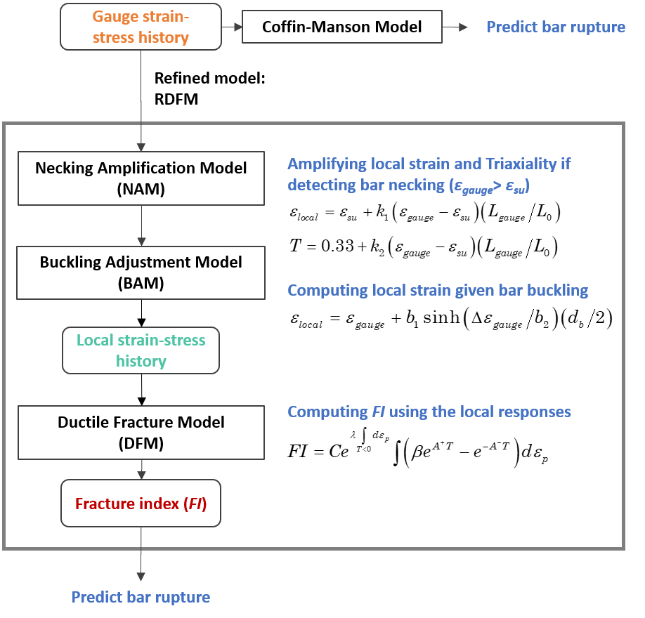

.. _ductile_fracture:

DuctileFracture Material
^^^^^^^^^^^^^^^^^^^^^^^^

This command is used to construct a uniaxial material object for simulating reinforcement steel fracture under monotonic/cyclic loads.
The material is based on a newly developed Reinforcement Ductile Fracture Model (RDFM) ([Zhong2021]_, [ZhongDeierlein2022a]_).

.. function:: uniaxialMaterial DuctileFracture $matTag $baseTag -c_momo $c_mono -c_cycl $c_cycl -c_symm $c_symm <-E_s $E_s> <-esu $esu> <-k1 $k1> <-k2 $k2> <-db $db> <-b1 $b1> <-b2 $b2> <-FImax $FImax>

.. csv-table:: 
   :header: "Argument", "Type", "Description"
   :widths: 10, 10, 40

   $matTag, |integer|,	    integer tag identifying material
   $baseTag, |integer|,	    integer tag identifying the base material (describing the constitutive model) wrapped by DuctileFracture 
   $c_mono, |float|, void-growth coefficient
   $c_cycl, |float|, cyclic deterioration coefficient
   $c_symm, |float|, symmetry coefficient
   $E_s, |float|, initial elastic tangent (optional: default = 29000.0 ksi).
   $esu, |float|, uniform strain of the reinforcement
   $k1, |float|, Necking Amplification Model strain coefficient (optional: default = 1.0). see note.
   $k2, |float|, Necking Amplification Model stress coefficient (optional: default = 0.0). see note.
   $db, |float|, bar diameter (optional: only used when considering bar buckling). see note.
   $b1, |float|, Buckling Adjustment Model amplitude coefficient (optional: default = 0.0). see note.
   $b2, |float|, Buckling Adjustment Model strain coefficient (optional: default = 1000.0). see note.
   $FImax, |float|, Fracture Index at bar fracture (optional: default = 1.0).
   
.. note::

   The RDFM extends the previous studies on simulating ductile fractures of structural steel materials 
   (e.g., [KavindeDeierlein2007]_, [SmithEtAl2017]_) to quantify the damage of reinforcing steel material by a 
   Fracture Index (:math:`FI`):

   .. math::

      FI = Ce^{\lambda \int_{T<0} d\epsilon_p}\int(\beta e^{1.3T}-e^{-1.3T})d\epsilon_p

   where modeling parameters are :math:`C` (void-growth coefficient), :math:`\lambda`, 
   and :math:`\beta` in the FI equation. :math:`T` is stress triaxiaility, the ratio of 
   hydrostatic stress and effective stress. :math:`\lambda` and :math:`\beta` 
   are path-dependent:

   .. math::

      \beta = 1.0+(\beta_0-1.0)\left[\frac{min(\Delta\epsilon_{max},\Delta\epsilon_{th})}{\Delta\epsilon_{th}}\right]^\gamma

      \lambda = \lambda_0\left[\frac{min(\Delta\epsilon_{max},\Delta\epsilon_{th})}{\Delta\epsilon_{th}}\right]^\gamma

   where :math:`\lambda_0` is cyclic deterioration coefficient, and :math:`\beta_0` is symmetry coefficient. These three 
   coefficients :math:`C`, :math:`\lambda_0`, and :math:`\beta_0` are material specific which corresponds to different 
   fracture resistances for different reinforcing steel materials. Given a plastic steel strain history, the influence 
   of these three coefficients on :math:`FI` are show in :numref:`fig-ductilefracture_mp_infl`. In *DuctileFracture*, :math:`C`, :math:`\lambda_0`, and :math:`\beta_0` are $c_mono, $c_cycl, and $c_symm,
   respectively.

   Comparing to traditional Coffin-Manson fatigue model, the RDFM can (1) predict ultra-low cycle and monontonic bar fracture 
   based on void growth/shrinkage mechanism, (2) simulate the influence of buckling-induced strain localization 
   on bar fracture, and (3) consider the path-dependency of buckling effects on longitudinal bar ruptures 
   in reinforced concrete beams and columns. These features are implemented as the Necking Amplification Model (NAM) and 
   Buckling Adjustment Model (BAM) as shown in the flowchart :numref:`fig-ductilefracture_workflow`. 

   The two NAM modeling coefficients :math:`k_1` ($k1) and :math:`k_2` ($k2) are calibrated to reinforcing steel bar fracture test data,
   and the two BAM modeling coefficients :math:`b1` ($b_1) and :math:`b2` ($b2) are calibrated to cyclic bar fatigue test data with observed 
   buckling effects. Based on the calibration, along with :math:`C`, :math:`\lambda_0`, and :math:`\beta_0`, the modeling coefficients in the *DuctileFracture* 
   are suggested to be estimated by ([Zhong2021]_, [ZhongDeierlein2022b]_):

   .. math::

      C = e^{-3.96-1.85ln\epsilon_{su}+0.20ln\left(\frac{d_b}{8in}\right)}

      \lambda_0 = e^{5.90+1.53ln\left(\frac{f_y}{60ksi}\right)+2.32ln\epsilon_{su}+1.11ln\left(\frac{d_b}{8in}\right)}
      
      \beta_0 = 1.05
      
      k_1 = e^{2.21-0.32ln\left(\frac{T}{Y}\right)-0.66ln\left(\frac{d_b}{8in}\right)}
      
      k_2 = e^{1.29+0.64ln\left(\frac{f_y}{60ksi}\right)-0.46ln\left(\frac{d_b}{8in}\right)}
      
      b_1 = e^{-2.53-1.90ln\left(\frac{T}{Y}\right)-1.36ln\left(\frac{d_b}{8in}\right)-0.43ln\left(\frac{R_{min}}{1.5H}\right)}
      
      b_2 = e^{-3.29-0.49ln\epsilon_{su}-0.14ln\left(\frac{R_{min}}{1.5H}\right)-0.70ln\left(\frac{s^*}{d_b}\right)}
   
.. _fig-ductilefracture_mp_infl:

.. figure:: figures/DuctileFracture_mp_infl.png
	:align: center
	:width: 700

	Influence of :math:`C`, :math:`\lambda_0`, and :math:`\beta_0` on :math:`FI`.

.. _fig-ductilefracture_workflow:

   Reinforcement Ductile Fracture Simulation.

.. admonition:: Example 

   The following is used to construct a *DuctileFracture* along with a base material using *ReinforcingSteel*.

   1. **Tcl Code**

   .. code-block:: tcl

      uniaxialMaterial Steel02 1 64.7 30944.0 0.012 18 0.925 0.15
      uniaxialMaterial DuctileFracture 2 1 -c_mono 1.255 -c_cycl 1.383 -c_symm 1.05 -E_s 30944.0 -esu 0.10 -k1 11.30 -k2 4.49 -db 0.63 -b1 0.04 -b2 0.02;

.. [Zhong2021] Zhong, K. (2020). "`Influence of Reinforcing Steel Fracture on Seismic Performance of Concrete Structures: Fracture Simulation, Earthquake Duration Effects, and Design Strategies <https://searchworks.stanford.edu/view/13751299>`_". PhD Dissertation, Stanford University. 
.. [ZhongDeierlein2022a] Zhong, K., Deierlein. G. G. (2022). "Reinforcement Fracture Simulation. I: Damage Model for Bare Bar Fatigue and Fracture".
.. [ZhongDeierlein2022b] Zhong, K., Deierlein. G. G. (2022). "Reinforcement Fracture Simulation. II: Predictive Equations and Application for Reinforcement in Concrete Structures".
.. [KavindeDeierlein2007] Kanvinde A M, Deierlein G G. (2007). "`Cyclic void growth model to assess ductile fracture initiation in structural steels due to ultra low cycle fatigue <https://doi.org/10.1061/(ASCE)0733-9399(2007)133:6(701)>`_"[J]. Journal of engineering mechanics, 133(6): 701-712.
.. [SmithEtAl2017] Smith C, Kanvinde A, Deierlein G. (2017). "`A local criterion for ductile fracture under low-triaxiality axisymmetric stress states <https://doi.org/10.1016/j.engfracmech.2016.10.011>`_"[J]. Engineering Fracture Mechanics, 169: 321-335.

Code Developed by: Kuanshi Zhong (kuanshi@stanford.edu), Gregory Deierlein
