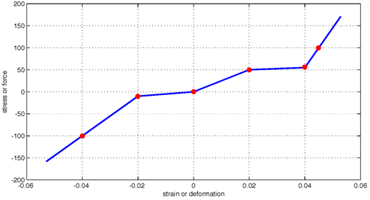

.. _ElasticMultiLinear:

Elastic Multi-Linear Material
^^^^^^^^^^^^^^^^^^^^^^^^^^^^^

This command constructs a multi-linear elastic uniaxial material defined by strain-stress points.

.. function:: uniaxialMaterial ElasticMultiLinear $matTag <$eta> -strain $strainPoints -stress $stressPoints

.. csv-table::
   :header: "Argument", "Type", "Description"
   :widths: 10, 10, 40

   $matTag, |integer|, unique material tag
   $eta, |float|, optional damping tangent
   -strain, |string|, flag followed by strain points (at least two)
   $strainPoints, |listFloat|, strain values
   -stress, |string|, flag followed by stress points (at least two)
   $stressPoints, |listFloat|, stress values corresponding to the strain points

The material is path-independent: unloading and reloading follow the same multi-linear stress-strain curve.

   ElasticMultiLinear material stress-strain behavior.

.. admonition:: Example

   1. **Tcl Code**

   .. code-block:: tcl

      uniaxialMaterial ElasticMultiLinear 1 -strain 0.0 0.01 0.02 -stress 0.0 30.0 35.0

   2. **Python Code**

   .. code-block:: python

      ops.uniaxialMaterial('ElasticMultiLinear', 1, '-strain', 0.0, 0.01, 0.02, '-stress', 0.0, 30.0, 35.0)

Code Developed by: Andreas Schellenberg
