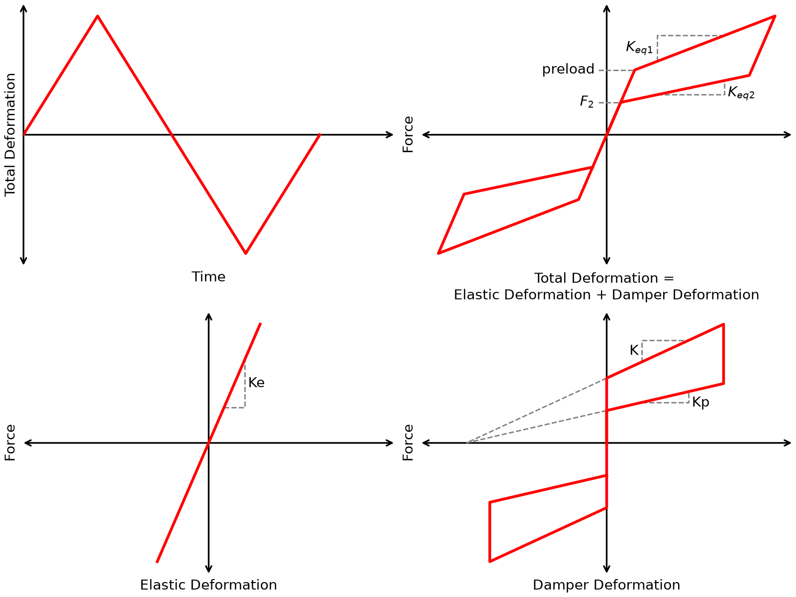

# FrictionSpringDamper Material

This command is used to construct a FrictionSpringDamper uniaxial material object. The material models the force-deformation response of a self-centering friction spring damper. The model is based on the behavior described by Wang et al. (2019) in series with an elastic stiffness.

:align: center
:figclass: align-center
:width: 70%

Force-deformation response of the FrictionSpringDamper material.

.. function:: uniaxialMaterial FrictionSpringDamper $matTag $Ke $K $Kp $preload <-initialStrain $initStrain>

.. list-table::
:header-rows: 1
:widths: 15 15 70

* * Parameter
  * Type
  * Description
* * `$matTag`
  * integer
  * Integer tag identifying the material.
* * `$Ke`
  * float
  * Elastic stiffness, as shown in the figure above.
* * `$K`
  * float
  * Loading stiffness, as shown in the figure above.
* * `$Kp`
  * float
  * Unloading stiffness, as shown in the figure above.
* * `$preload`
  * float
  * Preload, as shown in the figure above.
* * `$initStrain`
  * float
  * Optional initial strain. The default value is 0.0.

The effective secondary tangent stiffness during loading is

.. math::

K_{eq,1} = \left(\frac{1}{K_e}+\frac{1}{K}\right)^{-1},

and the effective tangent stiffness during unloading is

.. math::

K_{eq,2} = \left(\frac{1}{K_e}+\frac{1}{K_p}\right)^{-1}.

The force associated with the transition during unloading and reloading is

.. math::

F_2 = F_{preload}\frac{K_p}{K},

where :math:`F_{preload}` is the specified `$preload`.

The optional `-initialStrain` argument shifts the strain supplied to the constitutive model such that

.. math::

\epsilon = \epsilon_{applied} + \epsilon_{initial}.

Thus, a nonzero initial strain can result in a nonzero initial force.

## Example

The following example creates a FrictionSpringDamper material with a tag of 1, elastic stiffness of 1000, loading stiffness of 200, unloading stiffness of 100, and preload of 50.

**Tcl Code**

.. code-block:: tcl

uniaxialMaterial FrictionSpringDamper 1 1000.0 200.0 100.0 50.0

**Python Code**

.. code-block:: python

ops.uniaxialMaterial('FrictionSpringDamper', 1, 1000.0, 200.0, 100.0, 50.0)

An initial strain can optionally be specified.

**Tcl Code**

.. code-block:: tcl

uniaxialMaterial FrictionSpringDamper 1 1000.0 200.0 100.0 50.0 -initialStrain 0.01

**Python Code**

.. code-block:: python

ops.uniaxialMaterial('FrictionSpringDamper', 1, 1000.0, 200.0, 100.0, 50.0, '-initialStrain', 0.01)

## References

Wang, W., Fang, C., Zhao, Y., Sause, R., Hu, S., and Ricles, J. (2019).
"Self-centering friction spring dampers for seismic resilience."
*Earthquake Engineering & Structural Dynamics*, 48(9), 1045-1065.

Code Developed by: Mark D. Denavit, University of Tennessee, Knoxville
