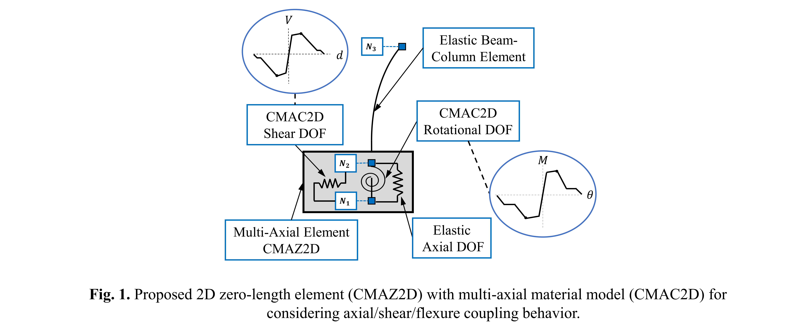

.. _GMG_CMAC2D:

GMG_CMAC2D Material
^^^^^^^^^^^^^^^^^^^^^^^^

This command is used to construct a Multi-Axial material object for simulating the cyclic behavior of reinforced concrete columns. The material is based on newly developed computational tools for decision-oriented reinforced concrete column simulations ([Ghorbani2022]_).

.. function:: uniaxialMaterial GMG_CMAC2D $matTag $H $B $C_C $L $L_a $f'c $f_yL $d_bL $nL_W $nL_H $f_yT $d_bT $n_leg $S_t $l_spl $P_Axial $PVM_Flag $Number_of_Step_ElasticBranch $Number_of_Step_HardeningBranch $Retrofit_Flag $f_je $t_j $b_j

.. csv-table:: 
   :header: "Argument", "Type", "Description"
   :widths: 10, 10, 40

   $matTag, |integer|,	    integer tag identifying material
   $H, |float|,	    Section height (parallel to the load direction); in inches
   $B, |float|,	    Section width (perpendicular to the load direction); in inches
   $C_C, |float|,	    Clear cover (The clear cover is assumed to be the same on all faces); in inches
   $L, |float|,	    Height of the column; in inches
   $L_a, |float|,	    Length of the Shear span; in inches
   $f'c, |float|,	    Compressive strength of concrete; in ksi
   $f_yL, |float|,	    Yielding strength of the longitudinal bars; in ksi
   $d_bL, |float|,	    Diameter of the longitudinal bar; in inches
   $nL_W, |float|,	    Number of longitudinal bars along the width of the section (only count one side)
   $nL_H, |float|,	    Number of longitudinal bars along the height of the section (only count one side of the section)
   $f_yT, |float|,	    Yield strength of the transverse reinforcement; in ksi
   $d_bT, |float|,	    Diameter of the transverse bar; in inches
   $n_leg, |float|,	    Number of transverse reinforcement legs in the direction of loading (this parameter can be non-integer for diagonal ties)
   $S_t, |float|,	    Center to center spacing between transverse reinforcement along the length of the column; in inches 
   $l_spl, |float|,	    Provided splice length; in inches
   $P_Axial, |float|,	    Initial gravity axial load (a positive value should be used for compression ); in kips
   $PVM_Flag, |integer|,	    0=the model skips the effect of axial demand on moment and shear strength; 1=model accounts for the effect of axial demand on moment and shear strength
   $Number_of_Step_ElasticBranch, |integer|,	    Number of prior converged steps considered to obtain the average axial demand that is used to calculate yield transition surfaces in the linear elastic branch of behavior. Values ranging from 3 to 10 are recommended in dynamic analyses
   $Number_of_Step_HardeningBranch, |integer|,	    Number of prior converged steps considered to obtain the average axial demand that is used to calculate the capping transition surfaces and other parameters post-yield. Values ranging from 20 to 200 are recommended in dynamic analyses
   $Retrofit_Flag, |integer|,	    0 = Non-rerofitted; 1 = FRP jacketed; 2 = Steel jacketed 
   $f_je, |float|,	    Strength of jacket; in ksi 
   $t_j, |float|,	    Total thickness of the jacket; in inches
   $b_j, |float|,	    Closes distance between anchor and the side of the section; in inches 
   
.. note::

   The proposed coupled multi-axial material, calibrated version, (CMAC) model is intended for use within a two-dimensional lumped-plasticity framework and aimed at capturing the lateral cyclic behavior of non-retrofitted and retrofitted reinforced concrete columns subjected to seismic motions, up to complete loss of lateral strength. 
   
   The material model is coupled to a multi-axial zero-length element (GMG_CMAZ2D) and only is functional when it is employed in conjunction with that element. CMAZ2D is intended for use in series with an elastic line element to fully simulate the lateral force-displacement of concrete columns, as shown in Figure 1. The multi-axial material model utilizes a uniaxial material model described in ([Ghorbani2022]_, [GhorbaniGhannoum2022]_) that is applied in CMAC2D for the translational (shear) and rotational (moment) DOFs, while the axial DOF remains elastic. The uniaxial material model is implemented in OpenSees as the GMG_CyclicReinforcedConcrete model.

   Highlights of proposed model capabilities are presented as follow:

   1- Backbone:

   For shear and flexure DOFs, the force-deformation envelopes are defined as an asymmetric multi-linear curve as shown in Fig. 2.

   2- Cyclic behavior and rules:

   A third-degree B-spline curve is adopted to represent the general shape of the cyclic force-deformation response for concrete columns and only requires three parameters to be defined, including unloading and reloading stiffnesses (see Fig. 3.a) and an Energy Ratio (ER). The ER is defined as the energy inside the hysteresis curve divided by the energy within an elastic-plastic hysteretic shape with the same peak deformation points ([Ghorbani2022]_, [GhorbaniGhannoum2022]_). For concrete columns, all three cyclic parameters were found to correlate with the Peak-Point Secant Slope (PPSS, shown by K_sec in Fig. 3.a); which connects the backbone peak deformation points at unloading and reloading. Having these parameters related to the secant slope addresses stiffness deterioration and non-linear changes in cyclic energy dissipation ratio with increasing deformation demands ([Ghorbani2022]_, [GhorbaniGhannoum2022]_, [Suselo2021]_). The material model employs peak-oriented cyclic rules similarly to work by ([Ibarra2005]_), whereby it targets the prior peak-deformation point on the backbone (Fig. 3.b).

   3- Strength Damage functions:

   In addition to degrading the unloading and reloading stiffnesses with increasing deformation demands, the material model utilizes an energy-based function to capture strength damage. The strength damage mode shifts the degrading branches towards the origin in the degrading branch, while their slopes remain constant (Fig. 4). Furthermore, strength damage accumulates based on cyclic energy dissipation and adjusts the degrading branches at every load reversal, even if backbone contact is not achieved. This mode can therefore account for loading history and loading duration on the envelope and cyclic responses of a column, especially for non-symmetric ratcheting type of seismic demands. 

   4- Automatic Selection of Degradation Mode and Adaptive Coupled Behaviors:

   The CMAC2D houses several capacity models to capture salient lateral strength-degradation modes including flexure, shear, flexure-shear, splice, and flexure-splice modes. These capacity models dynamically adjust to varying boundary conditions and are coupled to applied loads or deformations in other DOF. In addition to non-retrofitted columns, the CMAC2D is able to simulate the behavior of FRP and steel jacketed columns. The material model only requires the input of column geometric and material properties to fully calibrate its behavior to complete loss of lateral strength. A few sample column-test comparisons are presented in Fig. 5, where experimental and simulated global column force-deformation results are compared (columns in Fig. 5a and 5b were tested by [Kanda1988]_ and [Harajli2008]_ correspondingly). 

   5- Coupled Adaptive Behavior in the Hardening Branch:

   CMAC2D is able to capture the coupling behavior between axial/shear/flexure actions for shear and moment strengths without the need of implementing fiber-based elements. 

   6- Damage Outputs:

   The material model can output the damage state of the columns at the end of the analysis, such that users can check the governing mode of degradation, percentage of strength loss, and the remaining capacity for other modes of degradation. 

   Table 1 summarizes all the damage output parameters for a replicated column as illustrated in Fig. 4 (tested by [Ohue1985]_) and includes the following information. Col#1 and Col#2 of Table 1 show the general information including row number and material tag. Col#3 denotes flexural deformation at yielding. This data column is populated with the rotation in the DOF at yield (in rad), if the rotational DOF experiences yield, if not, a zero value is placed. Col#4 shows shear deformation at yield and is populated with the lateral translation at yield (in inches) if the shear DOF experiences yield. In the example in Table 1, a zero value is placed in this data column because yielding occurred in the rotational DOF. In Col#5-7 the percent of the yield transition surface capacities for each of the flexure, shear, and splice modes is output, when the first yield capacity is reached. As shown in Table 1, when the rotational DOF reaches yield, only 73.04% of the shear strength was reached. In this example, since the column does not have splices, a zero value is output under Col#7. In Col#8-12, the percent of the capping transition surface capacities for each of flexure, shear, splice, and flexure-splice modes is output, when the first capping capacity is reached. Table 1 indicates that when 100% of the capping deformation capacity for the flexure-shear mode of degradation was reached, 81.26% of the flexure was reached. Zero values appear for degradation modes that are not applicable. The shear DOF has a zero value because shear degradation is precluded once flexural yielding occurred. Also, zero values were assigned to the splice and flexure-splice modes because these modes of degradations were precluded based on the strength criteria (see [Ghorbani2022]_). Col#13 indicates the mode of degradation reached at capping according to the following: Flexure = 1, Shear mode = 2, Flexure-Shear mode = 3, Splice before yielding = 4, Flexure-Splice = 5. Col#14 outputs the deformation in the DOF that reached capping (in inches or rad as applicable). Col#15 shows the percent strength loss in the descending branch, with a value of 100% indicating that the residual strength is reached. Col#16 outputs the deformation at residual only if the residual deformation is exceeded. 

   ** Further discussion over input parameters:

   a- The parameters indicating the number of bars along the width (*nL_W*) and height of the section (*nL_H*) should both include corner bars. The material model does not double-count corner bars internally. Furthermore, the material assumes there is only one row of bars on each side of the section. When the number of bars is given for one side along the width and height of the section, the opposite side is filled with the same number of bars assuming the section is symmetric. 

   b- As described in ([Ghorbani2022]_), the material model can adjust the moment and shear strength as the axial load changes during the analysis. To enhance model numerical stability during sharp axial load excursions, the material model applies a moving average filter to the axial force used to evaluate moment and shear strength in the model. The number of prior steps the model included in the moving average can be set differently by users in the elastic range (*Number_of_Step_ElasticBranch*) and hardening range (*Number_of_Step_HardeningBranch*). It is recommended to use at least 3 steps or more to average in the linear range and 20 steps or more in the nonlinear hardening range. The material model skips the effect of axial demand on the moment and shear strength if the *PVM_Flag* is set to zero. By setting the flag to zero, the model becomes more stable, but the output response might be less accurate.

   c- When *PVM_Flag* is set to zero, the material model only estimates the shear and flexure strength based on *P_Axial* input and does not change those during the analysis.
   
   d- The material model uses the *P_Axial* to estimate the elastic stiffness and does not change it during the analysis.

   e- Once the *Retrofit_Flag* is set to 1 or 2, the material model no longer checks for the deformation and strength criteria associated with the non-retrofitted lateral degradation modes and instead aims for a modified flexure-controlled behavior.

.. warning::

   1- To be able to get the "damage output" file at the end of the analysis, in the .TCL file, right after defining each material model (GMG_CMAC2D), the corresponding element (GMG_CMAZ2D) should be defined. In other words, the .TCL file should include pairs of material models and elements that are defined right after each other.

   2- As described above, the material model applies a moving average filter to the axial force using *Number_of_Step_ElasticBranch* and *Number_of_Step_HardeningBranch* parameters to minimize convergence issues but they do not ensure numerical stability. This is because depending on how the axial demand changes during analysis a higher number of steps might be required to reach numerical stability.

.. admonition:: Example 

   The following is used to construct a *GMG_CMAC2D*.

   1. **Tcl Code**

   .. code-block:: tcl

      uniaxialMaterial GMG_CMAC2D 1 9.84 9.84 0.91 59.05 29.53 4.04 54.23 0.5 3 3 73.37 0.22 2 1.97 0.0 41.34 1 3 50 0 0.0 0.0 0.0;

.. [Ghorbani2022] Ghorbani, R. (2022). "`Computational Framework for Decision-Oriented Reinforced Concrete Column Simulation Capabilities <https://www.proquest.com/docview/2702490424?pq-origsite=gscholar&fromopenview=true>`_". PhD Dissertation, The University of Texas at San Antonio. 
.. [GhorbaniGhannoum2022] Ghorbani, R., A. Suselo, S. Gendy, A. Matamoros and W. Ghannoum (2022). "`Uniaxial model for simulating the cyclic behavior of reinforced concrete members <https://doi.org/10.1002/eqe.3736>`_". Earthquake Engineering & Structural Dynamics 51(15): 3574-3597.
.. [Suselo2021] Suselo, A. A. (2021). "Simulated Behavior of Rectangular Reinforced Concrete Columns under Seismic Loading". PhD Dissertation, The University of Texas at San Antonio. 
.. [Ibarra2005] Ibarra, L. F., R. A. Medina and H. Krawinkler (2005). "Hysteretic models that incorporate strength and stiffness deterioration". Earthquake engineering & structural dynamics 34(12): 1489-1511.
.. [Kanda1988] Kanda, M. (1988). "Analytical study on elasto-plastic hysteretic behavior of reinforced concrete members". Transaction of the Japan Concrete Institute 10: 257-264.
.. [Harajli2008] Harajli, M. H. and F. Dagher (2008). "Seismic strengthening of bond-critical regions in rectangular reinforced concrete columns using fiber-reinforced polymer wraps". ACI Structural Journal 105(1): 68.
.. [Ohue1985] Ohue, M., H. Morimoto, S. Fujii and S. Morita (1985). "The behavior of RC short columns failing in splitting bond-shear under dynamic lateral loading". Transactions of the Japan Concrete Institute 7(1): 293-300.

Code Developed by: 
Rasool Ghorbani (rasool.ghorbani@my.utsa.edu),
Adolfo Matamoros,
Wassim Ghannoum.
