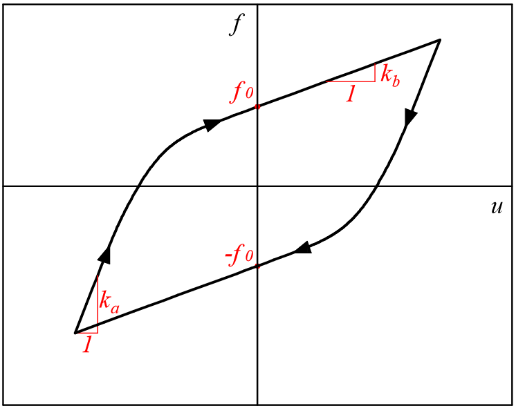
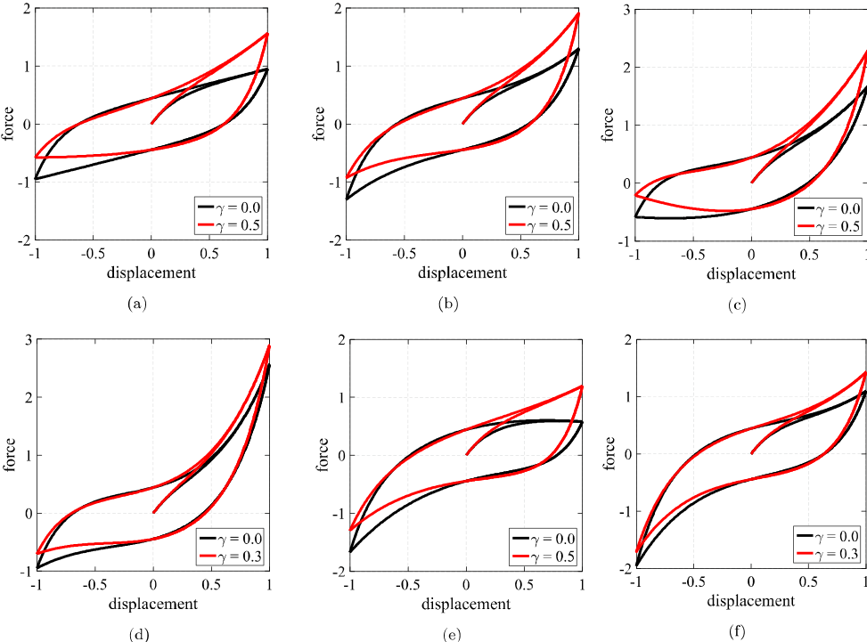

.. _HystereticAsym:

HystereticAsym Material (Smooth asymmetric hysteresis)
^^^^^^^^^^^^^^^^^^^^^^^^^^^^^^^^^^^^^^^^^^^^^^^^^^^^^^

This command is used to construct the uniaxial HystereticAsym material proposed by Vaiana et al. [VaianaEtAl2021]_. It produces smooth and asymmetric hysteretic loops with hardening-softening behavior.

.. function:: uniaxialMaterial HystereticAsym $matTag $ka $kb $fo $beta1 $beta2 $gamma  <-alpha>

.. csv-table:: 
   :header: "Argument", "Type", "Description"
   :widths: 10, 10, 40

   $matTag, |integer|, integer tag identifying material.
   $ka, |float|,  Tangent stiffness of the initial "elastic" part of the loop.
   $kb, |float|, Tangent stiffness at zero displacement/strain.
   $f0, |float|, Hysteresys force/stress at zero displacement/strain.
   $beta1, |float|, Parameter governing hardening/softening behavior and asymmetry.
   $beta2, |float|, Parameter governing hardening/softening behavior and asymmetry.
   $gamma, |float|, Parameter governing hardening/softening behavior and asymmetry.
   -alpha, |string|, Optional flag: if activated the 3rd parameter is  "alpha" instead of "f0" (see below for the details).
   
.. note::

   The HystereticAsym material provides the response sensitivity for reliability and parametric analysis. Possible calls for the parameters are 'ka', 'kb', 'fo', 'b1', 'b2' and 'gamma'.
   
The equations describing HystereticAsym behavior are described in [VaianaEtAl2021]_. Only minor changes have been made in its implementation for OpenSees. The model may reproduce either force-displacement or stress-strain relationships.

The model works as a sort of smooth, bilinear model whose response is modulated by nonlinear functions in order to obtain hardening, softening and asymmetry. Specifically, if :math:`\beta_1 = \beta_2 = \gamma = 0` then the loop is symmetric and bilinear:

parameter $ka is the initial stiffness of each branch (at the load inversion) while $kb is the hysteresys force/strain at zero displacement. Yielding is ruled by a parameter :math:`\alpha` determining the transition between the initial :math:`k_a` and final :math:`k_b` stiffness. This parameter is also related to the loop amplitude by means of:

:math:`f_0=\frac{k_a-k_b}{2\alpha}`

that is represented in figure. Because of the biunivocal relationship between :math:`f_0` and :math:`\alpha`, both can be used as input parameters. The default syntax uses :math:`f_0` although it is possible to provide :math:`\alpha` by adding the flag "-alpha".

Parameters $beta1 and $beta2 rule the hardening-softening behavior as well as asymmetry. Specifically, different loop shapes can be obtained by adopting different combinations of such parameters:

.. csv-table:: 
   :header: "Loop", "obtained for:"
   :widths: 10, 50

   a,	:math:`\beta_1 = \beta_2 = 0`
   b,	:math:`\beta_1 = \beta_2 > 0`
   c,	:math:`\beta_1 >0; \beta_2 = 0`
   d,	:math:`\beta_1 > \beta_2 > 0`
   e,	:math:`\beta_1 =0; \beta_2 > 0`
   d,	:math:`\beta_2 > \beta_1 > 0`

.. figure:: figures/HystereticAsym/HystereticAsym02.gif
	:align: center
	:figclass: align-center
	
Parameter $gamma introduces a further asymmetric behavior by a modulating function:
	

	
loops have been obtained by assuming $ka = 5.0, $kb = 0.5, $fo = 0.45 and:
	
.. csv-table:: 
   :header: "Loop", "$beta1", "$beta2", "$gamma"
   :widths: 10, 10, 10, 10

   a,	0.0,	0.0,	0.5
   b,	1.0,	1.0,	0.5 
   c,	1.0,	0.0,	0.5
   d,	1.5,	1.0,	0.3
   e,	0.0,	1.0,	0.5
   f,	1.0,	1.3,	0.3

.. admonition:: Example 

   The following constructs a HystereticAsym material with tag **1**, parameters corresponding to line (d) of the table above.

   1. **Tcl Code**

   .. code-block:: tcl

      uniaxialMaterial HystereticAsym 1 5.0 0.5 0.45 1.5 1.0 0.3

   2. **Python Code**

   .. code-block:: python

      uniaxialMaterial('HystereticAsym', 1, 5.0, 0.5, 0.45, 1.5, 1.0, 0.3)

Code Developed by: `Salvatore Sessa <https://www.docenti.unina.it/salvatore.sessa2/>`_, University of Naples Federico II, Italy 

.. [VaianaEtAl2021] Vaiana, N., Sessa, S. and Rosati, L. (2021). "A generalized class of uniaxial rate-independent models for simulating asymmetric mechanical hysteresis phenomena." Mechanical Systems and Signal Processing, 146: 106984. `DOI: https://doi.org/10.1016/j.ymssp.2020.106984 <https://www.sciencedirect.com/science/article/abs/pii/S0888327020303708?via%3Dihub>`_

