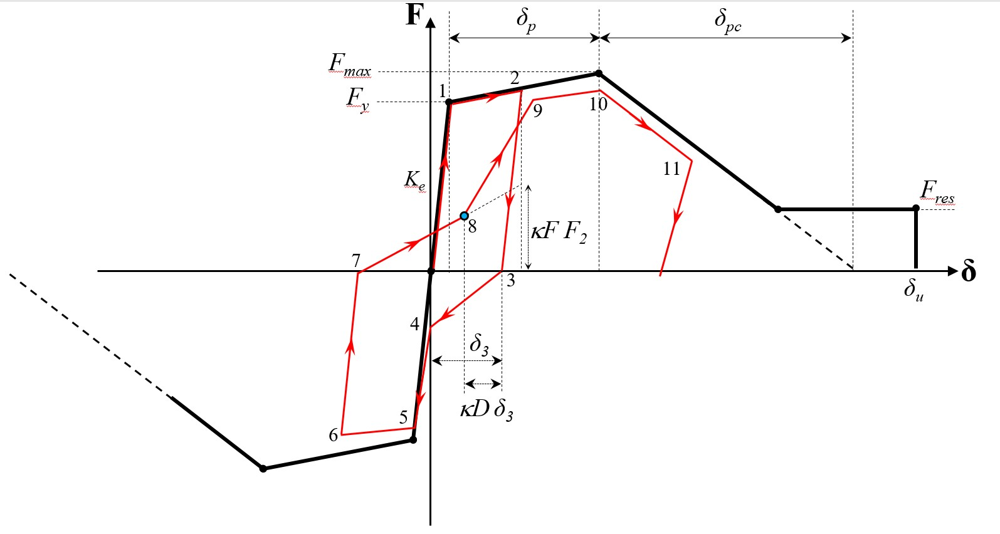

.. IMKPinching:

IMKPinching Material
^^^^^^^^^^^^^^^^^^^^^^^^^

This command is used to construct a material with a pinched hysteretic response based on the modified Ibarra-Medina-Krawinkler deterioration model.

.. function:: uniaxialMaterial IMKPinching $Mat_Tag $Ke $dp_pos $dpc_pos $du_pos $Fy_pos $FmaxFy_pos $FresFy_pos $dp_neg $dpc_neg $du_neg $Fy_neg $FmaxFy_neg $FresFy_neg $Lamda_S $Lamda_C $Lamda_A $Lamda_K $c_S $c_C $c_A $c_K $D_pos $D_neg $kappaF $kappaD

.. csv-table:: 
   :header: "Argument", "Type", "Description"
   :widths: 10, 10, 40

   $matTag, |integer|,	    integer tag identifying material
   $Ke, |float|,  Elastic stiffness
   $dp_pos, |float|,  Pre-capping deformation in positive loading direction
   $dpc_pos, |float|,  Post-capping deformation in positive loading direction
   $du_pos, |float|,  Ultimate deformation in positive loading direction
   $Fy_pos, |float|,  Yield strength in positive loading direction
   $FmaxFy_pos, |float|,  Maximum-to-yield strength ratio in positive loading direction
   $FresFy_pos, |float|,  Residual-to-yield strength ratio in positive loading direction
   $dp_neg, |float|,  Pre-capping deformation in negative loading direction
   $dpc_neg, |float|,  Post-capping deformation in negative loading direction
   $du_neg, |float|,  Ultimate deformation in negative loading direction
   $Fy_neg, |float|,  Yield strength in negative loading direction
   $FmaxFy_neg, |float|,  Maximum-to-yield strength ratio in negative loading direction
   $FresFy_neg, |float|,  Residual-to-yield strength ratio in negative loading direction
   $Lamda_S, |float|,  Cyclic deterioration parameter for yield strength deterioration
   $Lamda_C, |float|,  Cyclic deterioration parameter for post-capping stiffness deterioration
   $Lamda_A, |float|,  Cyclic deterioration parameter for accelerated reloading stiffness deterioration
   $Lamda_K, |float|,  Cyclic deterioration parameter for unloading stiffness deterioration
   $c_S, |float|,  Rate of yield strength deterioration
   $c_C, |float|,  Rate of post-capping stiffness deterioration
   $c_A, |float|,  Rate of accelerated reloading stiffness deterioration
   $c_K, |float|,  Rate of unloading stiffness deterioration
   $D_pos, |float|,  rate of cyclic deterioration in the positive loading direction. This parameter is used to create asymmetric hysteretic behavior as in the case of a composite beam (0< D_pos <1). For symmetric hysteretic response use 1.0.
   $D_neg, |float|,  rate of cyclic deterioration in the negative loading direction. This parameter is used to create asymmetric hysteretic behavior as in the case of a composite beam (0< D_pos <1). For symmetric hysteretic response use 1.0.
   $kappaF, |float|,   Pinching parameter defining the break point with respect to the maximum force experienced in the direction of loading (0 <kappaF <1).
   $kappaD, |float|,   Pinching parameter defining the break point with respect to the maximum permanent deformation experienced in the direction of loading (0 <kappaD <1).

.. note::

   All material model parameters (in both the positive and negative direction) shall be specified as positive values.

   Lamda is used to compute the reference energy based on the following equation Ref_Energy = Lamda * Fy

.. [IbarraEtAl2005] Ibarra, L. F., Medina, R. A., and Krawinkler, H. (2005). "Hysteretic models that incorporate strength and stiffness deterioration." Earthquake Engineering & Structural Dynamics, 34(12), 1489-1511, Doi: 10.1002/eqe.495.

.. _fig-IMKPinching:

	IMKPinching backbone curve

.. figure:: figures/IMK/IMKPinching_sample_responses_validations.jpg
	:align: center
	:figclass: align-center

	IMKPinching sample responses and validations

.. admonition:: Example 

   The following is used to construct a IMKPinching material with symmetric hysteretic response.

   .. code-block:: tcl

      set Ke 	  10000.;
      set dp 	  0.01;
      set dpc     0.05;
      set du 	  0.08;
      set My 	  100.;
      set Mc_My   1.10;
      set Mres_My 0.10;
      set lambda  0.50;
      set c_S 	  1.00;
      set c_C 	  1.00; 
      set c_K 	  1.00; 
      set c_A 	  1.00;
      set D_pos   1.00;
      set D_neg   1.00;
      set kappaF  0.50;
      set kappaD  0.50;

      uniaxialMaterial IMKPinching 	 1 $Ke $dp $dpc $du $My $Mc_My $Mres_My $dp $dpc $du $My $Mc_My $Mres_My $lambda $lambda $lambda $lambda $c_S $c_S $c_A $c_K $D_pos $D_neg $kappaF $kappaD;

For code inquires or bug reporting, please contact: 
- Kazuki Ichinohe, University of Tokyo, e-mail: z-ichinohe@g.ecc.u-tokyo.ac.jp
- Ahmed Elkady, University of Southampton, e-mail: a.elkady@soton.ac.uk

