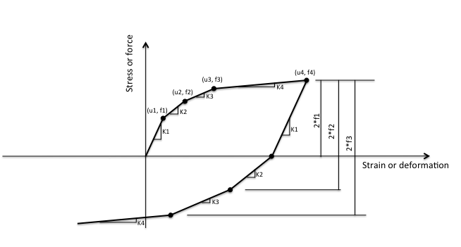

.. _MultiLinear:

Multi-Linear Material
^^^^^^^^^^^^^^^^^^^^^

This command constructs a multi-linear uniaxial material defined by strain-stress point pairs.

.. function:: uniaxialMaterial MultiLinear $matTag $e1 $s1 $e2 $s2 ...

.. csv-table::
   :header: "Argument", "Type", "Description"
   :widths: 10, 10, 40

   $matTag, |integer|, unique material tag
   $e1 $s1 ..., |listFloat|, alternating strain and stress points (at least two pairs)

The material follows a symmetric multi-linear envelope with inelastic hysteretic unloading and reloading.

   MultiLinear material hysteretic behavior.

.. admonition:: Example

   1. **Tcl Code**

   .. code-block:: tcl

      uniaxialMaterial MultiLinear 1 0.0 0.0 0.01 30.0 0.02 35.0

   2. **Python Code**

   .. code-block:: python

      ops.uniaxialMaterial('MultiLinear', 1, 0.0, 0.0, 0.01, 30.0, 0.02, 35.0)

Code Developed by: |fmk|

Images Developed by: Vesna Terzic
