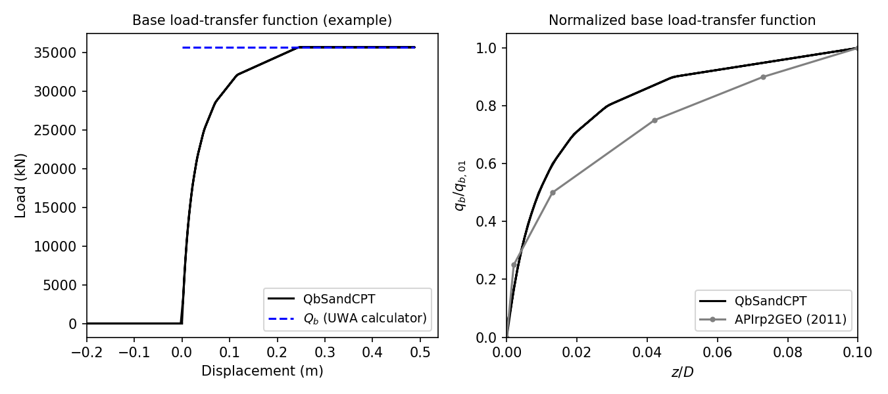

.. _QbSandCPT:

QbSandCPT Material
^^^^^^^^^^^^^^^^^^^^

This command is used to construct a ``QbSandCPT`` uniaxial material object:

.. function:: uniaxialMaterial QbSandCPT $matTag $qp $D $t $dcpt

.. csv-table:: 
   :header: "Argument", "Type", "Description"
   :widths: 10, 10, 40

   $matTag, |integer|, integer tag identifying material
   $qp, |float|,  end bearing mobilised at large displacements 
   $D, |float|, pile outer diameter 
   $t, |float|, pile wall thickness
   $dcpt, |float|, diameter of the standard CPT probe (see note)

.. note::   
   The nominal value of the diameter of the standard CPT probe is 35.7mm.

Description
""""""""""""""
   
The ``QbSandCPT`` function implements the base-load transfer function, commonly referred to as 
the :math:`q_z` curve or spring, according to the new Unified CPT-based method for driven piles in 
sands. 

End bearing capacity
++++++++++++++++++++++++

The material calculates the base or end bearing capacity according to the formulation given 
in [LehaneEtAl2020a]_.  The expression for the base capacity is given by Eq. :eq:`Eq.7`.

.. math::
   :label: Eq.7

   \mathrm{Q}_{\text{base}}= \mathrm{q}_{\mathrm{b} 0.1} \left(\pi \mathrm{D}^2 / 4\right)

where :math:`\mathrm{q}_{\mathrm{b} 0.1}` is the ultimate unit base resistance mobilized at a 
settlement of 10% of the pile diameter, given by Eq. :eq:`Eq.8`.

.. math::
   :label: Eq.8

   \mathrm{q}_{\mathrm{b}0.1}=\left[0.12+0.38 \mathrm{~A}_{\mathrm{re}}\right] \mathrm{q}_{\mathrm{p}}

The parameter :math:`\mathrm{q}_{\mathrm{p}}` represents the mobilised end bearing at large 
displacements by a pile  at the  level of the pile base by a pile with a ficticious diameter of 
:math:`D_{eq}=A_{re}^{0.5}`. Several techniques can be employed for estimate :math:`\mathrm{q}_{\mathrm{p}}`.  
In sands that are relatively homogeneous, one can consider :math:`\mathrm{q}_{\mathrm{p}}` to be 
the average value of cone resitance  within a zone 1.5D above and below the pile base. 
In more heterogeneous locations, the approaches discussed in [LehaneEtAl2020a]_ may be employed. 

Load-transfer function
+++++++++++++++++++++++++

The non-linear end bearing-displacement response obeys the hyperbolic function as defined by 
[LehaneLiBittar2020b]_. Unit end bearing, :math:`\mathrm{q}_{\mathrm{b}}`, is assumed to be fully 
mobilized at a pile base displacement value of 0.1D in APIrp2GEO standard (2011). This criterion 
was also maintained in the unified method. The proposed expression to represent the variation of 
pile base load with base displacement follows a hyperbolic function of the form:

.. math::
   
   \frac{z_{\mathrm{b}}}{D}=0.01\left[\frac{q_{\mathrm{b}} / q_{\mathrm{b} 0.1}}{1-0.9\left(q_{\mathrm{b}} / q_{\mathrm{b}0.1}\right)}\right]

with :math:`z_{\mathrm{b}}` as the pile base displacement and :math:`\mathrm{q}_{\mathrm{b}0.1}` 
calculated as indicated in Eq. :eq:`Eq.8`.

Example
""""""""""

Below, examples are provided on how to use this material. The input data assumed is based on a typical 
sand site in the Gulf of Mexico (referred to as *Site A* in [LehaneEtAl2005]_). The simulated 
end bearing behavior for this example is shown in the following figure. As expected, for tension 
loading there is no end bearing. 

The simulated end-bearing response by the material is shown in the left plot. Users can verify 
that the internally computed ultimate unit base resistance mobilized at a 
settlement of 10% of the pile diameter (:math:`q_{b 0.1}`) is 7.629MN, which corresponds to the 
value computed using the `UWA calculator <https://pile-capacity-uwa.com>`_. 

The right plot compares the normalized form of the simulated ``QbSandCPT`` response against the 
load-transfer curve recommended in API (2011). This comparison lead to the same conclusions in 
[LehaneLiBittar2020b]_. The proposed back-bone curve mathes relatively well the API (2011) 
recommendations for :math:`q_{b}/q_{b 0.1}` ratios lower than 0.4. For greater ratios, the unified 
CPT-based end bearing curve is stiffer than API formulae. 

.. admonition:: Example using default unit system

   The following constructs a QbSandCPT material with a tag of **1**, :math:`q_p` of **50000 kPa**, :math:`D` of **2.44 m**, :math:`t` of **0.0445 m** and :math:`d_{CPT}` of **35.7 mm**. 

   1. **Tcl Code**

   .. code-block:: tcl

      uniaxialMaterial QbSandCPT 1 50000. 2.44 0.0445 35.7e-3

   2. **Python Code** 

   .. code-block:: python

      uniaxialMaterial('QbSandCPT', 1, 50000. 2.44, 0.0445, 35.7e-3)

More details on the implementation, validation and benchmark of the ``TzSandCPT`` material are published
in a `conference paper in the ISC'7 Proceedings <https://www.scipedia.com/public/Sastre_Jurado_Stuyts*_2024a>`_.

Code Developed by: |csasj|

.. [LehaneEtAl2005] Lehane, B. M., Schneider, J. A. A., & Xu, X. (2005). A review of design methods for offshore driven piles in siliceous sand.

.. [LehaneEtAl2020a] Lehane, B. M., Liu, Z., Bittar, E., Nadim, F., Lacasse, S., Jardine, R., Carotenuto, P., Rattley, M., Gavin, K., & More Authors (2020). A New 'Unified' CPT-Based Axial Pile Capacity Design Method for Driven Piles in Sand. In Z. Westgate (Ed.), Proceedings Fourth International Symposium on Frontiers in Offshore Geotechnics (pp. 462-477). Article 3457

.. [LehaneLiBittar2020b] Lehane, B. M., Li, L., & Bittar, E. J. (2020). Cone penetration test-based load-transfer formulations for driven piles in sand. Geotechnique Letters, 10(4), 568-574.