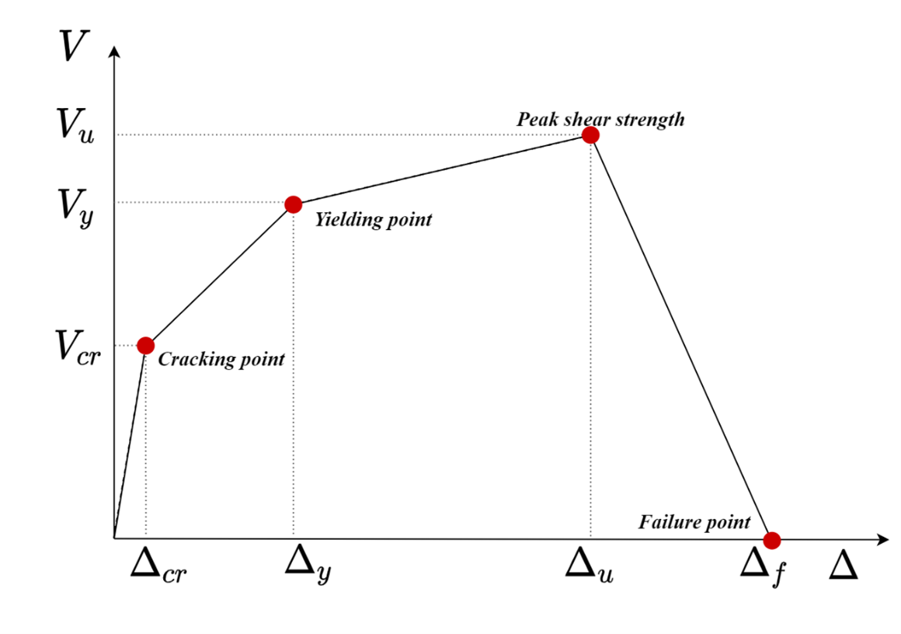
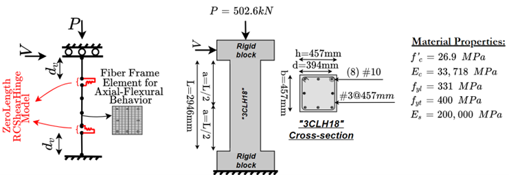
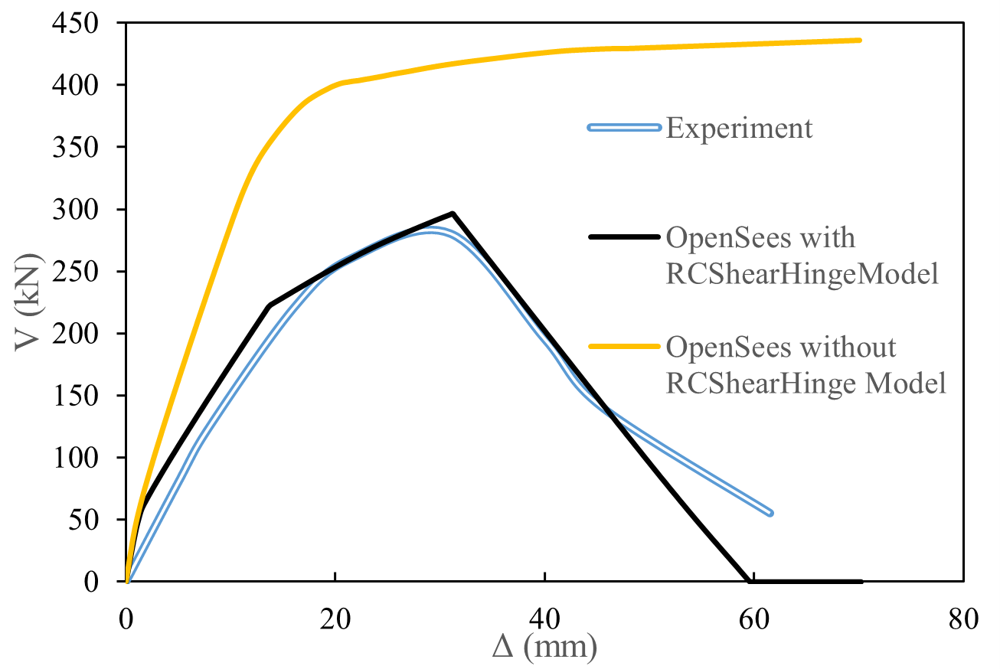
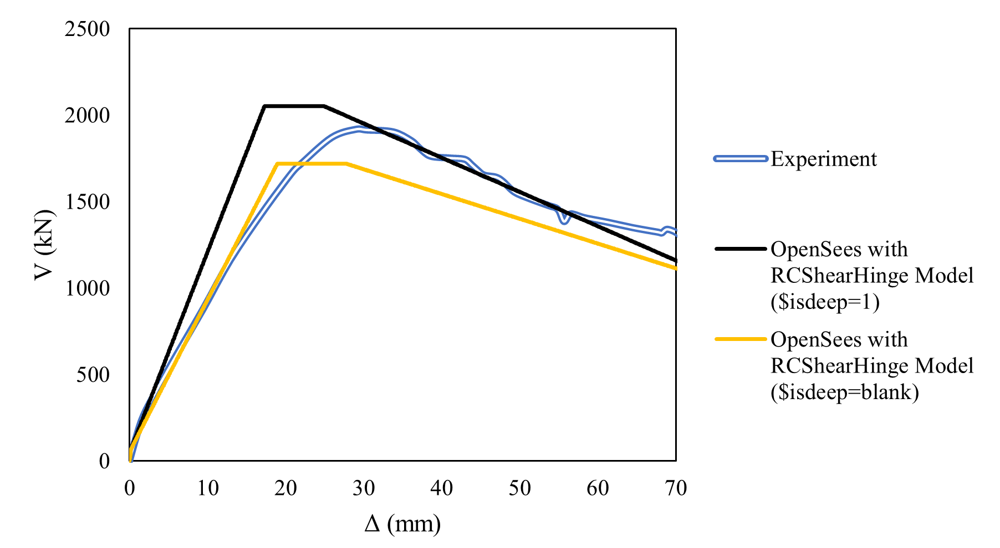

.. _RCShearHinge:

RCShearHinge Material
^^^^^^^^^^^^^^^^^^

This command is used to construct a multilinear shear force-shear deformation curve of a reinforced concrete (RC) member based on the Tabkhi-Sadeghian shear hinge model, considering advanced concrete mechanisms (e.g., compression softening, tension stiffening, aggregate interlock, beam-arch action, etc.). The model is applicable to RC beams and columns with different shear span ratios (slender and deep).

.. function:: uniaxialMaterial RCShearHinge $matTag $b $h $d $pRat $fc $Ec $eps0 $fyt $fyl $Es $Ast $Asl $Asc $s $a $alpha $cover $forcecf $dispcf <$isDeep>

.. csv-table:: 
   :header: "Argument", "Type", "Description"
   :widths: 10, 10, 40
  
  \\RCShearHinge(int tag, double b, double h, double d, double pRat, double fc, double Ec, double eps0, double fyt, double fyl, double Es,
        double Ast, double Asl, double Asc, double s, double a, double alpha, double cover, double forcecf, double dispcf, double isDeep = 0);

   $matTag, |integer|, integer tag identifying material.
   $b, |double|,  member width (mm).
   $h, |double|, member height (mm).
   $d, |double|, effective depth of member (mm).
   $pRat, |double|, axial load ratio [P/(fc*b*h)] – positive for compression, negative for tension (unitless).
   $fc, |double|, cylindrical compressive strength of concrete (MPa).
   $Ec, |double|, initial modulus of elasticity of concrete (MPa).
   $eps0, |double|, strain in concrete at f’c (unitless).
   $fyt, |double|, yield strength of transverse reinforcement (MPa).
   $fyl, |double|, yield strength of longitudinal reinforcement (MPa).
   $Es, |double|, initial modulus of elasticity of steel (MPa).
   $Ast, |double|, area of transverse reinforcement (mm^2).
   $Asl, |double|, area of tensile longitudinal reinforcement (mm^2).
   $Asc, |double|, area of compression longitudinal reinforcement (mm^2) (it can be entered as zero without significant effect on results).
   $s, |double|, spacing of transverse reinforcement (mm).
   $a, |double|, shear span (mm).
   $alpha, |double|, ratio of the bending moment to the shear force multiplied by the effective shear depth [M/(V*dv)] (unitless).
   $cover, |double|, concrete clear cover (mm).
   $forcecf, |double|, factor for determining the unit of forces calcualted by the command. Enter 1.0 if calculated forces are desired to be in Newton (N). For other units, enter the conversion ratio with respect to Newton (N). For example, for kN enter 0.001, or for lbf, enter 0.224809.
   $dispcf, |double|, factor for determining the unit of displacements calcualted by the command. Enter 1.0 if outputs displacements are desired to be in “mm”. For other units, enter the conversion ratio with respect to “mm”. For example, for “m” enter 0.001, or for “ft”, enter 0.00328084.
   $isDeep, |double|, Optional - enter 1 to consider the effect of beam-arch action for deep members (typically when a/d ratio is less than 2.0); otherwise, do not include the input.

.. note::

•	All input units should be in SI units (e.g., MPa, mm, mm^2) as shown in the definition of parameters, however, the unit for outputs of the model (shear force and shear deflection) can be customized based on the user’s need (see $forcecf & $dispcf descriptions).
•	Note that this model only calculates the shear deformations. Flexural and axial deformations should be considered by the user with other existing models, such as fiber sections with nonlinearBeamColumn element. 

•	Multilinear curve calculated in the model is shown in the following figure: 

   

.. admonition:: Example 
 *** Example 1 (RC Column) ***

An RC column specimen, namely “3CLH18” tested by Lynn[1] is shown as an example of how to use and enter the input data for this model. The geometry and properties of the specimen are shown in the following figure:

The input data for this specimen are as follows: 
b=457 mm
h=457 mm
d=394 mm
pRat=P/(f’c*b*h)=502.6*1000/(26.9*457*457)=0.0895
fc=26.9 MPa
Ec=33718 MPa
eps0=0.002 (assumed)
fyt=400 MPa
fyl= 331 MPa
Es=200000 MPa
Ast=2 * 71 mm^2 =142 mm^2
Asl=5 * 819 mm^2 = 4095 mm^2 (it was assumed that bars on the left layer and middle layer are contributing to tension)
Asc=3 * 819 mm^2 = 2457 mm^2 (it was assumed that bars on the right layer are contributing to compression)
s= 457 mm
a=2946/2=1473 mm (note that the member is in double curvature)
alpha=M/(V*dv)
	M and V are the bending moment and shear force at the critical section for the shear. In this example, the critical section for shear can be assumed at “dv” from column ends, according to the CSA A23.3 design code where dv is the effective shear depth and equal to max(0.9d,0.72h).
For this section: dv=max(0.9*394,0.72*457)=354.6 mm
Since M=V*(a-dv),  alpha can be expressed as: 
alpha=V*(a-dv)/(V*dv)=(a-dv)/dv=(1473-354.6)/354.6=3.15

cover=38 mm
forcecf=0.001 (assuming that the unit used for force in the rest of the OpenSees model is kN)
dispcf=0.001 (assuming that the unit used for displacement in the rest of the OpenSees model is m)
isdeep=leave blank (this is a slender column and therefore the arch action effect is negligible)

Finally, the command would be: 

   **Tcl Code**

   .. code-block:: tcl
uniaxialMaterial RCShearHinge 1 457 457 400 0.0895 26.9 33718 0.002 400 331 200000 142 4095 2457 457 1473 3.15 38 0.001 0.001;

This uniaxial material is assigned to a ZeroLength element to capture the nonlinear shear behavior of the column. Note that one shear hinge (ZeroLength element) shall be placed at each shear span of the member at the shear critical section. The flexural and axial behaviour is considered using nonlinearBeamColumn elements with fiber sections. For more information, refer to the Tabkhi-Sadeghian shear hinge model in the references. 
Load-deflection responses for the experimental test as well as OpenSees model with and without using the RCShearHinge model are shown in the following figure.

1.	Lynn, A. C., “Seismic Evaluation of Existing Reinforced Concrete Building Columns,” PhD thesis, University of California, Berkeley, 2001, 359 pp.

 *** Example 2 (RC Deep Coupling Beam) ***
 An RC coupling beam specimen with a shear-span to depth (a/d) ratio of less than 2.0, namely “CBF1” tested by Fisher[2] is shown as an example of how to use and enter the input data for this model. The geometry and properties of the specimen are shown in the following figure:

 .. figure:: figures/RCShearHinge4.png
	:align: center
	:figclass: align-center

The input data for this specimen are as follows: 
b=316 mm
h=600 mm
d=488 mm
pRat=P/(f’c*b*h)=0*1000/(80.3*316*600)=0
fc=80.3 MPa
Ec=36650 MPa
eps0=0.003 (assumed)
fyt=422 MPa
fyl= 563 MPa
Es=200000 MPa
Ast=2 * 200 mm^2 =400 mm^2
Asl=12 * 700 mm^2 = 8400 mm^2 
Asc=12 * 700 mm^2 = 8400 mm^2 
s= 60 mm
a=1600/2=800 mm (note that the member is in double curvature)
alpha=M/(V*dv)
	M and V are the bending moment and shear force at the critical section for the shear. In this example, the critical section for shear can be assumed at the edge of coupling beam ends.
For this section: dv= max(0.9d,0.72h)=max(0.9*488,0.72*600)=439.2 mm
Since M=V*a,  alpha can be expressed as: 
alpha=V*a/(V*dv)=a/dv=800/439.2=1.82

cover=30 mm
forcecf=0.001 (assuming that the unit used for force in the rest of the OpenSees model is kN)
dispcf=0.001 (assuming that the unit used for displacement in the rest of the OpenSees model is m)
isdeep=1 (since this is a deep member (a/d=1.64<2.0) and therefore the arch action effect is not negligible)

Finally, the command would be: 

   **Tcl Code**

   .. code-block:: tcl

uniaxialMaterial RCShearHinge 1 316 600 488 0 80.3 36650 0.003 422 563 200000 400 8400 8400 60 800 1.82 30 0.001 0.001 1;

This uniaxial material is assigned to a ZeroLength element to capture the nonlinear shear behavior of the column. Note that one shear hinge (ZeroLenght element) shall be placed at each shear span of the member at the shear critical section. The flexural and axial behaviour is considered using nonlinearBeamColumn elements with fiber sections. For more information, refer to the Tabkhi-Sadeghian shear hinge model in the references. 
Load-deflection responses for the experimental test as well as OpenSees model with the RCShearHinge model in two cases: 1- $isdeep=1 (considering arch action) and 2- $isdeep=blank (neglecting arch action) are shown in the following figure.

2.	Fisher, A. W. 2016. “Shear Performance of Heavily Reinforced High-Strength Concrete Coupling Beams”. Master’s thesis, University of Toronto, Toronto, Canada.

Code Developed by: Amir Reza Tabkhi, Vahid Sadeghian 

.. Tabkhi, A.R. and Sadeghian, V. (2021) “A Shear Hinge Model for Analysis of Reinforced Concrete Beams,” ACI Structural Journal, Vol. 118, No. 6, pp. 279-291.. DOI: https://doi.org/10.14359/51733001.

.. Tabkhi, A.R. and Sadeghian, V. (2022) “A Shear Hinge Model for Analysis of Reinforced Concrete Columns,” ACI Structural Journal, Vol. 119, No. 3, pp. 321-334.. DOI: https://dx.doi.org/10.14359/51734499.

.. Tabkhi, A.R. (2021) "Development of Shear Plastic Hinge Models for Analysis of Reinforced Concrete Members," MASc Thesis, Carleton University.. https://curve.carleton.ca/dcaae566-c675-4fdc-b293-fc7ebead34ae