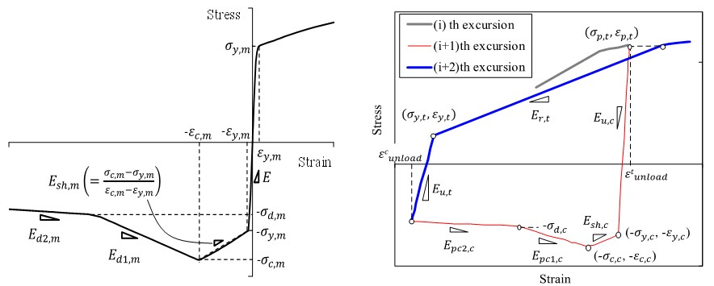
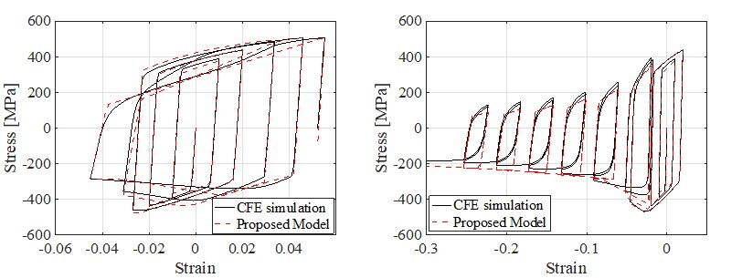

.. SLModel:

SLModel Material
^^^^^^^^^^^^^^^^^^^^^^^^^

This command is used to construct a material based on the Suzuki and Lignos model.

.. function:: uniaxialMaterial SLModel $Mat_Tag $Dt $E $sigma_y $C $gamma $QInf $b $sigma_c0 $epsilon_c0 $Ed1 $Ed2 $sigma_dm $aSigma $aE $Lambda $c

.. csv-table:: 
   :header: "Argument", "Type", "Description (Units)"
   :widths: 10, 10, 40

   $matTag, |integer|,	    Integer tag identifying material (-)
   $Dt, |float|, Section slenderness D/t (-)
   $E, |float|, Young's modulus (MPa)
   $sigma_y, |float|, Initial yield stress (MPa)
   $C, |float|, Kinematic hardening parameter (MPa)
   $gamma, |float|, Saturation rate of kinematic hardening (-)
   $QInf, |float|, Isotropic hardening parameter (MPa)
   $b, |float|, Saturation rate of isotropic hardening (-)
   $sigma_c0, |float|, Initial capping stress (MPa)
   $epsilon_c0, |float|, Initial capping strain (-)
   $Ed1, |float|, First softening slope (MPa)
   $Ed2, |float|, Second softening slope (MPa)
   $sigma_dm, |float|, Stress at local buckling wave length stabilization (MPa)
   $aSigma , |float|, Cyclic deterioration parameter for yield stress (-)
   $aE , |float|, Cyclic deterioration parameter for unloading stiffness (-)
   $Lambda, |float|, Reference cumulative strain capacity (-)
   $c, |float|, Parameter defining the rate of cyclic deterioration (-)

.. note::

   The stresses and strains model parameters (for both tension and compression) should be specified as positive values.
   
   (-) means that the parameter is unitless

.. [SuzukiAndLignos2020] Suzuki, Y., Lignos, D. G. (2020). "Fiber-based hysteretic model for simulating strength and stiffness deterioration of steel hollow structural section columns under cyclic loading." Earthquake Engineering & Structural Dynamics 49 (15): 1702–20. https://doi.org/10.1002/eqe.3324.

.. _fig-SLModel:

	SLModel monotonic and cyclic curves

	SLModel sample responses and validations
	
.. figure:: figures/SLModel/SLModel_beamColumn_validations.jpg
	:align: center
	:figclass: align-center

	SLModel validation within a beam-column element

.. admonition:: Example 

   The following code is used to construct a SLModel material using SI units.

   .. code-block:: tcl

	set Dt 25.; #(-)
	set E 200000; #(MPa)
	set sigma_y 325.; #(MPa)
	set C 4200.; #(MPa)
	set gamma 19.; #(-)
	set QInf 68.1; #(MPa)
	set b 14.1; #(-)
	set sigma_c0 399.6; #(MPa)
	set epsilon_c0 0.0132; #(-)
	set Ed1 -4330.7; #(MPa)
	set Ed2 -543.4; #(MPa)
	set sigma_dm 249.1; #(MPa) 
	set aSigma 0.043; #(-)
	set aE 0.021; #(-)
	set Lambda 0.83; #(-)
	set c 1.; #(-)

   	uniaxialMaterial SLModel 1 $Dt $E $sigma_y $C $gamma $QInf $b $sigma_c0 $epsilon_c0 $Ed1 $Ed2 $sigma_dm $aSigma $aE $Lambda $c;

For code inquires or bug reporting, please contact: 
- Diego Heredia, Ecole Polytechnique Federale Lausanne (EPFL), e-mail: diego.herediarosa@epfl.ch

For more information visit: https://www.epfl.ch/labs/resslab/ 

