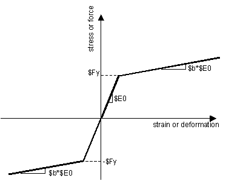
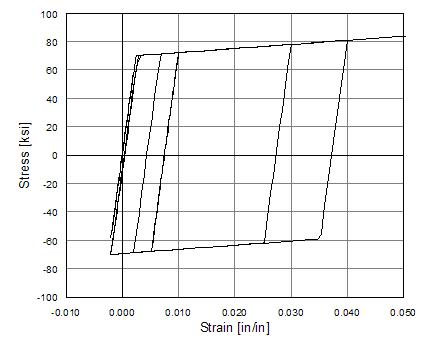

.. _steel01:

Steel01 Material
^^^^^^^^^^^^^^^^

This command is used to construct a uniaxial bilinear steel material object with kinematic hardening and optional isotropic hardening described by a non-linear evolution equation (REF: Fedeas).

.. function:: uniaxialMaterial Steel01 $matTag $Fy $E0 $b <$a1 $a2 $a3 $a4>

.. csv-table:: 
   :header: "Argument", "Type", "Description"
   :widths: 10, 10, 40

   $matTag, |integer|, integer tag identifying material
   $Fy, |float|, yield strength
   $E0, |float|, initial elastic tangent
   $b, |float|, strain-hardening ratio (ratio between post-yield tangent and initial elastic tangent)
   $a1, |float|, optional: isotropic hardening parameter: increase of compression yield envelope as proportion of yield strength after a plastic strain of $a2*($Fy/E0).
   $a2, |float|, optional:isotropic hardening parameter (see explanation under $a1)
   $a3, |float|, optional: isotropic hardening parameter: increase of tension yield envelope as proportion of yield strength after a plastic strain of $a4*($Fy/E0)
   $a4, |float|, optional: isotropic hardening parameter (see explanation under $a3)

.. note::
   By default there is no isotropic hardening.

.. _fig-mdof:

	Steel01

	Steel01 Material -- Default Hysteretic Behavior (NO isotropic hardening)

.. figure:: figures/Steel01/Steel01HystereticB.jpg
	:align: center
	:figclass: align-center

	Steel01 Material -- Hysteretic Behavior of Model with Isotropic Hardening in Compression

.. figure:: figures/Steel01/Steel01HystereticC.jpg
	:align: center
	:figclass: align-center

	Steel01 Material -- Hysteretic Behavior of Model with Isotropic Hardening in Tension

.. admonition:: Example 

   The following is used to construct a Steel01 mataerial with a tag of **1**, a yield strength of $60.0** and an initial tangent stiffness of **30000,0**.

   1. **Tcl Code**

   .. code-block:: tcl

      uniaxialMaterial Steel01 60.0 30000.0

   2. **Python Code**

   .. code-block:: python

      uniaxialMaterial('Steel01',60.0,30000.0)

Code Developed by: |mhs|
