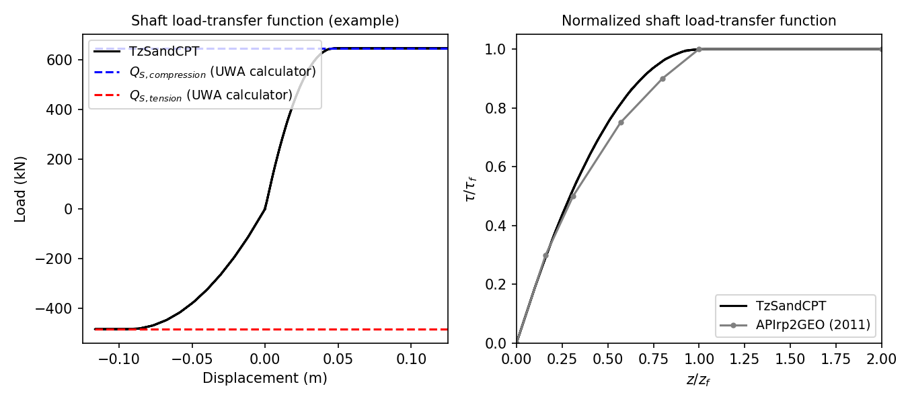

.. _TzSandCPT:

TzSandCPT Material
^^^^^^^^^^^^^^^^^^^^^^

This command is used to construct a ``TzSandCPT`` uniaxial material object:

.. function:: uniaxialMaterial TzSandCPT $matTag $qc $Sv_eff $D $t $h $dz $dcpt $pa <$delta_f>

.. csv-table:: 
   :header: "Argument", "Type", "Description"
   :widths: 10, 10, 40

   $matTag, |integer|, integer tag identifying material
   $qc, |float|,  cone resistance
   $Sv_eff, |float|, vertical effective soil stress 
   $D, |float|, pile outer diameter 
   $t, |float|, pile wall thickness
   $h, |float|, distance to the pile tip
   $dz, |float|, local pile height
   $dcpt, |float|, diameter of the standard CPT probe (see note)
   $pa, |float|, atmospheric pressure (see note)
   $delta_f, |float|, ultimate interface friction angle (optional with default value of: 29.0)

.. note::
   The nominal value of the diameter of the standard CPT probe is 35.7mm. For the atmospheric 
   pressure a value of 100 kPa or equivalent may be retained. 

.. note::
   For the ultimate sand-pile interface friction angle, in the absence of site-specific measurements, 
   the recommended value of 29 :math:`^\circ` is assummed as suggested in the litterature.  

Description
""""""""""""""

The ``TzSandCPT`` function implements the shaft-load transfer function, commonly referred to as 
the :math:`t_z` curve or spring, according to the *new Unified CPT-based method* for driven piles 
in sands.

Shaft capacity
+++++++++++++++

The material calculates the maximum shaft or skin friction according to the formulations as 
given in [LehaneEtAl2020a]_. The shaft capacity is given by Eq. :eq:`Eq.1`, being :math:`\tau_f` the local ultimate shaft friction, :math:`\mathrm{D}` the pile diameter, and :math:`L` the embedded pile length.

.. math::
   :label: Eq.1
   
   \mathrm{Q}_{\text{shaft}}=\pi \mathrm{D} \int_0^L \tau_f \ dz

A Coulomb’s law is assumed to estimate :math:`\tau_f` as follows:

.. math::
   :label: Eq.2
   
   \tau_f = \left(\frac{f_t}{f_c}\right) \left(\sigma'_{rc} + \Delta \sigma'_{rd}\right) \tan \delta_f

where :math:`\sigma'_{rc}` is the (stationary) radial effective stress, :math:`\Delta \sigma'_{rd}` is the increase in radial effective stress that occurs during pile loading. The term :math:`\delta_f` stands for the ultimate sand-pile interface friction angle, in the absence of site-specific measurements, a constant value of :math:`29^\circ` is recommended. The coefficient :math:`\frac{f_t}{f_c}` becomes 1 for compression loading and 0.75 for tension loading.

The term :math:`\sigma'_{rc}` is calculated according to Eq. :eq:`Eq.3`:

.. math::
   :label: Eq.3
   
   \sigma_{r c}^{\prime}=\left(\frac{q_c}{44}\right) A_{re}^{0.3}[\operatorname{Max}[1,(h / D)]]^{-0.4}

where :math:`d_{CPT}=35.7` mm, :math:`h` refers to the distance from the pile tip to a given soil depth, and :math:`A_{re}` represents the effective area ratio which is given in Eq. :eq:`Eq.4`. Note that for a closed-ended pile :math:`A_{re}` becomes 1.

.. math::
   :label: Eq.4
   
   \mathrm{A}_{\mathrm{re}}=1-\text{PLR}\left(\frac{\mathrm{D}_{\mathrm{i}}}{\mathrm{D}}\right)^2

being :math:`\mathrm{D}_{\mathrm{i}}` the pile inner diameter and :math:`\text{PLR}` the ratio of the plug length to the pile embedment which can be approximated by Eq. :eq:`Eq.5`.

.. math::
   :label: Eq.5
   
   \text{PLR} \approx \tanh \left[0.3\left(\frac{D_i}{d_{CPT}}\right)^{0.5}\right]

The :math:`\Delta \sigma'_{rd}` term in Eq. :eq:`Eq.2` can be calculated as follows:

.. math::
   :label: Eq.6
   
   \Delta \sigma_{r d}^{\prime}=\left(\frac{q_c}{10}\right)\left(\frac{q_c}{\sigma_v^{\prime}}\right)^{-0.33}\left(\frac{d_{CPT}}{D}\right) 

The non-linear axial load-transfer function obeys the formulas 
defined by [LehaneLiBittar2020b]_.

Load-transfer function
+++++++++++++++++++++++++

The unified method for sands assumes a parabolic formulae as given in Eq. :eq:`Eq.9`. 

.. math::
   :label: Eq.9

   \frac{\tau}{\tau_{\mathrm{f}}}=\left(\frac{G}{\tau_{\mathrm{f}}}\right)\left(\frac{z}{2 D}\right)\left[1-\frac{z}{2 z_{\mathrm{f}}}\right]

where the ratio :math:`G/\tau_{\mathrm{f}}` is inversely proportional to the displacement :math:`z_f` at which the peak shear friction :math:`\tau_f` is attained, as shown in Eq. :eq:`Eq.10`.

.. math::
   :label: Eq.10

   \frac{G}{\tau_{\mathrm{f}}} = \frac{4D}{z_f}

The API (2011) guidelines recommend a constant value of 0.01 for the normalized peak displacement :math:`z_f/D`. The unified method proposes the following expression that allows for a better match with the measured axial backbone curves:

.. math::
   :label: Eq.11

   \frac{z_{\mathrm{f}}}{D} =\frac{q_{\mathrm{c}}^{0.5} \sigma_{\mathrm{v}}^{\prime 0.25}}{A p_{\mathrm{a}}^{0.75}}

where :math:`p_a` is the atmospheric pressure, equal to 100 kPa, and :math:`\sigma_{\mathrm{v}}^{\prime}` is the vertical effective stress. The proposed values for :math:`A` are 1250 for compression and half of that, i.e., 625, for tension.

Example
""""""""""

Below, examples are provided on how to use this material. The input data assumed is based on a typical 
sand site in the Gulf of Mexico (referred to as *Site A* in [LehaneEtAl2005]_). The simulated 
behavior for this example is shown in the following figure.

Users can verify that the internally computed ultimate shaft friction values should be 84.3kPa and 
63.2kPa for compression and tension loading, respectively. These estimates were confirmed by 
comparing them with those computed using the `UWA calculator <https://pile-capacity-uwa.com>`_, 
which led to the same results. This can be observed in the left plot, displaying the simulated 
load-displacement response.

The right plot compares the normalized form of the simulated ``TzSandCPT`` response against the 
load-transfer curve recommended in API (2011). This comparison shows a close match, as discussed 
in [LehaneLiBittar2020b]_.

.. admonition:: Example 

   The following constructs a TzSandCPT material with a tag of **1**, :math:`q_c` of **39928 kPa**, :math:`\sigma'_v` of **203.8 kPa**, :math:`D` of **2.44 m**, :math:`t` of **0.0445 m**, :math:`h` of **40 m**, :math:`\Delta_z` of **1 m**, :math:`d_{CPT}` of **35.7 mm** and :math:`p_{a}` of **100 kPa**.

   1. **Tcl Code**

   .. code-block:: tcl

      uniaxialMaterial TzSandCPT 1 39928. 203.8 2.44 0.0445 40. 1. 35.7e-3  100.

   2. **Python Code** 

   .. code-block:: python

      uniaxialMaterial('TzSandCPT', 1, 39928., 203.8, 2.44, 0.0445, 40., 1., 35.7e-3 , 100.)

More details on the implementation, validation and benchmark of the ``TzSandCPT`` material are published
in a `conference paper in the ISC'7 Proceedings <https://www.scipedia.com/public/Sastre_Jurado_Stuyts*_2024a>`_.

Code Developed by: |csasj|

.. [LehaneEtAl2005] Lehane, B. M., Schneider, J. A. A., & Xu, X. (2005). A review of design methods for offshore driven piles in siliceous sand.

.. [LehaneEtAl2020a] Lehane, B. M., Liu, Z., Bittar, E., Nadim, F., Lacasse, S., Jardine, R., Carotenuto, P., Rattley, M., Gavin, K., & More Authors (2020). A New 'Unified' CPT-Based Axial Pile Capacity Design Method for Driven Piles in Sand. In Z. Westgate (Ed.), Proceedings Fourth International Symposium on Frontiers in Offshore Geotechnics (pp. 462-477). Article 3457

.. [LehaneLiBittar2020b] Lehane, B. M., Li, L., & Bittar, E. J. (2020). Cone penetration test-based load-transfer formulations for driven piles in sand. Geotechnique Letters, 10(4), 568-574.