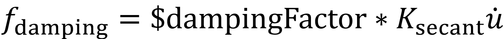

.. _SecStifDamping:

Secant Stiffness-Proportional Damping
^^^^^^^^^^^^^^^^^^^^^^^^^^^^^^^^^^^^^

This command is used to construct a secant stiffness-proportional damping model.

.. function:: damping SecStiff $dampingTag $dampingFactor <-activateTime $Ta> <-deactivateTime $Td> <-fact $tsTagScaleFactorVsTime>

.. csv-table:: 
   :header: "Argument", "Type", "Description"
   :widths: 10, 10, 40

   $dampingTag, |integer|, integer tag identifying damping
   $dampingFactor, |float|, coefficient used in the secant stiffness-proportional damping 
   $Ta, |float|, time when the damping is activated
   $Td, |float|, time when the damping is deactivated
   $tsTagScaleFactorVsTime, |integer|, time series tag identifying the scale factor of the damping versus time

	Secant Stiffness-Proportional Damping

.. admonition:: Example 

   The following is used to construct a secant stiffness-proportional damping with damping factor of **0.05**.

   .. code-block:: tcl

      damping SecStiff 1 0.05

   The following is an example for an SDOF system.

   .. literalinclude:: SecStifDamping.tcl
      :language: tcl

**Code Developed by**: Yuli Huang and `Xinzheng Lu <http://www.luxinzheng.net/english.htm>`_ (Tsinghua University).

**References**

.. [1] Tian Y, Huang Y, Qu Z, Fei Y, Lu X. 2023. `High-performance uniform damping model for response history analysis in OpenSees <https://www.researchgate.net/publication/363845908_High-Performance_Uniform_Damping_Model_for_Response_History_Analysis_in_OpenSees>`_. `Journal of Earthquake Engineering`. `http://dx.doi.org/10.1080/13632469.2022.2124557 <http://dx.doi.org/10.1080/13632469.2022.2124557>`_

