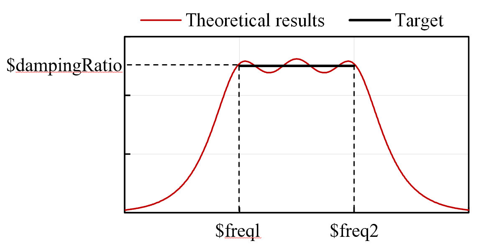

.. _UniformDamping:

Uniform Damping
^^^^^^^^^^^^^^^

This command is used to construct a uniform damping model.

.. function:: damping Uniform $dampingTag $dampingRatio $freql $freq2 <-activateTime $Ta> <-deactivateTime $Td> <-fact $tsTagScaleFactorVsTime>

.. csv-table:: 
   :header: "Argument", "Type", "Description"
   :widths: 10, 10, 40

   $dampingTag, |integer|, integer tag identifying damping
   $dampingRatio, |float|, target equivalent viscous damping ratio
   $freql, |float|, lower bound of the frequency range (in units of T^−1)
   $freq2, |float|, upper bound of the frequency range (in units of T^−1)
   $Ta, |float|, time when the damping is activated
   $Td, |float|, time when the damping is deactivated
   $tsTagScaleFactorVsTime, |integer|, time series tag identifying the scale factor of the damping versus time

	Uniform Damping

.. admonition:: Example 

   The following is used to construct a uniform damping with damping ratio of **0.05** in the frequency range of **1.0** ~ **100** Hz.

   .. code-block:: tcl

      damping Uniform 1 0.05 1.0 100.0 

   The following is an example for an SDOF system.

   .. literalinclude:: UniformDamping.tcl
      :language: tcl

**Code Developed by**: Yuli Huang and `Xinzheng Lu <http://www.luxinzheng.net/english.htm>`_ (Tsinghua University).

**References**

.. [1] Huang Y, Sturt R, Willford M. 2019. `A damping model for nonlinear dynamic analysis providing uniform damping over a frequency range <https://www.researchgate.net/publication/328827267_A_damping_model_for_nonlinear_dynamic_analysis_providing_uniform_damping_over_a_frequency_range>`_. `Computers and Structures`, 212:101–9. `http://dx.doi.org/10.1016/j.compstruc.2018.10.016 <http://dx.doi.org/10.1016/j.compstruc.2018.10.016>`_

.. [2] Tian Y, Huang Y, Qu Z, Fei Y, Lu X. 2023. `High-performance uniform damping model for response history analysis in OpenSees <https://www.researchgate.net/publication/363845908_High-Performance_Uniform_Damping_Model_for_Response_History_Analysis_in_OpenSees>`_. `Journal of Earthquake Engineering`. `http://dx.doi.org/10.1080/13632469.2022.2124557 <http://dx.doi.org/10.1080/13632469.2022.2124557>`_

.. [3] Fei Y, Tian Y, Huang Y, Lu X. 2022. `Influence of damping models on dynamic analyses of a base-isolated composite structure under earthquakes and environmental vibrations <http://dx.doi.org/10.6052/j.issn.1000-4750.2021.07.0500>`_. `Engineering Mechanics`, 39(3): 201-211. `http://dx.doi.org/10.6052/j.issn.1000-4750.2021.07.0500 <http://dx.doi.org/10.6052/j.issn.1000-4750.2021.07.0500>`_

