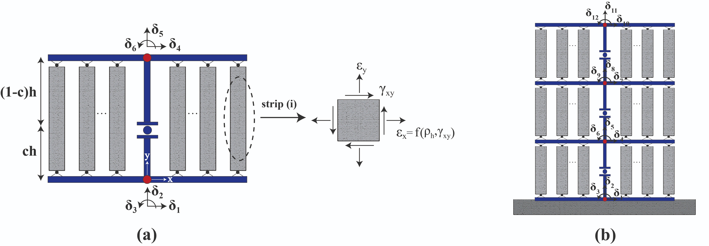

.. _E_SFI::

E-SFI Element
^^^^^^^^^^^^^^^^^^^^

The Efficient Shear-Flexure Interaction (E-SFI) element was developed based on the `SFI-MVLEM <https://opensees.berkeley.edu/wiki/index.php/SFI_MVLEM_-_Cyclic_Shear-Flexure_Interaction_Model_for_RC_Walls>`_ formulation. 
The E-SFI element incorporates the shear-flexure interaction phenomenon by replacing the :math:`m` number of uniaxial fibers of the `MVLEM <https://opensees.berkeley.edu/wiki/index.php/MVLEM_-_Multiple-Vertical-Line-Element-Model_for_RC_Walls>`_, 
by two-dimensional RC panel elements subjected to membrane actions (`FSAM <https://opensees.berkeley.edu/wiki/index.php/FSAM_-_2D_RC_Panel_Constitutive_Behavior>`_). An E-SFI element is described by six degrees of freedom, 
and therefore no additional degrees of freedom are incorporated into the original MVLEM formulation, as in the SFI-MVLEM. The curvature of an E-SFI element is assumed to be uniform, and the resultant rotation is concentrated at height :math:`ch`. 
The kinematic assumption of plane sections remain plane, as well as the assumption of constant shear strain along the element length, are considered for computing the axial and shear strains for each panel over the entire section. 
To complete the strain field of a panel element, a calibrated expression for the horizontal normal strain :math:`\varepsilon_{x}` is implemented to obtain accurate predictions from squat to slender RC walls. 
  

	
	E-SFI Element: (a) Element idealization; (b) Wall model.
	
	
This command is used to construct an E-SFI element object.

.. admonition:: Command

   element E_SFI $eleTag $iNode $jNode $m $c -thick $thicknesses -width $widths -mat $matTags

.. csv-table:: 
   :header: "Parameter", "Type", "Description"
   :widths: 10, 10, 40

   $eleTag, integer, unique element object tag
   $iNode $jNode, 2 integer, tags of element nodes defined in upward direction
   $m, integer, number of element macro-fibers
   $c, float, location of center of rotation from the base (c = 0.4 - recommended)
   $thicknesses, list float, a list of *m* macro-fiber thicknesses
   $widths, list float, a list of *m* macro-fiber widths
   $matTags,  list int, a list of *m* macro-fiber nDMaterial tags
   
   
   
The following recorders are available with the E-SFI element.

.. csv-table:: 
   :header: "Recorder", "Description"
   :widths: 20, 40

   globalForce, element global forces
   Curvature, element curvature
   ShearDef, element deformation
   RCPanel $fibTag $Response, returns RC panel (macro-fiber) $Response for a $fibTag-th panel (1 ≤ fibTag ≤ m). For available $Response(s) refer to nDMaterial
   
.. admonition:: Notes

   | 1. This element shall be used in domain defined with **-ndm 2 -ndf 3**
   | 2. For additional information please visit `E-SFI GitHub Page <https://github.com/carloslopezolea/E-SFI>`_
   
.. admonition:: Examples

   The following example constructs an E-SFI element with tag **1** between nodes **1** and **2**, with **8** macro-fibers and a location of center of rotation of **0.4**. Each macro-fiber has a thickness **1**, width **1** and nDMaterial of tag **1**.  

   1. **Tcl Code**

   .. code-block:: tcl
	  
	  element E_SFI 1 1 2 8 0.4 -thick 1 1 1 1 1 1 1 1 -width 1 1 1 1 1 1 1 1 -mat 1 1 1 1 1 1 1 1;

   2. **Python Code**

   .. code-block:: python

	  element('E_SFI', 1, 1, 2, 8, 0.4, '-thick', 1, 1, 1, 1, 1, 1, 1, 1, '-width', 1, 1, 1, 1, 1, 1, 1, 1, '-mat', 1, 1, 1, 1, 1, 1, 1, 1)	  
   

   
**REFERENCES:**

#. Massone, L. M., López, C. N., & Kolozvari, K. (2021). Formulation of an efficient shear-flexure interaction model for planar reinforced concrete walls. Engineering Structures, 243, 112680. (`link <https://www.sciencedirect.com/science/article/abs/pii/S0141029621008300>`_).
#. López, C. N., Massone, L. M., & Kolozvari, K. (2022). Validation of an efficient shear-flexure interaction model for planar reinforced concrete walls. Engineering Structures, 252, 113590. (`link <https://www.sciencedirect.com/science/article/abs/pii/S0141029621016837>`_).
#. López C. N. Efficient shear-flexure interaction model for nonlinear analysis of reinforced concrete structural walls. MS Dissertation. Santiago, Chile: University of Chile; 2021. (`link <https://repositorio.uchile.cl/handle/2250/180296>`_).

**Code Developed by:** `C. N. López <mailto:carloslopezolea@ug.uchile.cl>`_ (University of Chile), L. M. Massone (University of Chile), K. Kolozvari (CSU Fullerton).