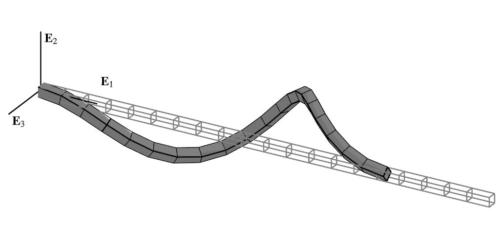

.. _ExactFrame:

Geometrically Exact Frame Element
^^^^^^^^^^^^^^^^^^^^^^^^^^^^^^^^^

	Fig. 1: Torsional instability captured by the **ExactFrame** formulation and rendered with `sees <https://pypi.org/project/sees>`_.

The **ExactFrame** element is a geometrically exact beam element based on Simo's
parameterization [1]_ of Antman's *Special Cosserat Rod* [2]_. 
This element is formulated without any geometric simplifications, and consequently,
is capable of modeling highly nonlinear geometric phenomena with extreme accuracy.
The implementation closely follows the treatment by Perez and Filippou (2024) [3]_. 

.. tabs::

   .. tab:: Tcl

      .. function:: element ExactFrame $tag $iNode $jNode $sect $tran

      The required arguments are:

      .. csv-table:: 
         :header: "Argument", "Type", "Description"
         :widths: 10, 10, 40

         ``tag``, |integer|,	       unique element object tag
         ``iNode`` ``jNode`` , |integer|,  end nodes
         ``sect``, |integer|,         section tag
         ``tran``, |integer|,      identifier for previously-defined coordinate-transformation

   .. tab:: Python (RT)

      .. function:: element("ExactFrame", tag, (iNode, jNode), section=sect, transform=tran)

      The required arguments are:

      .. csv-table:: 
         :header: "Argument", "Type", "Description"
         :widths: 10, 10, 40

         ``tag``, |integer|,	       unique element tag
         ``iNode`` ``jNode`` , |integer|,  tags of end nodes
         ``sect``, |integer|,         section tag
         ``tran``, |integer|,      identifier for previously-defined coordinate-transformation

Geometrically exact elements often exhibit undesirable features. These are rectified
as follows:

* **Path Dependence** The geometrically exact Cosserat rod theory is posed over a
  non-vectorial configuration space, and consequently may exhibit minor 
  path-dependence.

References
==========

.. [1] Simo, J.C. (1985) ‘A finite strain beam formulation. The three-dimensional dynamic problem. Part I’, Computer Methods in Applied Mechanics and Engineering, 49(1), pp. 55–70. Available at: https://doi.org/10.1016/0045-7825(85)90050-7.

.. [2] Antman, S.S. (2005) Nonlinear problems of elasticity. 2nd ed. New York: Springer (Applied mathematical sciences, v. 107).

.. [3] Perez, C.M. and Filippou, F.C. (2024) ‘On nonlinear geometric transformations of finite elements’, International Journal for Numerical Methods in Engineering, p. e7506. Available at: https://doi.org/10.1002/nme.7506.

Code developed by: `Claudio M. Perez <https://github.com/claudioperez>`_ (University of California, Berkeley).

