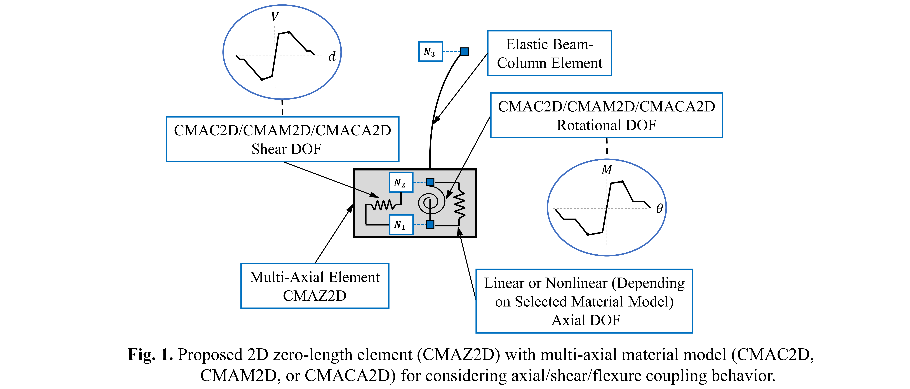

.. _GMG_CMAZ2D:

Coupled Multi-Axial ZeroLength Element (CMAZ2D)
^^^^^^^^^^^^^^^^^^
This command is used to construct a Multi-Axial ZeroLength element object within a two-dimensional lumped-plasticity framework, which is defined by two nodes at the same location. The element is based on a newly developed "Computational Framework for Decision-Oriented Reinforced Concrete Column Simulation Capabilities" ([Ghorbani2022]_). CMAZ2D is intended for use in series with an elastic line element to fully simulate the lateral cyclic behavior of non-retrofitted and retrofitted reinforced concrete columns subjected to seismic motions, up to complete loss of lateral and axial strength. (see Fig. 1). 
The proposed element is coupled to recently developed multi-axial material models including GMG_CMAC2D, GMG_CMAM2D, and GMG_CMACA2D, as shown in Fig. 1. By implementing any of the listed material model in conjuntion with CMAZ2D element, the axial/shear/flexure DOFs could be coupled seamlessly and can share information necessary to adjust behavior (e.g., axial/flexure interaction effects on moment strength).
	
.. function:: element GMG_CMAZ2D $eleTag $iNode $jNode -mat $matTag <-doRayleigh $rFlag> <-orient $x $yp>

.. csv-table:: 
   :header: "Argument", "Type", "Description"
   :widths: 10, 10, 40

   $eleTag, |integer|, unique element object tag
   $endNodes, |integerList|, 2 end nodes
   $matTags, |integer|, Material tag
   $x, |floatList|,  (optional) 3 components in global coordinates defining local x-axis 
   $yp, |floatList|, "| (optional) 3 components in global coordinates defining vector yp 
   | which lies in the local x-y plane for the element."
   $rFlag, |integer|, "| optional, default = 0
   | rFlag = 0 NO RAYLEIGH DAMPING (default)
   | rFlag = 1 include rayleigh damping"

.. note::

   - If the optional orientation vectors are not specified, the local element axes coincide with the global axes. Otherwise the local z-axis is defined by the cross product between the vectors x and yp vectors specified on the command line.

   - The element has all the functionality of the pre-existing ZeroLength element, developed by Gregory L. Fenves, except that it does not require any direction as an input from the user as it automatically passes deformations for all the axial/shear/flexure degrees-of-freedom (DOFs) to the material models listed above. Furthermore, as it generates deformations for all the axial/shear/flexure DOFs, only one material tag should be assigned to the element.

.. admonition:: Example  

   The following is used to construct a *GMG_CMAZ2D*.

   1. **Tcl Code**

   .. code-block:: tcl

	  element GMG_CMAZ2D 1 1 2 -mat 2;
	  element GMG_CMAZ2D 2 3 4 -mat 2 -orient 1 1 0 -1 1 0
	  element GMG_CMAZ2D 3 5 6 -mat 1 -doRayleigh 1

Code Developed by: 
Rasool Ghorbani (rasool.ghorbani@my.utsa.edu),
Adolfo Matamoros,
Wassim Ghannoum.

.. [Ghorbani2022] Ghorbani, R. (2022). "`Computational Framework for Decision-Oriented Reinforced Concrete Column Simulation Capabilities <https://www.proquest.com/docview/2702490424?pq-origsite=gscholar&fromopenview=true>`_". PhD Dissertation, The University of Texas at San Antonio. 
