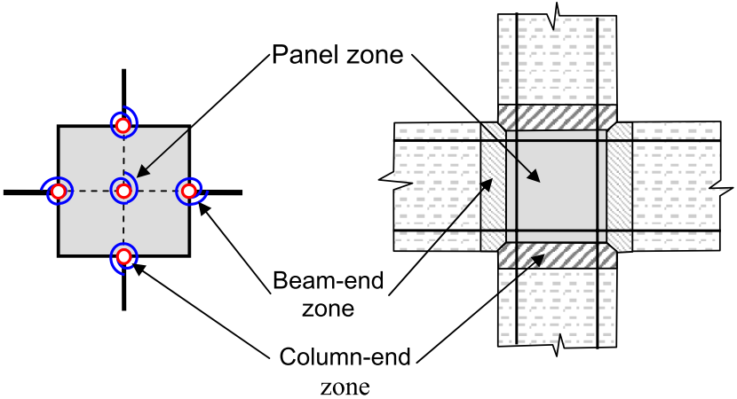

.. Joint2D:

Joint2D Element
^^^^^^^^^^^^^^^^^^^^^^^

This command is used to construct a two-dimensional beam-column-joint element object. The two dimensional beam-column joint is idealized as a parallelogram shaped shear panel with adjacent elements connected to its mid-points. The midpoints of the parallelogram are referred to as external nodes. These nodes are the only analysis components that connect the joint element to the surrounding structure.

Command Lines
"""""""""""""""""""""""

TCL:

.. function:: element Joint2D $eleTag $Node1 $Node2 $Node3 $Node4 $NodeC <$Mat1 $Mat2 $Mat3 $Mat4> $MatC $LrgDspTag <-damage <Dmg1 Dmg2 Dmg3 Dmg4> DmgC>

Python:

.. function:: element('Joint2D', eleTag, Node1, Node2, Node3, Node4, NodeC, <Mat1, Mat2, Mat3, Mat4>, MatC, LrgDspTag, <'-damage', DmgTag>, <'-damage', Dmg1 Dmg2 Dmg3 Dmg4 DmgC>)

where:

.. csv-table::
   :header: "Argument", "Type", "Description"
   :widths: 10, 10, 40

   "$eleTag",       "|integer|", "Unique element object tag"
   "$Node1 ... $Node4", "|integer|", "Node tags indicating four external nodes where the joint element is connected to the adjoining beam-column element"
   "$NodeC", "|integer|", "Node tag indicating the central node of beam-column joint (the tag is used to generate the internal node, thus, the node should not exist in the domain or be used by any other node)"
   "$Mat1 ... $Mat4", "|integer|", "Uniaxial material tags  for interface rotational spring at the specified node. Use a zero tag to indicate the case that a beam-column element is rigidly framed to the joint. (optional)"
   "$MatC", "|integer|", "Uniaxial material tag for rotational spring of the central node that describes shear panel behavior"
   "$LrgDspTag", "|integer|", "| an integer indicating the flag for considering large deformations:
   | ``0`` - for small deformations and constant geometry
   | ``1`` - for large deformations and time varying geometry
   | ``2`` - for large deformations, time varying geometry and length correction"
   

	
	Joint2D Element: The joint zones represented by rotational springs.

 
.. figure:: figures/Joint2D/Joint2D_5SPR_and_1SPR.png
	:align: center
	:figclass: align-center
	:name: Joint2D_5SPR_and_1SPR
	:scale: 50%
	
	Joint2D Element: Graphic representation of the internal components of the element a) with 1 rotational spring and b) with 5 rotational springs.

.. admonition:: Notes
	
	| 1. The nodes must be located such that the main chords bisect.

	| 2. The node tags shall be entered in a clockwise or counter-clockwise order.
	 
	| 3. In the case that the beam-column element is rigidly framed to the joint, the tag for materials **Mat1** to **Mat4** shall be zero.

	| 3. The shear panel uniaxial material (with the tag **MatC**) shall be calibrated for shear-equivalent moment versus shear distortion. In the calibration formulations the shear-equivalent moment is calculated by multiplying the joint average shear stress to the joint panel volume.

	| 4. The element connects the external nodes to the central node via multi-point constraints, and Joint2D must be used along with either the Penalty or the Transformation constraint handler.

	| 5. If the **LrgDspTag** flag is set to zero the element uses a constant constraint matrix for small-deformation formulation. In the large-deformation formulation the constraint matrix is time varying and it is updated at every converged time step.

	
Output Recorders
"""""""""""""""""""""""

The valid inquires to the Joint2D beam-to-column joint finite element include:

- `centralNode`: Displacement components of the central node.
- `deformation`: Interface rotations and shear panel deformation.
- `force`: Nodal moments and the joint panel shear-equivalent moment.
- `size`: Length of the main chord (element size).
- `stiffness`: Joint element stiffness matrix.
- `defoANDforce`: Joint deformation components followed by the nodal moments.

Examples
"""""""""""""""""""""""

.. admonition:: Command Lines

   **Example 1** 
   
   The following example constructs constructs a Joint2D joint element with element tag *12*, that is connected to nodes *1*, *2*, *3*, *4*. The element will generate a center node with tag *112*, and it uses the uniaxial material object with tag *10* as the shear panel rotational spring. This joint element does not have rotational springs at external nodes and does not include large deformations.

   1.1. **Tcl**

   .. code-block:: tcl

      element Joint2D 12 1 2 3 4 112 10 0; 

   1.2. **Python**

   .. code-block:: python

      element('Joint2D', 12, 1, 2, 3, 4, 112, 10, 0)

   **Example 2** 
   
   The following example constructs constructs a Joint2D joint element with element tag *13*, that is connected to nodes *5*, *6*, *7*, *8*. The element will generate a center node with tag *113*, and it uses the uniaxial material object with tag 11 for nodes *5* and *7*, and rigid connections for nodes *6* and *8* to prevent member end rotations. The shear panel behavior is modeled with uniaxial material with tag *10*. The generated multipoint constraint matrices will be time varying to cover large deformations and the nodal positions will be corrected to maintain the initial joint size.

   2.1. **Tcl**

   .. code-block:: tcl

      element Joint2D 13 5 6 7 8 113 11 0 11 0 10 2; 

   2.2. **Python**

   .. code-block:: python

      element('Joint2D', 13, 5, 6, 7, 8, 113, 11, 0, 11, 0, 10, 2)
  
	
.. admonition:: References

	More information available in the following reference:
	
	#. Arash Altoontash, 2004, "Simulation and damage models for performance assessment of reinforced concrete beam-column joints", PhD Dissertation, Stanford University, California, USA. [`URL <https://opensees.berkeley.edu/OpenSees/doc/Altoontash_Dissertation.pdf>`_].
	

	
Code developed by: Arash Altoontash