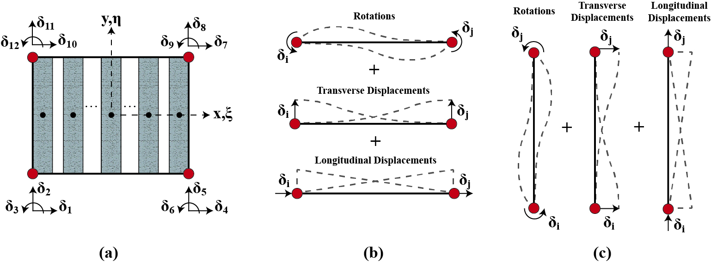

.. _MEFI::

MEFI Element
^^^^^^^^^^^^^^^^^^^^

The Membrane Fiber (MEFI) element, is described by four nodes, each containing three degrees of freedom (DOFs), two translations, and one in-plane rotation (drilling) DOF, 
which incorporates a blended interpolation function for the displacements over the element. The element formulation accommodates the quadrature points and weights of the 
classical finite element formulation of membrane elements to resemble strips (fibers), similarly to macroscopic elements.
  

	
	MEFI Element: (a) Element idealization; (b) Interpolation function at bottom and top edges; (c) Interpolation function at left and right edges.
	
	
This command is used to construct a MEFI element object.

.. admonition:: Command

   element MEFI $eleTag $iNode $jNode $kNode $lNode $numFib -width $widths -sec $secTags

.. csv-table:: 
   :header: "Parameter", "Type", "Description"
   :widths: 10, 10, 40

   $eleTag, integer, unique element object tag
   $iNode $jNode $kNode $lNode, 4 integer, tags of element nodes defined in counterclockwise direction
   $numFib, integer, number of element macro-fibers
   $widths, list float, a list of *numFib* macro-fiber widths
   $secTags,  list int, a list of *numFib* macro-fiber section tags
   
   
   
The following recorders are available with the MEFI element.

.. csv-table:: 
   :header: "Recorder", "Description"
   :widths: 20, 40

   forces, element global forces
   stresses, element stresses
   strains, element strains
   RCPanel $fibTag $Response, returns material $Response for a $fibTag-th panel (1 ≤ fibTag ≤ numFib). For available $Response(s) refer to material
   
.. admonition:: Notes

   | 1. This element shall be used in domain defined with **-ndm 2 -ndf 3**
   | 2. For additional information please visit `MEFI GitHub Page <https://github.com/carloslopezolea/MEFI>`_
   
.. admonition:: Command Example

   The following example constructs a MEFI element with tag **1** between nodes **1, 2, 3, 4**, with **8** macro-fibers. Each macro-fiber has width **1** and material tag **1**.  

   1. **Tcl Code**

   .. code-block:: tcl
	  
	  element MEFI 1 1 2 3 4 8 -width 1 1 1 1 1 1 1 1 -sec 1 1 1 1 1 1 1 1;

   2. **Python Code**

   .. code-block:: python

	  element('MEFI', 1, 1, 2, 3, 4, 8, '-width', 1, 1, 1, 1, 1, 1, 1, 1, '-sec', 1, 1, 1, 1, 1, 1, 1, 1)	  
   
.. admonition:: Pushover Example 

   The following example creates a pushover analysis for a reinforced concrete wall. The example is based on specimen RW-A20-P10-S38 tested by Tran and Wallace (`2012 <https://escholarship.org/uc/item/1538q2p8>`_).

   1. **Tcl Code**

   .. code-block:: tcl
	  
	  # ------------------------------------------------------------------------------------------------------------------------------------------------------
	  # Description: Pushover analysis of specimen RW-A20-P10-S38 (Tran and Wallace, 2012)
	  # Created by: Carlos López Olea (carloslopezolea@gmail.com)
	  # Last Modification: 01/2024
	  # Basic units: N, mm, sec
	  # ------------------------------------------------------------------------------------------------------------------------------------------------------

	  # ------------------------------------------------------------------------------------------------------------------------------------------------------
	  # Start of model generation
	  # ------------------------------------------------------------------------------------------------------------------------------------------------------
	  
	  wipe
	  model Basic -ndm 2 -ndf 3

	  # ------------------------------------------------------------------------------------------------------------------------------------------------------
	  # Set geometry, nodes, boundary conditions
	  # ------------------------------------------------------------------------------------------------------------------------------------------------------

	  # Nodes for RC wall
	  for {set i 1} {$i <= 8} {incr i} {
		  node [expr 2*$i-1] 0.0    [expr (2209.8/7)*($i-1)]
		  node [expr 2*$i]   1220.0 [expr (2209.8/7)*($i-1)]
	  }

	  # Nodes for loading transfer beam
	  for {set i 9} {$i <= 10} {incr i} {
		  node [expr 2*$i-1] 0.0    [expr 2209.8 + (457.2/2)*($i-8)]
		  node [expr 2*$i]   1220.0 [expr 2209.8 + (457.2/2)*($i-8)]
	  }

	  # Restraint fixes
	  fix 1 1 1 1                       
	  fix 2 1 1 1  

	  # Node restraints
	  equalDOF 15 16 1
	  equalDOF 17 18 1
	  equalDOF 19 20 1

	  # ------------------------------------------------------------------------------------------------------------------------------------------------------
	  # Define and build materials
	  # ------------------------------------------------------------------------------------------------------------------------------------------------------

	  # Build uniaxial steel materials
	  uniaxialMaterial  Steel02  1 469.93 200000.0 0.02 20.0 0.925 0.15; # steel X
	  uniaxialMaterial  Steel02  2 409.71 200000.0 0.02 20.0 0.925 0.15; # steel Y web
	  uniaxialMaterial  Steel02  3 429.78 200000.0 0.01 20.0 0.925 0.15; # steel Y boundary

	  # Build uniaxial concrete materials
	  uniaxialMaterial Concrete02 4 -47.09 -0.00232  0.0  -0.037 0.1 2.13 1738.33; # unconfined concrete
	  uniaxialMaterial Concrete02 5 -53.78 -0.00397 -9.42 -0.047 0.1 2.13 1827.12; # confined concrete 
 
	  # Build nD concrete materials
	  nDMaterial OrthotropicRAConcrete 6 4 0.00008 -0.00232 0.0 -damageCte1 0.175 -damageCte2 0.5; # unconfined concrete
	  nDMaterial OrthotropicRAConcrete 7 5 0.00008 -0.00397 0.0 -damageCte1 0.175 -damageCte2 0.5; # confined concrete

	  # Build nD steel materials
	  nDMaterial SmearedSteelDoubleLayer 8 1 2 0.0027 0.0027 0.0; # steel web
	  nDMaterial SmearedSteelDoubleLayer 9 1 3 0.0082 0.0323 0.0; # steel boundary

	  # Build reinforced concrete sections
	  section RCLMS 10 1 1 -reinfSteel 8  -conc 6   -concThick 152.4;       # wall web
	  section RCLMS 11 1 2 -reinfSteel 9  -conc 6 7 -concThick 50.8  101.6; # wall boundary

	  # ------------------------------------------------------------------------------------------------------------------------------------------------------
	  # Define and build elements
	  # ------------------------------------------------------------------------------------------------------------------------------------------------------

	  # Build MEFI elements
	  set numFib 8;   # number of element macro-fibers
	  set db 228.6;   # boundary length discretization
	  set dw 127.133; # web length discretization

	  for {set i 1} {$i <= 9} {incr i} {
		  element MEFI $i [expr 2*$i-1] [expr 2*$i] [expr 2*$i+2] [expr 2*$i+1] $numFib -width $db $dw $dw $dw $dw $dw $dw $db -sec 11 10 10 10 10 10 10 11;
	  }

	  # ------------------------------------------------------------------------------------------------------------------------------------------------------
	  #  Define recorders
	  # ------------------------------------------------------------------------------------------------------------------------------------------------------

	  recorder Element -file MEFI/MEFI1_forces.out -time -ele 1 forces
	  recorder Element -file MEFI/MEFI1_stresses.out -time -ele 1 stresses
	  recorder Element -file MEFI/MEFI1_strains.out -time -ele 1 strains
	  recorder Element -file MEFI/MEFI1_fiber1_strain.out -time -ele 1 RCPanel 1 panel_strain
	  recorder Element -file MEFI/MEFI1_fiber1_stress.out -time -ele 1 RCPanel 1 panel_stress

	  # ------------------------------------------------------------------------------------------------------------------------------------------------------
	  # Gravity load analysis
	  # ------------------------------------------------------------------------------------------------------------------------------------------------------

	  # Define gravity load pattern
	  pattern Plain 1 Linear {
		  load 19  0.0 -320272.0 0.0  
		  load 20  0.0 -320272.0 0.0	
	  }

	  # Analysis generation
	  system BandGeneral
	  constraints Transformation
	  numberer RCM
	  test NormUnbalance 100.0 100 0
	  algorithm Newton
	  integrator LoadControl 0.05
	  analysis Static
	  set ok [analyze 20]
	  if {$ok == 0} {
	     puts "Gravity analysis completed successfully";
	  } else {
	     error "Gravity analysis failed";    
	  }
	  loadConst -time 0.0
	  wipeAnalysis

	  # ------------------------------------------------------------------------------------------------------------------------------------------------------
	  # Lateral load analysis
	  # ------------------------------------------------------------------------------------------------------------------------------------------------------

	  # Define lateral load pattern
	  pattern Plain 2 Linear {
		  load 15 1000.0 0.0 0.0
		  load 17 1000.0 0.0 0.0
		  load 19 1000.0 0.0 0.0
	  }

	  # Analysis generation
	  system BandGeneral
	  constraints Transformation
	  numberer RCM
	  test NormDispIncr 0.001 100 0
	  algorithm Newton
	  integrator DisplacementControl 17 1 0.1
	  analysis Static
	  set ok [analyze 800]
	  if {$ok == 0} {
	     puts "Pushover analysis completed successfully";
	  } else {
	     error "Pushover analysis failed";    
	  }

	  # ------------------------------------------------------------------------------------------------------------------------------------------------------
	  # Perform tests
	  # ------------------------------------------------------------------------------------------------------------------------------------------------------

	  # Base shear test
	  reactions
	  set BSref 421968.7;                                         # reference value for base shear
	  set BS [expr abs([nodeReaction 1 1] + [nodeReaction 2 1])]; # computed value for base shear
	  set BSerr [expr abs($BS-$BSref)/$BSref];                    # compute relative error
	  puts "Relative base shear error is abs(BS-BSref)/BSref: $BSerr"
	  if {$BSerr <= 0.0001} {
	     puts "Base shear test completed successfully";
	  } else {
	     error "Base shear test failed";    
	  }
	
   
**REFERENCES:**

#. López, C. N., Rojas, F., & Massone, L. M. (2022). Membrane fiber element for reinforced concrete walls – the benefits of macro and micro modeling approaches. Engineering Structures, 254, 113819. (`link <https://www.sciencedirect.com/science/article/abs/pii/S0141029621018897>`_).

**Code Developed by:** `C. N. López <mailto:carloslopezolea@ug.uchile.cl>`_
