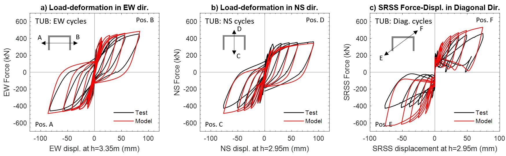

.. _MVLEM_3D::

MVLEM_3D Element
^^^^^^^^^^^^^^^^

| Developed and implemented by: 
| `Kristijan Kolozvari <mailto:kkolozvari@fullerton.edu>`_ (CSU Fullerton)
| Kamiar Kalbasi (CSU Fullerton)
| Kutay Orakcal (Bogazici University)
| John Wallace (UCLA)

Description
################

The MVLEM_3D model (Figure 1a) is a three-dimensional four-node element with 24 DOFs for nonlinear analysis of flexure-controlled non-rectangular reinforced concrete walls subjected to multidirectional loading. The model is an extension of the two-dimensional, two-node Multiple-Vertical-Line-Element-Model (`MVLEM <https://opensees.berkeley.edu/wiki/index.php/MVLEM_-_Multiple-Vertical-Line-Element-Model_for_RC_Walls>`_). The baseline MVLEM, which is essentially a line element for rectangular walls subjected to in-plane loading, is extended to a three-dimensional model formulation by: 1) applying geometric transformation of the element in-plane degrees of freedom that convert it into a four-node element formulation (Figure 1b), as well as by incorporating linear elastic out-of-plane behavior based on the Kirchhoff plate theory (Figure 1c). The in-plane and the out-of-plane element behaviors are uncoupled in the present model.

This element shall be used in Domain defined with **-ndm 3 -ndf 6**.

.. figure:: MVLEM_3D_formulation.jpg
	:align: center
	:figclass: align-center

	**Figure 1: MVLEM_3D Element Formulation**

Input Parameters
################

.. admonition:: Command

   element MVLEM_3D eleTag iNode jNode kNode lNode m -thick {Thicknesses} -width {Widths} -rho {Reinforcing_ratios} -matConcrete {Concrete_tags} -matSteel {Steel_tags} -matShear {Shear_tag} <-CoR c> <-ThickMod tMod> <-Poisson Nu> <-Density Dens>

.. csv-table:: 
   :header: "Parameter", "Type", "Description"
   :widths: 10, 10, 40

   eleTag, integer, unique element object tag
   iNode jNode kNode lNode, 4 integer, tags of element nodes defined in counterclockwise direction|
   m, integer, number of element fibers
   {Thicknesses}, *m* float, array of *m* fiber thicknesses
   {Widths}, *m* float, array of *m* macro-fiber widths
   {Reinforcing_ratios}, *m* float, array of *m* reinforcing ratios corresponding to macro-fibers
   {Concrete_tags}, *m* float, array of *m* uniaxialMaterial tags for concrete
   {Steel_tags}, *m* float, array of *m* uniaxialMaterial tags for steel
   {Shear_tag}, *m* float, tag of uniaxialMaterial for shear material
   c, float, location of center of rotation from the base (optional; default = 0.4 (recommended))
   tMod, float, thickness multiplier (optional; default = 0.63 equivalent to 0.25Ig for out-of-plane bending)
   Nu, float, Poisson ratio for out-of-plane bending (optional; default = 0.25)
   Dens, float, Density (optional; default = 0.0)

Recorders
#########

The following recorders are available with the MVLEM_3D element.

.. csv-table:: 
   :header: "Recorder", "Description"
   :widths: 20, 40

   globalForce, Element global forces
   Curvature, Element curvature
   Shear_Force_Deformation, Element shear force-deformation relationship
   Fiber_Strain, Vertical strains in m fibers along the cross-section
   Fiber_Stress_Concrete, Vertical concrete stresses in m fibers along the cross-section
   Fiber_Stress_Steel, Vertical steel stresses in m fibers along the cross-section

OpenSeesPy Documentation
########################

OpenSeesPy user documetation for the MVLEM_3D element can be accessed from `HERE <https://openseespydoc.readthedocs.io/en/latest/src/MVLEM_3D.html>`_.

Example
#######

Specimen TUB (Beyer et al. 2008) is analyzed using the MVLEM_3D. Figure 2a shows the photo of the test specimen and the multidirectional displacement pattern applied at the top of the wall, while Figure 2b-c show the MVLEM_3D model of specimen TUB. Tcl Input files can be downloaded from `MVLEM-3D GitHub Page <https://github.com/kkolozvari/MVLEM-3D>`_.

.. figure:: MVLEM_3D_TUB_model.jpg
	:align: center
	:figclass: align-center

	**Figure 2: MVLEM_3D Model of Specimen TUB**

.. figure:: MVLEM_3D_TUB_animation.gif
	:align: center
	:figclass: align-center

	**Figure 3: Animation of MVLEM_3D Analysis of Specimen TUB (displacement scale factor = 3.0)**

Figure 4 compares experimentally measured and analytically predicted load deformation behavior of the specimen TUB in E-W, N-S, and diagonal loading directions. The model provides accurate predictions of the lateral load capacity and the stiffness under cyclic loading in loading directions parallel to the principal axes of the cross-section (E-W, N-S direction). Analysis results overestimate the lateral load capacity in diagonal loading directions due to plane-sections-remain-plane assumption implemented in the model formulation that cannot capture pronounced shear lag effect observed in the test specimen. 

	**Figure 4: Experimental vs. MVLEM_3D Load-Deformation Response of Specimen TUB**

References
##########

K. Kolozvari, K. Kalbasi, K. Orakcal & J. W. Wallace, "Three-Dimensional Model for Nonlinear Analysis of Slender Flanged Reinforced Concrete Walls", Engineering Structures, `Volume 236, 1 June 2021, 112105 <https://doi.org/10.1016/j.engstruct.2021.112105>`_.