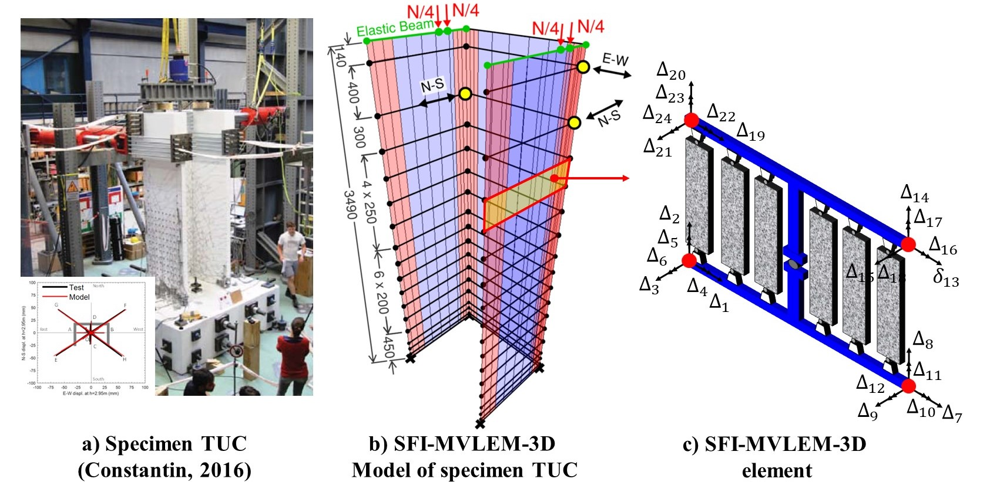
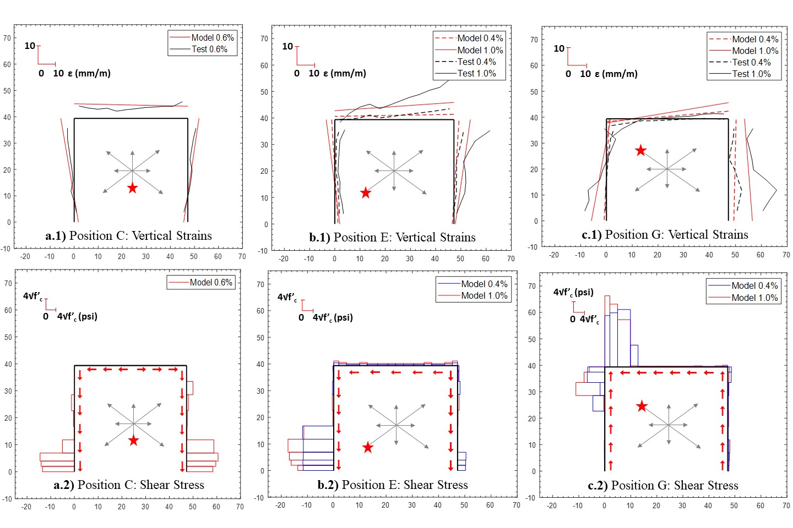

.. _SFI_MVLEM_3D::

SFI-MVLEM-3D Element
^^^^^^^^^^^^^^^^^^^^

| Developed and implemented by: 
| `Kristijan Kolozvari <mailto:kkolozvari@fullerton.edu>`_ (CSU Fullerton)
| Kamiar Kalbasi (CSU Fullerton)
| Kutay Orakcal (Bogazici University)
| John Wallace (UCLA)

Description
###########

The SFI-MVLEM-3D model (Figure 1a) is a three-dimensional four-node element with 24 DOFs that incorporates axial-flexural-shear interaction and can be used for nonlinear analysis of non-rectangular reinforced concrete walls subjected to multidirectional loading. The SFI-MVLEM-3D model is an extension of the two-dimensional, two-node Shear-Flexure-Interaction Multiple-Vertical-Line-Element-Model (`SFI-MVLEM <https://opensees.berkeley.edu/wiki/index.php/SFI_MVLEM_-_Cyclic_Shear-Flexure_Interaction_Model_for_RC_Walls>`_). The baseline SFI-MVLEM, which is essentially a line element for rectangular walls subjected to in-plane loading, is extended in this study to a three-dimensional model formulation by applying geometric transformation of the element degrees of freedom that converted it into a four-node element formulation (Figure 1b), as well as by incorporating linear elastic out-of-plane behavior based on the Kirchhoff plate theory (Figure 1c). The in-plane and the out-of-plane element behaviors are uncoupled in the present model.

For additional information please visit `SFI-MVLEM-3D GitHub Page <https://github.com/kkolozvari/SFI-MVLEM-3D>`_.

This element shall be used in Domain defined with **-ndm 3 -ndf 6**.

.. figure:: figures/SFI_MVLEM/SFI_MVLEM_3D_formulation.jpg
	:align: center
	:figclass: align-center

	**Figure 1: SFI-MVLEM-3D Element Formulation**

Input Parameters
################

.. admonition:: Command

   element SFI_MVLEM_3D eleTag iNode jNode kNode lNode m  -thick {Thicknesses} -width {Widths} -mat {Material_tags} <-CoR c> <-ThickMod tMod> <-Poisson Nu>  <-Density Dens>

.. csv-table:: 
   :header: "Parameter", "Type", "Description"
   :widths: 10, 10, 40

   eleTag, integer, unique element object tag
   iNode jNode kNode lNode, 4 integer, tags of element nodes defined in counterclockwise direction|
   m, integer, number of element fibers
   {Thicknesses}, *m* float, array of *m* fiber thicknesses
   {Widths}, *m* float, array of *m* macro-fiber widths
   {Material_tags}, *m* float, array of *m* macro-fiber nDMaterial (`FSAM <https://opensees.berkeley.edu/wiki/index.php/FSAM_-_2D_RC_Panel_Constitutive_Behavior>`_) tags
   c, float, location of center of rotation from the base (optional; default = 0.4 (recommended))
   tMod, float, thickness multiplier (optional; default = 0.63 equivalent to 0.25Ig for out-of-plane bending)
   Nu, float, Poisson ratio for out-of-plane bending (optional; default = 0.25)
   Dens, float, Density (optional; default = 0.0)

Recorders
#########

The following recorders are available with the SFI-MVLEM-3D element.

.. csv-table:: 
   :header: "Recorder", "Description"
   :widths: 20, 40

   globalForce, Element global forces
   Curvature, Element curvature
   ShearDef, Element deformation
   RCPanel $fibTag $Response, Returns RC panel (macro-fiber) $Response for a $fibTag-th panel (1 ≤ fibTag ≤ m). For available $Response-s refer to nDMaterial (`FSAM <https://opensees.berkeley.edu/wiki/index.php/FSAM_-_2D_RC_Panel_Constitutive_Behavior>`_)

OpenSeesPy Documentation
########################

OpenSeesPy user documetation for the SFI_MVLEM_3D element can be accessed from `HERE <https://openseespydoc.readthedocs.io/en/latest/src/SFI_MVLEM_3D.html>`_.

Example
#######

Specimen TUC (Constantin 2016) is analyzed using the SFI-MVLEM-3D. Figure 2a shows the photo of the test specimen and the multidirectional displacement pattern applied at the top of the wall, while Figure 2b-c show the SFI-MVLEM-3D model of specimen TUC.

	**Figure 2: SFI-MVLEM-3D Model of Specimen TUB**

Figure 3 compares measured and simulated load-deformation responses for specimen TUC in E-W (Figure 3a) and N-S (Figure 3b) directions, as well as for diagonal cycles between positions E-F (Figure 3c) and G-H (Figure 3d). As results comparisons illustrate, the SFI-MVLEM-3D predicts well the overall strength and stiffness of the wall for loading cycles in E-W (Figure 3a) and N-S (Figure 3b) directions where the behavior of the specimen was primarily in the linear elastic range since the maximum magnitude of displacements applied at the top of the wall corresponded to a drift level of only 1.0%. For diagonal cycles (Figure 3c and Figure 3d), the model slightly overestimates the initial stiffness of the specimens, but accurately captures the overall SRSS lateral load resisted by the specimen, with the only exception that the lateral load is overestimated during the last loading cycles corresponding to the largest drift of 2.5%. The cyclic stiffness and pinching characteristics of the wall are well-predicted by the model.

.. figure:: figures/SFI_MVLEM/SFI_MVLEM_3D_TUC_results_LD.jpg
	:align: center
	:figclass: align-center

	**Figure 3: Experimental vs. SFI-MVLEM-3D Load-Deformation Response of Specimen TUB**

Side-by-side comparison of the analytically-obtained vertical strains (Figure 4a-c.1) and shear stresses along wall base (Figure 4a-c.2) demonstrates the capability of the model to capture the interaction between the axial tensile/compressive strains (and resulting stresses) and the in-plane shear stresses developing in the panel-fibers of the SFI-MVLEM-3D elements. Results presented in Figure 4 clearly illustrate that for each of the loading positions, the majority of the shear force demand imposed at the wall is resisted by the regions (panel-fibers) that are subjected to axial compression, while little-to-no shear stress occurs in the panel-fibers subjected to tension. Commonly used fiber-based models that treat axial/flexural and shear behaviors as uncoupled (e.g., displacement based element in OpenSees, shear wall element in Perform 3D) cannot capture this highly non-uniform distribution of shear demands across the wall cross-section and may be subject to considerable bias in predicting shear demands developing in the piers (flanges, web) of non-planar walls subjected to multi-directional seismic actions.

	**Figure 4: Vertical strains (1) and shear stresses (2) at the base of wall specimen TUC at: a) Position E, b) Position G, and c) Position C. Positive (compressive) strains are shown at the outer face of the wall; negative (tensile) strains are plotted at the inner face of the wall. A magnitude scale for strains or stresses is provided in the upper left corner of each plot**

References
##########

K. Kolozvari, K. Kalbasi, K. Orakcal & J. W. Wallace (2021), "Three-dimensional shear-flexure interaction model for analysis of non-planar reinforced concrete walls", Journal of Building Engineering, Vol. 44, 102946. (`link <https://www.sciencedirect.com/science/article/pii/S2352710221008044>`_).

K. Kolozvari, K. Kalbasi, K. Orakcal, L. M. Massone & J. W. Wallace (2019), "Shear–flexure-interaction models for planar and flanged reinforced concrete walls", Bulletin of Eathquake Engineering, Vol. 17, pages 6391–6417. (`link <https://link.springer.com/article/10.1007/s10518-019-00658-5>`_).