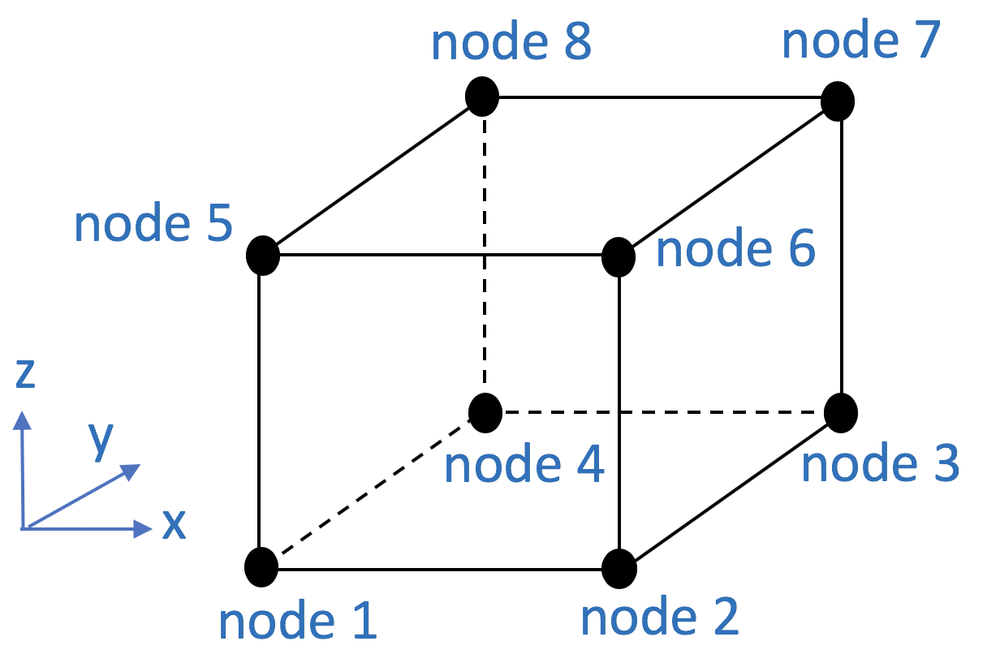

.. _SSPbrick::

SSPbrick Element
^^^^^^^^^^^^^^^^

This command is used to construct an eight-node ssp brick element. The SSPbrick element is an eight-node hexahedral element using physically stabilized single-point integration (SSP --> Stabilized Single Point). The stabilization incorporates an enhanced assumed strain field, resulting in an element which is free from volumetric and shear locking. The elimination of shear locking results in greater coarse mesh accuracy in bending dominated problems, and the elimination of volumetric locking improves accuracy in nearly-incompressible problems. Analysis times are generally faster than corresponding full integration elements.

.. admonition:: Command

   element SSPbrick $eleTag $node1 $node2 $node3 $node4 $node5 $node6 $node7 $node8 $matTag <$b1 $b2 $b3>

.. csv-table:: 
   :header: "Argument", "Type", "Description"
   :widths: 10, 10, 40

   $eleTag, |integer|,	unique element object tag
   $node1 .. $node8, 8 |integer|, nodes of brick (ordered as shown in fig below)
   $matTag, |integer|, tag of nDMaterial
   $b1 $b2 $b3, |listFloat|, optional: body forces in global x y z directions

	stdBrick Element Node Numbering

.. note::

	Valid queries to the SSPbrick element when creating an ElementalRecorder object correspond to those for the nDMaterial object assigned to the element (e.g., 'stress', 'strain'). Material response is recorded at the single integration point located in the center of the element.

      The SSPbrick element was designed with intentions of duplicating the functionality of the stdBrick Element. If an example is found where the SSPbrick element cannot do something that works for the stdBrick Element, e.g., material updating, please contact the developers listed below so the bug can be fixed.

   This element can only be defined after a :numref:`model` with **-ndm 3 -ndf 3**

.. admonition:: Example 

   The following example constructs a brick element with tag **1** between nodes **1, 2, 3, 4, 5, 6, 7, 8** with an nDMaterial of tag **1** and x- and y-directed body forces of zero, and z-directed body force of -10.0. After element has been constructed two recoder commands, :numref:`recorder`, are given to record stress and strain when using the SSPbrick element (note the difference from the stdBrick Element)

   1. **Tcl Code**

   .. code-block:: tcl

      element SSPbrick 1 1 2 3 4 5 6 7 8 1 0.0 0.0 -10.0

      recorder Element -eleRange 1 $numElem -time -file stress.out  stress
      recorder Element -eleRange 1 $numElem -time -file strain.out  strain

   2. **Python Code**

   .. code-block:: python

      element('SSPbrick',1,1,2,3,4,5,6,7,8,1, 0.0, 0.0, -10.0)

Code Developed by: |chris|, |pedro|, |peter| at University of Washington.