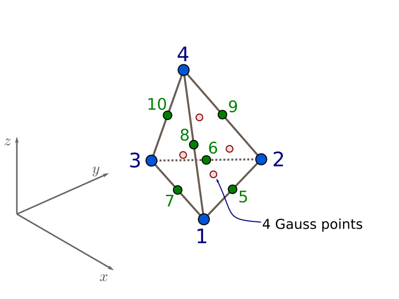

.. _TenNodeTetrahedron:

TenNodeTetrahedron Element
^^^^^^^^^^^^^^^^^^^^^^^^^^

This command is used to construct a ten-node tetrahedron element object, which uses the standard isoparametric formulation.

.. admonition:: Command

   **element TenNodeTetrahedron $eleTag $node1 $node2 $node3 $node4 $node5 $node6 $node7 $node8 $node9 $node10 $matTag <$b1 $b2 $b3> <-doInitDisp $value>**

.. csv-table::
   :header: "Argument", "Type", "Description"
   :widths: 10, 10, 40

   $eleTag, |integer|,	unique element object tag
   $node1 .. $node10, 10 |integer|, nodes of tet (ordered as shown in fig below)
   $matTag, |integer|, tag of nDMaterial
   $b1 $b2 $b3, |listFloat|, optional: body forces in global x y z directions (default: 0.0 0.0 0.0)
   -doInitDisp $value, |integer|, "optional flag; if $value is non-zero, the nodal displacements present when the element is added to the domain are stored and subtracted from all later trial displacements before strains are computed (default: 0, i.e. disabled, so ordinary total displacements are used)"

This element is based on second-order interpolation of nodal quantities, so the strain and stress field inside the element vary linearly over the element. Four Gauss points inside the element are used for integration.

.. note::

   ``-doInitDisp`` may follow ``$matTag`` directly or any of the optional body forces ``$b1 $b2 $b3`` (earlier versions required all three body forces to be given first; otherwise the command failed with "WARNING: invalid double data").

	TenNodeTetrahedron Element Node Numbering

Theory
""""""

The element uses the full quadratic (10-node) interpolation of the tetrahedron: the 4 corner nodes plus the 6 edge mid-side nodes shown above, giving a displacement field that is quadratic in the natural (barycentric) coordinates :math:`(\xi,\eta,\zeta,\lambda)`, with :math:`\lambda = 1-\xi-\eta-\zeta`, and a strain/stress field that varies linearly over the element.

Integration uses the classical symmetric 4-point rule for tetrahedra, exact for polynomials up to degree 2 (sufficient for the quadratic displacement field). The four sample points are the permutations of the barycentric coordinates

.. math::

   \alpha = \frac{5+3\sqrt{5}}{20} \approx 0.58541020,\qquad
   \beta  = \frac{5-\sqrt{5}}{20}  \approx 0.13819660

i.e. point :math:`k` has one barycentric coordinate equal to :math:`\alpha` and the other three equal to :math:`\beta`, each with the same natural weight :math:`w = 1/24` (so that :math:`4w = 1/6`, the volume of the reference tetrahedron in natural coordinates). For an element with straight edges, the Jacobian determinant is constant over the element and equal to :math:`6V`, where :math:`V` is the physical element volume, so that

.. math::

   \int_V f\, dV = \sum_{k=1}^{4} w\, f(\mathbf{x}_k)\, \det(J) = \sum_{k=1}^{4} \frac{1}{24} f(\mathbf{x}_k)\, (6V)

reproduces the exact element volume when :math:`f \equiv 1` (see, e.g., Keast, "Moderate degree tetrahedral quadrature formulas," *Computer Methods in Applied Mechanics and Engineering*, 55(3), 1986, for this family of quadrature rules).

Responses and parameters
""""""""""""""""""""""""

Valid queries to a ``TenNodeTetrahedron`` element (e.g. via :ref:`ElementRecorder <elementRecorder>` or the ``eleResponse`` command) are:

.. csv-table::
   :header: "Response", "Size", "Description"
   :widths: 15, 10, 40

   forces (or force), 30, "nodal resisting forces, 3 components per node, nodes 1 to 10 in order"
   stresses, 24, ":math:`(\sigma_{11},\sigma_{22},\sigma_{33},\sigma_{12},\sigma_{23},\sigma_{13})` at each of the 4 Gauss points, concatenated gp 1..4"
   strains, 24, ":math:`(\epsilon_{11},\epsilon_{22},\epsilon_{33},\epsilon_{12},\epsilon_{23},\epsilon_{13})` at each of the 4 Gauss points, concatenated gp 1..4"
   "material $gp arg1 ...", varies, "forwarded to ``setResponse`` of the NDMaterial copy at Gauss point $gp (1 to 4); ``integrPoint $gp ...`` is accepted as a synonym"

Each of the 4 Gauss points holds its own independent copy of the assigned ``nDMaterial`` (made with ``getCopy`` when the element is added to the domain). ``setParameter``/``updateParameter`` can target one copy or all of them:

.. csv-table::
   :header: "Parameter", "Description"
   :widths: 25, 50

   "material $gp arg1 ...", "forwarded to ``setParameter`` of the material copy at Gauss point $gp only (1 to 4)"
   "arg1 ... (no ``material`` keyword)", "forwarded to ``setParameter`` of all 4 material copies, so the same change is applied at every Gauss point"

.. note::

   Earlier versions of this element integrated the stiffness, mass and consistent body-force vectors over a volume **6 times smaller** than the true element volume (an erroneous extra division by 6 of the Jacobian determinant, on top of the `1/24` quadrature weights that already account for it), the ``stresses``/``strains`` element responses wrote 24 values (4 Gauss points x 6 components) into a statically-sized length-6 buffer, corrupting the heap on any call to ``eleResponse ... stresses`` or an equivalent recorder, and ``-doInitDisp`` could not be used without body forces. All three are fixed in OpenSees PR "TenNodeTetrahedron fixes" (`#1833 <https://github.com/OpenSees/OpenSees/pull/1833>`_); the example below reproduces and checks the fix.

   This element can only be defined after a :ref:`model` with **-ndm 3 -ndf 3**

Verification
""""""""""""

:download:`example_tet10_patch.tcl <figures/TenNodeTetrahedron/example_tet10_patch.tcl>` builds a single, deliberately distorted ``TenNodeTetrahedron`` with corners at :math:`(0,0,0)`, :math:`(2,0,0)`, :math:`(0,3,0)`, :math:`(0,0,1.5)` (volume :math:`V = 2 \cdot 3 \cdot 1.5/6 = 1.5`) and runs three checks:

#. **Body-force patch test.** With a uniform body force :math:`b_3=-2.0` and all nodes restrained, the sum of the vertical reactions over all 10 nodes must equal :math:`-b_3 V = 3.0` exactly (any underintegration of the volume shows up directly here). The script prints the summed reaction and compares it to the expected value.
#. **Uniform-strain patch test.** Prescribing :math:`\epsilon_{xx}=10^{-3}` on all 10 nodes (linear displacement BC) must reproduce the exact uniform stress :math:`(\sigma_{11},\sigma_{22},\sigma_{33})=(1.2,\,0.4,\,0.4)` (with :math:`E=1000`, :math:`\nu=0.25`) identically at all 4 Gauss points; this also exercises the ``stresses`` element response (24 values) without heap corruption.
#. **Per-Gauss-point parameter targeting.** For each Gauss point in turn, ``parameter ... element 1 material $gp E`` followed by ``updateParameter`` doubles the stiffness at that point only; the stress at that Gauss point must double while the other three stay unchanged.

Running it with the OpenSees interpreter gives, on the fixed element:

.. code-block:: text

   BODYFORCE  sum Rz = 3.0000000000  expected = 3.0000000000
   STRESSES  (expect per GP: 1.2 0.4 0.4 0 0 0)
   PATCH max abs error = 3.802e-11
   SETPARAMETER  per-Gauss-point E override (E: 1000.0 -> 2000.0, scale = 2.0)
     gp=1  sigma_xx before=1.200000 after=2.400000 (expected 2.400000)  other-points-unchanged=yes
     gp=2  sigma_xx before=1.200000 after=2.400000 (expected 2.400000)  other-points-unchanged=yes
     gp=3  sigma_xx before=1.200000 after=2.400000 (expected 2.400000)  other-points-unchanged=yes
     gp=4  sigma_xx before=1.200000 after=2.400000 (expected 2.400000)  other-points-unchanged=yes
   OVERALL: PASS

On the unfixed (vanilla upstream) element the same model instead gives a body-force reaction sum of ``0.5`` (should be ``3.0``) and a work-of-reactions under the imposed :math:`\epsilon_{xx}=10^{-3}` of ``3.0e-4`` (should be ``1.8e-3``), both exactly a factor of 6 too small, confirming the volume-scaling bug above.

.. admonition:: Example

   The following example constructs a TenNodeTetrahedron element with tag **1** between nodes **1, 2, 3, 4, 5, 6, 7, 8, 9, 10** with an nDMaterial of tag **1** and body forces given by varaiables **b1, b2, b3**.

   1. **Tcl Code**

   .. code-block:: tcl

      element TenNodeTetrahedron 1 1 2 3 4 5 6 7 8 9 10 1 $b1 $b2 $b3

   2. **Python Code**

   .. code-block:: python

      element('TenNodeTetrahedron',1, 1,2,3,4,5,6,7,8,9,10, 1, b1, b2, b3)

This command is registered in both the Tcl and the (Python-backing) generic OpenSees interpreter.

Code Developed by: `José Antonio Abell <www.joseabell.com>`_ and José Luis Larenas (UANDES). For bugs and features, start a new issue on the `OpenSees github repo <https://github.com/OpenSees/OpenSees>`_ and tag me (@jaabell).
