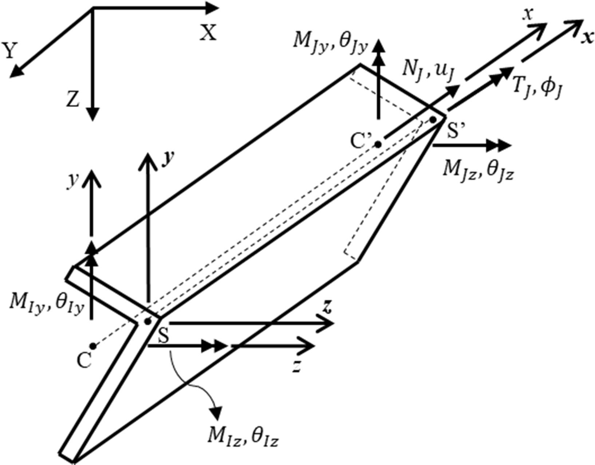

.. _dispBeamColumnAsym:

Displacement-Based Beam Element (Asymmetric Sections)
^^^^^^^^^^^^^^^^^^^^^^^^^^^^^^^^^^^^^^
This command is used to construct a **DispBeamColumnAsym3d** element object, which is suitable for modeling flexural, flexural-torsionl and torsional buckling of members with asymmetric section such as angles and tees. It can also be used to model members with doublely-symmetric sections. The corotational total Lagrangian method is used to capture the axial-flexural-torsional interaction behavior, while the fiber section method is used for modeling material nonlinearity. The fibers and coordinates of the shear center should be defined with respect to the principal axes of the section. Note that warping is not considered in this element.

For more information about the element formulation, please refer to the references at the end of this page.

**TCL ELEMENT COMMAND**

For 3D problems:

.. function:: element dispBeamColumnAsym $eleTag $iNode $jNode $numIntgrPts $secTag $transfTag <-shearCenter $y0 $z0> <-integration integrType>

The required arguments are:

.. csv-table:: 
   :header: "Argument", "Type", "Description"
   :widths: 10, 10, 40

   $eleTag, |integer|,	       unique element object tag
   $iNode  $jNode, |integer|,  end nodes
   $numIntgrPts, |integer|,    total number of integration points
   $secTag, |integer|,         section tag
   $transfTag, |integer|,      identifier for previously-defined coordinate-transformation (CrdTransf) object      

The optional arguments are:

.. csv-table:: 
   :header: "Argument", "Sub-argument", "Type", "Description"
   :widths: 10, 10, 10, 40

   -shearCenter, "", "",	  used to define coordinates of the shear center
   "", $y0  $z0,	|float|,  coordinates of the shear center S w.r.t. the centroid C and the principal axes (Fig. 1) (default y0=z0=0.0)
   -integration, "", "",	  used to select integration type
   "", integrType,	|string|, "numerical integration type, options are Lobatto, Legendre, Radau, NewtonCotes, Trapzoidal (default = Lobatto)"

	Fig. 1: Coordinate systems for members with asymmetric sections (CC': centroidal axis, SS': shear center axis)

**PYTHON ELEMENT COMMAND**

For 3D problems:

.. function:: element  ('dispBeamColumnAsym', $eleTag, $iNode, $jNode, $transfTag, $integrTag, '-shearCenter', $y0, $z0)

The required arguments are:

.. csv-table:: 
   :header: "Argument", "Type", "Description"
   :widths: 10, 10, 40

   $eleTag, |integer|,	       unique element object tag
   $iNode  $jNode, |integer|,  end nodes
   $transfTag, |integer|,    identifier for previously-defined coordinate-transformation (CrdTransf) object
   $integrTag, |integer|,    identifier for previously-defined beam integration object
   
The optional arguments are:

.. csv-table:: 
   :header: "Argument", "Sub-argument", "Type", "Description"
   :widths: 10, 10, 10, 40
   
   -shearCenter, "", "",	  used to define coordinates of the shear center
   "", $y0  $z0,	|float|,  coordinates of the shear center S w.r.t. the centroid C and the principal axes (Fig. 1)

NOTES: 
	#. For asymmetric sections, y0 and z0 should be passed to the fiber section object using the FiberAsym command. In Tcl, it is like: section FiberAsym $secTag $y0 $z0 -GJ $GJ {...}.

.. admonition:: Example 

   The following codes construct Example 4.6 in Du and Hajjar (2021). The libraries can be found from the OpenSeesWiki. The definition of the angle section (L3x2x0_25.tcl) is not provided here, but the mesh information is shown in the following Python code. Note that in order for clarity the mesh here is coarser than that used in Du and Hajjar (2021).

   1. **Tcl Code**

   .. code-block:: tcl

      # --------------------------------------------------------------------------------------------------
      # 3D Steel L-section beam subjected to compressive load on shear center
      # Xinlong Du, 9/25/2019
      # Displacement-based beam-column element for asymmetric sections
      # --------------------------------------------------------------------------------------------------
      set systemTime [clock seconds] 
      puts "Starting Analysis: [clock format $systemTime -format "%d-%b-%Y %H:%M:%S"]"
      set startTime [clock clicks -milliseconds];
      # SET UP ----------------------------------------------------------------------------
      wipe;				# clear memory of all past model definitions
      model BasicBuilder -ndm 3 -ndf 6;	# Define the model builder, ndm=#dimension, ndf=#dofs
      set dataDir Data;			# set up name of data directory
      file mkdir $dataDir; 			# create data directory
      source LibUnits.tcl;			# define units
      source DisplayPlane.tcl;		# procedure for displaying a plane in model
      source DisplayModel3D.tcl;		# procedure for displaying 3D perspectives of model
      # define GEOMETRY ------------------------------------------------------------------
      #Nodes, NodeNumber, xCoord, yCoord, zCoord
      for {set i 1} {$i<8} {incr i 1} {
	      node $i [expr -9.2+9.2*$i] 0 0;
      }
      # ------ define boundary conditions
      # NodeID,dispX,dispY,dispZ,rotX,RotY,RotZ 
      fix 1  1 1 1 1 1 1;    
      set StartNode 1;
      set EndNode 7;
      # Define  SECTIONS -------------------------------------------------------------
      set ColSecTag 1
      # define MATERIAL properties 
      set Es [expr 27910.0*$ksi];		# Steel Young's Modulus
      set nu 0.3;
      set Gs [expr $Es/2./[expr 1+$nu]];  # Torsional stiffness Modulus
      set matID 1
      uniaxialMaterial Elastic $matID $Es;
      set J [expr  0.02473958*$in4]
      set GJ [expr $Gs*$J]
      set z0 [expr 0.64625474*$in];
      set y0 [expr -0.68720012*$in];
      source L3x2x0_25.tcl;
      # define ELEMENTS-----------------------------------------------------------------------------------------------
      set IDColTransf 1; # all members
      set ColTransfType Corotational;		# options for columns: Linear PDelta Corotational 
      geomTransf $ColTransfType  $IDColTransf 0 0 1;	#define geometric transformation: performs a corotational geometric transformation
      set numIntgrPts 2;	# number of Gauss integration points
      for {set i 1} {$i<$EndNode} {incr i 1} {
      set elemID $i
      set nodeI $i
      set nodeJ [expr $i+1]
      element dispBeamColumnAsym $elemID $nodeI $nodeJ $numIntgrPts $ColSecTag $IDColTransf -shearCenter $y0 $z0;	
      } 

      # Define RECORDERS -------------------------------------------------------------
      recorder Node -file $dataDir/DispDB6.out -time -node $EndNode -dof 1 2 3 4 5 6 disp;			# displacements of middle node
      recorder Node -file $dataDir/ReacDB6.out -time -node $StartNode -dof 1 2 3 4 5 6 reaction;		# support reaction

      # Define DISPLAY -------------------------------------------------------------
      DisplayModel3D DeformedShape;	 # options: DeformedShape NodeNumbers ModeShape

      # define Load------------------------------------------------------------- 
      set N 15.0;
      pattern Plain 2 Linear {
        # NodeID, Fx, Fy, Fz, Mx, My, Mz
        load $EndNode -$N 0 0 0 0 0; 
      }

      # define ANALYSIS PARAMETERS------------------------------------------------------------------------------------
      constraints Plain; # how it handles boundary conditions
      numberer Plain;	   # renumber dof's to minimize band-width 
      system BandGeneral;# how to store and solve the system of equations in the analysis
      test NormDispIncr 1.0e-08 1000; # determine if convergence has been achieved at the end of an iteration step
      #algorithm NewtonLineSearch;# use Newton's solution algorithm: updates tangent stiffness at every iteration
      algorithm Newton;
      set Dincr -0.01;
                                     #Node,  dof, 1st incr, Jd, min,   max
      integrator DisplacementControl $EndNode 1   $Dincr     1  $Dincr -0.01;
      analysis Static	;# define type of analysis static or transient
      analyze 7000;
      puts "Finished"
      #--------------------------------------------------------------------------------
      set finishTime [clock clicks -milliseconds];
      puts "Time taken: [expr ($finishTime-$startTime)/1000] sec"
      set systemTime [clock seconds] 
      puts "Finished Analysis: [clock format $systemTime -format "%d-%b-%Y %H:%M:%S"]"

   2. **Python Code**

   .. code-block:: python

      # --------------------------------------------------------------------------------------------------
      # 3D Steel L-section beam subjected to compressive load on shear center
      # Xinlong Du, 5/31/2021
      # Displacement-based beam-column element for asymmetric sections
      # --------------------------------------------------------------------------------------------------
      #from openseespy.opensees import *
      from opensees import *
      import numpy as np
      import matplotlib.pyplot as plt
      import os
      # SET UP ----------------------------------------------------------------------------
      wipe()
      model('basic', '-ndm', 3, '-ndf', 6)
      # units
      inch = 1.0;
      kip = 1.0;
      sec = 1.0;
      # Dependent units
      sq_in = inch*inch;
      ksi = kip/sq_in;
      ft = 12.0*inch;
      in4 = inch**4;
      dataDir = 'Data';
      #os.mkdir(dataDir);
      # define GEOMETRY ------------------------------------------------------------------
      for i in range(1,8):
          node(i,-9.2+9.2*i,0.0,0.0)
      # define boundary conditions
      fix(1, 1, 1, 1, 1, 1, 1);    
      StartNode = 1;
      EndNode = 7;
      # Define  SECTIONS -------------------------------------------------------------
      ColSecTag = 1;
      # define MATERIAL properties 
      Es = 27910.0*ksi;		# Steel Young's Modulus
      nu = 0.3;
      Gs = Es/2./(1+nu);  # Torsional stiffness Modulus
      matID = 1;
      uniaxialMaterial('Elastic', matID, Es);
      # SECTION properties
      J = 0.02473958*in4;
      Gj = Gs*J;
      z0 = 0.64625474*inch;
      y0 = -0.68720012*inch;
      section('FiberAsym', ColSecTag, y0, z0, '-GJ', Gj);
      fiber(-0.6872,  0.6463, 0.0625, matID);
      fiber(-0.5864,  0.4175, 0.0625, matID);
      fiber(-0.4857,  0.1887, 0.0625, matID);
      fiber(-0.3849, -0.0401, 0.0625, matID);
      fiber(-0.2841, -0.2689, 0.0625, matID);
      fiber(-0.1834, -0.4977, 0.0625, matID);
      fiber(-0.0826, -0.7265, 0.0625, matID);
      fiber( 0.0182, -0.9553, 0.0625, matID);
      fiber( 0.1189, -1.1841, 0.0625, matID);
      fiber( 0.2197, -1.4129, 0.0625, matID);
      fiber( 0.3205, -1.6417, 0.0625, matID);
      fiber( 0.4212, -1.8705, 0.0625, matID);
      fiber( -0.4584, 0.7470, 0.0625, matID);
      fiber( -0.2296, 0.8478, 0.0625, matID);
      fiber( -0.0008, 0.9486, 0.0625, matID);
      fiber( 0.2280,  1.0493, 0.0625, matID);
      fiber( 0.4568,  1.1501, 0.0625, matID);
      fiber( 0.6856,  1.2509, 0.0625, matID);
      fiber( 0.9143,  1.3516, 0.0625, matID);
      # define ELEMENTS-----------------------------------------------------------------------------------------------
      # set up geometric transformations of element
      ColTransfTag = 1; # all members
      vecxz=[0.0, 0.0, 1.0];
      geomTransf('Corotational', ColTransfTag, *vecxz);	#define geometric transformation: performs a corotational geometric transformation
      # Define Beam-Column Elements
      numIntgrPts = 2;	# number of Gauss integration points
      beamIntTag = 1;
      beamIntegration("Legendre",  beamIntTag, ColSecTag, numIntgrPts)
      for i in range (1,EndNode):
          elemID = i;
          nodeI = i;
          nodeJ = i+1;
          element('dispBeamColumnAsym', elemID, *[nodeI, nodeJ], ColTransfTag, beamIntTag,'-shearCenter', *[y0, z0]);
      # Define RECORDERS -------------------------------------------------------------
      recorder('Node', '-file', f'{dataDir}/DispDB6.out', '-time', '-node', *[EndNode], '-dof', *[1, 2, 3, 4, 5, 6,], 'disp');
      recorder('Node', '-file', f'{dataDir}/ReacDB6.out', '-time', '-node', *[StartNode], '-dof', *[1, 2, 3, 4, 5, 6,], 'reaction');
      #------------------------------------------------------------- 
      N = 15.0;
      timeSeries('Linear',1);
      pattern('Plain', 2, 1);
      load(EndNode, *[-N, 0.0, 0.0, 0.0, 0.0, 0.0]); 
      # define ANALYSIS PARAMETERS
      #------------------------------------------------------------------------------------
      constraints('Plain'); # how it handles boundary conditions
      numberer('Plain');	   # renumber dof's to minimize band-width 
      system('BandGeneral');# how to store and solve the system of equations in the analysis
      test('NormDispIncr', 1.0e-08, 1000); # determine if convergence has been achieved at the end of an iteration step
      algorithm('Newton');
      Dincr = -0.01;
                                        #Node,  dof, 1st incr, Jd,  min,   max
      integrator('DisplacementControl', EndNode, 1,   Dincr,    1,  Dincr, -0.01);
      analysis('Static');	# define type of analysis static or transient
      analyze(7000);
      print('Finished')

**REFERENCES:**

#. Du, X., & Hajjar, J. (2021). Three-dimensional nonlinear displacement-based beam element for members with angle and tee sections. Engineering Structures, 239, 112239.

Code developed by: `Xinlong Du <https://github.com/dxl9838/>`_ |dxl| (Northeastern University).
