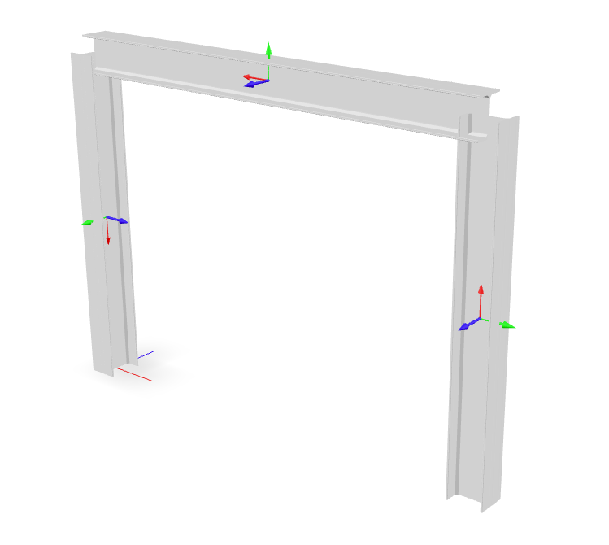
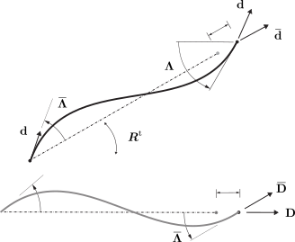

.. _CorotTR:

Corotational02
^^^^^^^^^^^^^^

The corotational coordinate transformation allows small-strain frame elements to be employed in a large deformation analysis. [1]_  [2]_
*Corotational02* superceeds the original :ref:`Corotational <CorotTR>` transformation, which is now deprecated.

.. tabs::

   .. tab:: Python

      .. py:method:: Model.geomTransf("Corotational02", tag, vecxz, [offi, offj])
         :no-index:

         Define a corotational geometric transformation for frame elements.

         :param integer tag: integer tag identifying transformation
         :type tag: |integer|
         :param vecxz: X, Y, and Z components of vecxz, the vector used to define the local x-z plane of the local-coordinate system, **required in 3D**. The local y-axis is defined by taking the cross product of the vecxz vector and the x-axis.
         :type vecxz: tuple of floats
         :param offi: joint offset values -- offsets specified with respect to the global coordinate system for element-end node i (optional, the number of arguments depends on the dimensions of the current model).
         :type offi: tuple of floats
         :param offj: joint offset values -- offsets specified with respect to the global coordinate system for element-end node j (optional, the number of arguments depends on the dimensions of the current model).
         :type offj: tuple of floats

   .. tab:: Tcl
   
      .. function:: geomTransf Corotational02 $tag < $vecxzX $vecxzY $vecxzZ > <-jntOffset $dXi $dYi $dZi $dXj $dYj $dZj>

      .. csv-table:: 
         :header: "Argument", "Type", "Description"
         :widths: 10, 10, 40

         $tag, |integer|, integer tag identifying transformation
         $vecxzX $vecxzY $vecxzZ,  |float|,  "X, Y, and Z components of vecxz, the vector used to define the local x-z plane of the local-coordinate system. The local y-axis is defined by taking the cross product of the vecxz vector and the x-axis.
         
         These components are specified in the global-coordinate system X,Y,Z and define a vector that is in a plane parallel to the x-z plane of the local-coordinate system.
         
         These items need to be specified for the three-dimensional problem."
         $dXi $dYi $dZi, |float|, "joint offset values -- offsets specified with respect to the global coordinate system for element-end node i (optional, the number of arguments depends on the dimensions of the current model)."
         $dXj $dYj $dZj, |float|, "joint offset values -- offsets specified with respect to the global coordinate system for element-end node j (optional, the number of arguments depends on the dimensions of the current model)."

.. note::
	
   The element coordinate system and joint offsets are the same as that documented for the :ref:`Linear <linearTR>` transformation.

Examples
--------

This example is developed in detail on the examples `site <https://gallery.stairlab.io/examples/framevecxz/>`__.
In order to cover a wide range of cases, the strong axis of the first column, element `1`, 
is oriented so as to resist bending *outside* the plane of the portal, but the strong axis of the second column, element `3`, will resist bending *inside* the portal plane.

   A portal frame with :math:`X_3` vertical.

.. code-block:: Python

   model.node(1, (    0, 0,      0))
   model.node(2, (width, 0,      0))
   model.node(3, (width, 0, height))
   model.node(4, (    0, 0, height))

   model.geomTransf("Corotational", 1, (1, 0, 0)) # Column
   model.geomTransf("Corotational", 2, (0, 0, 1)) # Girder
   model.geomTransf("Corotational", 3, (0,-1, 0)) # Column

Theory
------

.. _corot-directors:

   Corotational transformation of a two-node frame element.

Under a corotational transformation, an element's *state determination* is performed
in a transformed configuration space represented by director fields
:math:`\left\{\bar{\mathbf{d}}_k\right\}`, and
:math:`\left\{\bar{\mathbf{D}}_k\right\}` with the expressions:

.. math::

   \left.\begin{aligned}
   \mathbf{d}_k &\triangleq \boldsymbol{\Lambda}\mathbf{D}_k \\
   \bar{\mathbf{d}}_k &\triangleq \boldsymbol{R}\mathbf{D}_k \\
   \bar{\mathbf{D}}_k &\triangleq \bar{\boldsymbol{\Lambda}}\mathbf{D}_k \\
   \end{aligned}\right.,
   \quad\text{ implying }\qquad 
   \begin{aligned}
   \boldsymbol{\Lambda} &= \mathbf{d}_k\otimes\mathbf{D}_k \\
   \boldsymbol{R}       &= \bar{\mathbf{d}}_k\otimes\mathbf{D}_k \\
   \bar{\boldsymbol{\Lambda}} &= \bar{\mathbf{D}}_k\otimes\mathbf{D}_k \\
   \end{aligned}

.. note::

   It is more appropriate to think of the corotational transformation as a *family* of transformations.

References
----------

.. [1] Perez, Claudio M., and Filip C. Filippou. “On Nonlinear Geometric Transformations of Finite Elements.” International Journal for Numerical Methods in Engineering 125, no. 17 (September 15, 2024): e7506. https://doi.org/10.1002/nme.7506.

.. [2] De Souza, R. M. "Force-based finite element for large displacement inelastic analysis of frames" University of California, Berkeley (2000)

Code Developed by: |rms|, |cmp|

