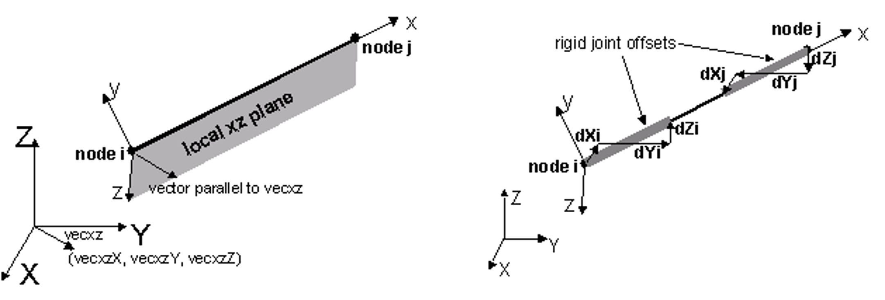

.. _PDeltaTransformation:

PDeltaTransformation geomTransf
^^^^^^^^^^^^^^^^

This command is used to construct the P-Delta Coordinate Transformation (PDeltaCrdTransf) object, which performs a linear geometric transformation of beam stiffness and resisting force from the basic system to the global coordinate system, considering second-order P-Delta effects. NOTE: P LARGE Delta effects do not include P small delta effects. 

For a two-dimensional problem

.. function:: geomTransf PDelta  $transfTag <-jntOffset $dXi $dYi $dXj $dYj> 

For a three-dimensional problem

.. function:: geomTransf PDelta  $transfTag $vecxzX $vecxzY $vecxzZ <-jntOffset $dXi $dYi $dZi $dXj $dYj $dZj> 

.. list-table:: 
   :widths: 10 10 40
   :header-rows: 1

   * - Argument
     - Type
     - Description
   * - $transfTag
     - |integer|
     - integer tag identifying transformation 
   * - $vecxzX $vecxzY $vecxzZ 
     - |float|
     - X, Y, and Z components of vecxz, the vector used to define the local x-z plane of the local-coordinate system. The local y-axis is defined by taking the cross product of the vecxz vector and the x-axis. These components are specified in the global-coordinate system X,Y,Z and define a vector that is in a plane parallel to the x-z plane of the local-coordinate system. These items need to be specified for the three-dimensional problem. 
   * - $dXi $dYi $dZi
     - |float|
     - joint offset values -- offsets specified with respect to the global coordinate system for element-end node i (the number of arguments depends on the dimensions of the current model). The offset vector is oriented from node i to node j as shown in a figure below. (optional) 
   * - $dXj $dYj $dZj 
     - |float|
     - joint offset values -- offsets specified with respect to the global coordinate system for element-end node j (the number of arguments depends on the dimensions of the current model). The offset vector is oriented from node j to node i as shown in a figure below. (optional) 

