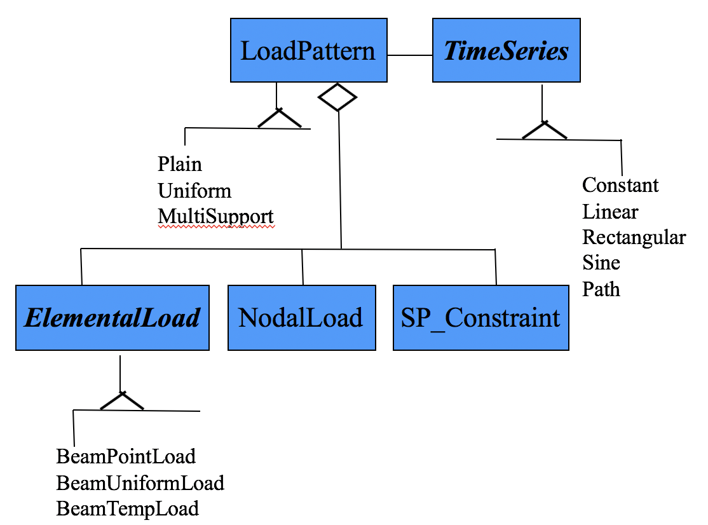

.. _pattern:

Pattern Command
***************

The pattern command is used to construct a LoadPattern and add it to the Domain. Each LoadPattern in OpenSees has a TimeSeries associated with it. In addition it may contain ElementLoads, NodalLoads and SinglePointConstraints. Some of these SinglePoint constraints may be associated with GroundMotions.

The command has the following form:

.. function:: pattern patternType? arg1? arg2? ...

.. csv-table:: 
   :header: "Argument", "Type", "Description"
   :widths: 10, 10, 40

   $patternType, |string|, pattern type
   $eleTag,  |integer|,  unique epattern tag.
   $args, |list|,  a list of args

The type of pattern created and the additional arguments required depends on the patternType? provided in the command. The following contain information about patternType? and the additional args required for each of the available pattern types:

	OpenSees Loads

.. toctree::
   :maxdepth: 4

   pattern/plainPattern
   pattern/uniformExcitationPattern
   pattern/multiSupportPattern
   pattern/DRM
   pattern/H5DRM