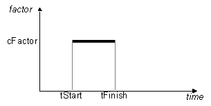

Rectangular Time Series
^^^^^^^^^^^^^^^^^^^^^^^

This command is used to construct a TimeSeries object in which the load factor is constant for a specified period and 0 otherwise, i.e. :math:`\lambda = f(t) = \begin{cases} \text{cFactor}, &\text{tStart} <= t <= \text{tFinish}\\
\text{0.0}, &\text{otherwise}\\
\end{cases}`

.. function:: timeSeries Rectangular $tag $tStart $tEnd <-factor $cFactor>

	Rectangular Time Series

.. function:: timeSeries Rectangular $tag $tStart $tFinish $period <-shift $shift> <-factor $cFactor>

.. csv-table:: 
   :header: "Argument", "Type", "Description"
   :widths: 10, 10, 40

      $tag, |integer|, unique tag among TimeSeries objects.
      $tStart, |float|, starting time of non-zero load factor
      $tFinish, |float|, ending time of non-zero load factor
      $cFactor, |float|, the load factor applied (optional: default=1.0)

.. admonition:: Example:

   The following code demonstrates how user would create a trigonometric time series with a tag of **1**, has a start time of **0.0**, an end time of **10.0**, and a max load factor of **2.0**.

   1. **Tcl Code**

   .. code-block:: none

      timeSeries Rectangular 1 0.0 10.0 -factor 2.0

   2. **Python Code**

   .. code-block:: python

      timSeries('Rectangular',  1, 0.0, 10.0, '-factor', 2.0)

Code Developed by: |fmk|
