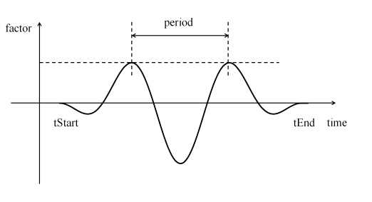

MPAcc TimeSeries
^^^^^^^^^^^^^^^^^^^^^

This command is used to represent near-field strong ground motion and can simulate the entire set of available near-fault displacement, velocity, and (in many cases) acceleration time histories, as well as the corresponding deformation, velocity, and acceleration response spectra.

	MPAcc Time Series

.. function:: timeSeries MPAcc $tag $tStart $tEnd $period <-gammaMP $gammaMP> <-nuMP $nuMP> <-AFactor $AFactor>

.. csv-table:: 
   :header: "Argument", "Type", "Description"
   :widths: 10, 10, 40

   	    $tag, |integer|, unique tag among TimeSeries objects
	    $tStart, |float|, starting time of non-zero load factor
	    $tEnd, |float|,	ending time of non-zero load factor
	    $period, |float|, characteristic period of M&P pulse
       $gammaMP,|float|, γ factor in M&P pulse model (optional: default = 1.0)
	    $nuMP, |float|,   v in degree in M&P pulse model (optional: default = 90.0)
	    $AFactor, |float|, the M&P velocity amplification factor (optional: default = 1.0)

.. admonition:: Example:

   The following code demonstrates how user would create a MPAcc time series with a tag of **1**, has a start time of **0.0**, an end time of **10.0**, a period of **5.0**, a gamma of **1.0**,a nuMP of **90**, and the M&P velocity amplification factor of **2.0**.

   1. **Tcl Code**

   .. code-block:: none

      timeSeries MPAcc 1 0.0 10.0 5.0 -gammaMP 1.0 -nuMP 90 -AFactor 2.0

   2. **Python Code**

   .. code-block:: python

      timSeries('MPAcc',  1, 0.0, 10.0, 5.0,'-gammaMP',1.0,'-nuMP',90, '-AFactor', 2.0)

Code Developed by: |TangSEU|
