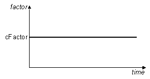

.. _constantTimeSeries:

Constant TimeSeries
^^^^^^^^^^^^^^^^^^^

This command is used to construct a TimeSeries object in which the load factor applied remains constant and is independent of the time in the domain, i.e. :math:`\lambda = f(t) = C`.

	Constant Time Series

.. function:: timeSeries Constant $tag <-factor $cFactor>

.. _fig-constantTimeSeries:

.. csv-table:: 
   :header: "Argument", "Type", "Description"
   :widths: 10, 10, 40

   $tag, |integer|, unique tag among TimeSeries objects.
   $cFactor, |float|, the load factor applied (optional: default=1.0)

.. admonition:: Example:

   The following code demonstrates how user would create two constant time series, the first with tag **1** has a **1.0** factor, the second **2** has a constant load factr of **10.0**.

   1. **Tcl Code**

   .. code-block:: none

      timeSeries Constant 1
      timeSeries Constant 2 -factor 10.0

   2. **Python Code**

   .. code-block:: python

      timSeries('Constant',  1)
      timSeries('Constant',  2, '-factor', 10.0)

Code Developed by: **fmk**
