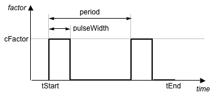

Pulse TimeSeries
^^^^^^^^^^^^^^^^

This command is used to construct a TimeSeries object in which the load factor is some pulse function of the time in the domain.

	Pulse Time Series

.. function:: timeSeries Pulse $tag $tStart $tFinish $period <-width $pulseWidth> <-shift $shift> <-factor $cFactor>

.. csv-table:: 
   :header: "Argument", "Type", "Description"
   :widths: 10, 10, 40

      $tag, |integer|,	   unique tag among TimeSeries objects
      $tStart, |float|,	   starting time of non-zero load factor
      $tEnd, |float|, ending time of non-zero load factor
      $period, |float|, characteristic period of pulse
      $pulseWidth, |float|, pulse width as a fraction of the period (optional: default = 0.5)
      $shift, |float|,	phase shift in seconds (optional: default = 0.0)
      $cFactor, |float|, the load amplification factor (optional: default = 1.0)

.. admonition:: Example:

   The following code demonstrates how user would create a trigonemtric time series with a tag of **1**, has a start time of **0.0**, an end time of **10.0**, a period of **1.0**, and a max load factor of **2.0**.

   1. **Tcl Code**

   .. code-block:: none

      timeSeries Pulse 1 0.0 10.0 1.0 -factor 2.0

   2. **Python Code**

   .. code-block:: python

      timSeries('Pulse',  1, 0.0, 10.0, 1.0, '-factor', 2.0)

Code Developed by: |andreas|
